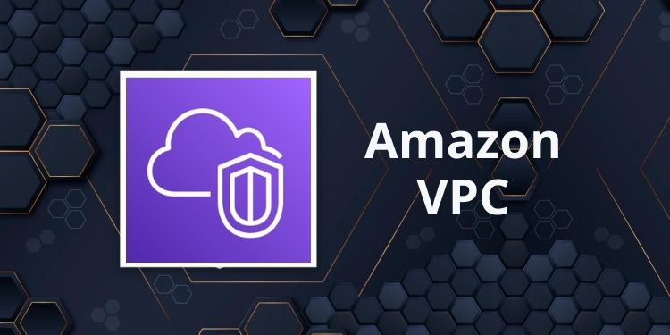
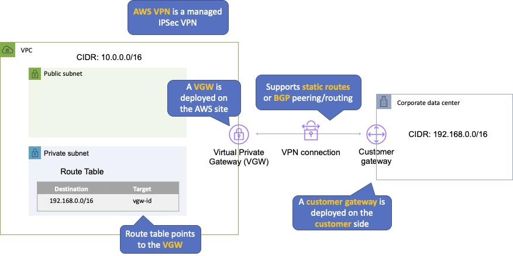
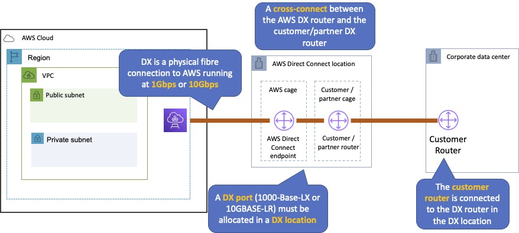
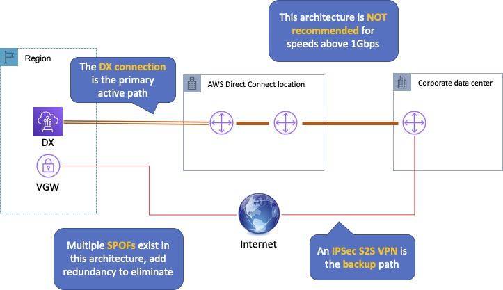
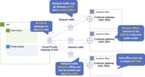

# AWS VPC Comprehensive Study Notes


**Figure 1: Amazon VPC Services Overview**


## Overview

Amazon VPC (Virtual Private Cloud) lets you provision a **logically isolated section** of the AWS cloud where you can launch AWS resources in a virtual network that you define.

### Key Concepts
- **Analogous to having your own DC inside AWS**
- Provides complete control over virtual networking environment
- VPCs are **region-wide**
- **Logically isolated** from other VPCs on AWS
- Can connect corporate data center using hardware VPN (site-to-site)
- **Default limit: 5 VPCs per region**

### Default VPC Characteristics
- Automatically created for each AWS account
- Has **all-public subnets**
- Subnet in each AZ
- Instances have both **public and private IP addresses**

---

## VPC Components

### Core Components
1. **Virtual Private Cloud**: Logically isolated virtual network
2. **Subnet**: Segment of VPC's IP address range (maps to AZ, 1:1)
3. **Internet Gateway**: Connection to public Internet
4. **NAT Gateway**: Managed NAT service for private subnet internet access
5. **Router**: Interconnects subnets and directs traffic
6. **Peering Connection**: Route traffic via private IPs between VPCs
7. **VPC Endpoints**: Private connectivity to AWS services

### Gateway Types
- **Internet Gateway (IGW)**: AWS VPC side of public Internet connection
- **Virtual Private Gateway (VPG)**: VPC endpoint on AWS side
- **Customer Gateway (CGW)**: Customer end of VPN connection
- **Egress-only Internet Gateway**: IPv6 outbound-only access

---

## Routing

### VPC Router Characteristics
- Performs routing **between AZs within a region**
- Connects different AZs and VPC to Internet Gateway
- Each subnet has a route table

### Route Table Limits
- **Up to 200 route tables per VPC**
- **Up to 50 route entries per route table**
- Each subnet can only be associated with **one route table**
- Can assign one route table to **multiple subnets**

### Important Rules
- **Default rule**: Allows all VPC subnets to communicate (cannot be deleted)
- If no route table specified, subnet assigned to **main route table**
- Cannot delete the **main route table**

---

## Subnets and Subnet Sizing

### Subnet Types
1. **Public Subnet**: Traffic routed to internet gateway
2. **Private Subnet**: No route to internet gateway
3. **VPN-only Subnet**: Traffic routed to virtual private gateway

### CIDR Block Rules
- VPC created with master address range (CIDR block: **16-28 bits**)
- **Cannot change CIDR block** after VPC creation
- **Cannot create overlapping** CIDR blocks
- **Cannot create additional CIDR blocks** in different RFC 1918 range

### Reserved IP Addresses
**First 4 and last 1 IP addresses** in subnet are reserved:

For subnet `10.0.0.0/24`:
- `10.0.0.0`: Network address
- `10.0.0.1`: Reserved by AWS for VPC router
- `10.0.0.2`: Reserved by AWS
- `10.0.0.3`: Reserved by AWS for future use
- `10.0.0.255`: Network broadcast address

### Recommended Private IP Ranges (RFC 1918)
- `10.0.0.0 – 10.255.255.255` (10/8 prefix)
- `172.16.0.0 – 172.31.255.255` (172.16/12 prefix)
- `192.168.0.0 – 192.168.255.255` (192.168/16 prefix)

---

## Internet Gateways

### Purpose
1. **Target in VPC route tables** for internet-routable traffic
2. **Perform NAT** for instances with public IPv4 addresses

### Characteristics
- Horizontally scaled, redundant, and **highly available**
- **No availability risk or bandwidth constraints**
- Only **1 IGW per VPC**
- Supports **IPv4 and IPv6**
- Must be **detached before deletion**

### Internet Access Requirements
To enable internet access for instances:
1. **Attach IGW** to VPC
2. **Update route table** to point to IGW
3. Ensure instances have **globally unique IP** address
4. Configure **security groups and NACLs** appropriately

### Egress-only Internet Gateway
- **IPv6 outbound access only**
- Prevents inbound access to IPv6 instances
- **Stateful** – forwards traffic and sends back responses
- Use instead of NAT for IPv6

---

## VPC Wizard Configurations

### 1. Single Public Subnet
- Creates `/16` network with `/24` subnet
- Instances use **Elastic IPs or Public IPs**
- Direct internet access

### 2. Public and Private Subnets
- Creates `/16` network with **two `/24` subnets**
- Public subnet uses Elastic IPs
- Private subnet uses **NAT** for internet access

### 3. Public and Private Subnets + Hardware VPN
- **IPsec VPN connection** to data center
- Extends data center to cloud
- Creates `/16` network with two `/24` subnets

### 4. Private Subnet Only + Hardware VPN
- **Private subnet only** with VPN tunnel
- No direct internet access
- Creates `/16` network with `/24` subnet

---

## NAT Instances vs NAT Gateways

### NAT Instances (Customer Managed)
**Pros:**
- Can use as **bastion host**
- Can monitor **traffic metrics**
- **Security group** association

**Cons:**
- **Not highly available** by default
- Performance dependent on **instance size**
- Requires **manual scaling**
- Need to **disable source/destination** check

### NAT Gateways (AWS Managed)
**Pros:**
- **Fully managed** by AWS
- **Highly available** within AZ
- **Up to 45 Gbps** bandwidth
- **No security groups** to maintain
- **Auto-assigned public IP**

**Cons:**
- **Cannot use as bastion** host
- **No port forwarding** support
- **No traffic metrics**

### Comparison Table

| Feature | NAT Gateway | NAT Instance |
|---------|-------------|--------------|
| **Managed** | AWS Managed | Customer Managed |
| **Availability** | HA within AZ | Not HA (requires scripting) |
| **Bandwidth** | Up to 45 Gbps | Depends on EC2 instance |
| **Maintenance** | AWS Managed | Customer Managed |
| **Security Groups** | Cannot associate | Can associate |
| **Bastion Host** | Not supported | Supported |

---

## Security Groups

### Characteristics
- Act like **firewall at instance level**
- Operate at **network interface level**
- **Stateful** (return traffic automatically allowed)
- Only **allow rules** (no deny rules)
- **Implicit deny** at the end

### Default Behavior
- **Custom security groups**: No inbound allow rules (all denied)
- **Default security groups**: Have inbound allow rules (within group)
- **All outbound traffic** allowed by default

### Important Rules
- **Up to 5 security groups** per EC2 instance
- Can use **security group names** as source/destination
- **Changes take effect immediately**
- Cannot block specific IPs (use NACLs instead)

---

## Network ACLs (NACLs)

### Characteristics
- Function at **subnet level**
- **Stateless** (responses subject to rules)
- Can have **permit and deny** rules
- **Numbered list** evaluated in order

### Default Behavior
- **Default NACL**: Allows all inbound/outbound traffic
- **Custom NACL**: Denies all traffic by default
- All subnets **must be associated** with a NACL

### Important Rules
- **Recommended spacing** between rule numbers
- **Changes take effect immediately**
- **First line of defense** (Security Group = second line)
- Preferred for **blocking specific IPs**

### Security Groups vs NACLs Comparison

| Feature | Security Group | Network ACL |
|---------|----------------|-------------|
| **Level** | Instance (interface) | Subnet |
| **Rules** | Allow only | Allow and Deny |
| **State** | Stateful | Stateless |
| **Rule Processing** | Evaluates all rules | Processes in order |
| **Association** | Must be associated | Auto-applies to subnet |

---

## VPC Connectivity Options


**Figure 2: AWS Site-to-Site VPN Configuration**


### 1. AWS Managed VPN

**When to Use:** Multiple VPCs need to communicate
**Pros:** Uses AWS backbone, no public internet
**Cons:** Transitive peering not supported

**Requirements:**
- **Virtual Private Gateway (VGW)** on AWS side
- **Customer Gateway** on customer side
- **Internet routable IP** on customer gateway
- **Two tunnels per connection** for redundancy

### 2. AWS Direct Connect


**Figure 3: AWS Direct Connect Architecture**


**When to Use:** Large network link, lots of AWS resources
**Pros:** Predictable performance, up to 10 Gbps, BGP support
**Cons:** Requires telecom relationships, costly

**Characteristics:**
- **1 Gbps or 10 Gbps** dedicated connections
- Uses **industry standard VLANs**
- **Does not encrypt** traffic in transit
- More consistent than internet-based connections

### 3. AWS Direct Connect + VPN


**Figure 4: AWS Direct Connect Plus VPN Hybrid Configuration**


**When to Use:** Need encrypted tunnels over Direct Connect
**Pros:** Secure IPsec over dedicated connection
**Cons:** Added complexity

### 4. AWS VPN CloudHub



**Figure 5: AWS VPN CloudHub Hub-and-Spoke Topology**


**When to Use:** Connect remote offices in hub-and-spoke
**Pros:** Reuses existing internet, supports BGP
**Cons:** Dependent on internet, no inherent redundancy

**Characteristics:**
- **Hub-and-spoke model** with AWS as hub
- **Up to 10 IPSec tunnels** on VGW
- Uses **eBGP**
- Branches can communicate with each other

### 5. Software VPN
**When to Use:** Need full control for compliance
**Pros:** Ultimate flexibility
**Cons:** Must design redundancy

### 6. Transit VPC
**When to Use:** Global network transit center
**Pros:** AWS-managed hub-and-spoke between VPCs
**Cons:** Must design redundancy

---

## VPC Peering

### Characteristics
- **One-to-one relationship** between VPCs
- Uses existing VPC infrastructure
- **No single point of failure**
- Can peer **within or across accounts**
- Can peer **across regions** (with limitations)

### Limitations
- **No transitive peering**
- **Cannot have overlapping CIDR** ranges
- **50 VPC peers per VPC** (125 by request)
- Inter-region limitations:
  - No security group rule references
  - No DNS resolution
  - **MTU limited to 1500 bytes**

### Setup Steps
1. Create VPC peering connection
2. Accept peering request
3. **Update route tables**
4. **Update security group rules**

---

## AWS PrivateLink & VPC Endpoints

### AWS PrivateLink
**Purpose:** Private connectivity between VPCs and AWS services
**Benefits:**
- Eliminates public internet exposure
- Uses AWS backbone
- Simplifies network architecture

### VPC Endpoint Types

#### Interface Endpoints
- **Elastic Network Interface (ENI)** with private IP
- Uses **AWS PrivateLink**
- Supports **many AWS services**
- Uses **DNS entries** to redirect traffic

#### Gateway Endpoints
- **Gateway target** for route table
- Uses **prefix lists** in route table
- **Only supports:**
  - **Amazon S3**
  - **Amazon DynamoDB**

### Endpoint Comparison

| Feature | Interface Endpoint | Gateway Endpoint |
|---------|-------------------|------------------|
| **Type** | ENI with private IP | Gateway target |
| **Traffic Redirect** | DNS entries | Route table prefix lists |
| **Supported Services** | Many AWS services | S3 and DynamoDB only |

---

## VPC Sharing

### Benefits
- **Separation of duties**: Centralized VPC management
- **Application ownership**: Resources, accounts, security groups
- **Efficiency**: Higher subnet density, shared NAT gateways
- **Cost optimization**: Shared resources and infrastructure

### Capabilities
- Share subnets with other AWS accounts in **same organization**
- Reference each other's **security group IDs**
- Avoid hard limits through **simplified architecture**

---

## VPC Flow Logs

### Purpose
Capture **IP traffic information** going to/from network interfaces

### Levels
- **VPC level**
- **Subnet level**  
- **Network interface level**

### Storage
- **Amazon CloudWatch Logs**

### Excluded Traffic
- Route53 traffic
- Windows license activation
- Instance metadata (169.254.169.254)
- Amazon Time Sync Service (169.254.169.123)
- DHCP traffic
- Default VPC router traffic

### Limitations
- **Cannot enable** for peered VPCs (unless in your account)
- **Cannot tag** flow logs
- **Cannot change configuration** after creation
- **Cannot modify** - must delete and recreate

---

## High Availability Best Practices

### Multi-AZ Strategies
- Create **subnets in multiple AZs**
- **At least two VPN tunnels** to Virtual Private Gateway
- **Secondary Direct Connect** connection or VPN backup

### DNS and IP Management
- **Route 53 health checks** for DNS redirection
- **Elastic IPs** for flexible asset changes

### NAT Gateway Redundancy
- Create **NAT Gateways in each AZ**
- Configure **routes for private subnets** to use local gateway

---

## Quick Reference Commands

### Create VPC
```bash
aws ec2 create-vpc --cidr-block 10.0.0.0/16
```

### Create Subnet
```bash
aws ec2 create-subnet --vpc-id vpc-12345678 --cidr-block 10.0.1.0/24 --availability-zone us-east-1a
```

### Create Internet Gateway
```bash
aws ec2 create-internet-gateway
aws ec2 attach-internet-gateway --internet-gateway-id igw-12345678 --vpc-id vpc-12345678
```

### Create NAT Gateway
```bash
aws ec2 create-nat-gateway --subnet-id subnet-12345678 --allocation-id eipalloc-12345678
```

### Create Security Group
```bash
aws ec2 create-security-group --group-name MySecurityGroup --description "My security group" --vpc-id vpc-12345678
```

---

## Exam Tips

### Remember These Key Points:
1. **Gateway Endpoints**: Only S3 and DynamoDB
2. **Interface Endpoints**: Most other AWS services
3. **NAT Gateway**: Managed, HA, up to 45 Gbps
4. **NAT Instance**: Customer managed, can be bastion
5. **Security Groups**: Stateful, allow rules only
6. **NACLs**: Stateless, allow and deny rules
7. **VPC Peering**: No transitive peering
8. **Direct Connect**: Not encrypted by default
9. **Subnets**: 1:1 mapping with AZs
10. **Reserved IPs**: First 4 and last 1 in each subnet