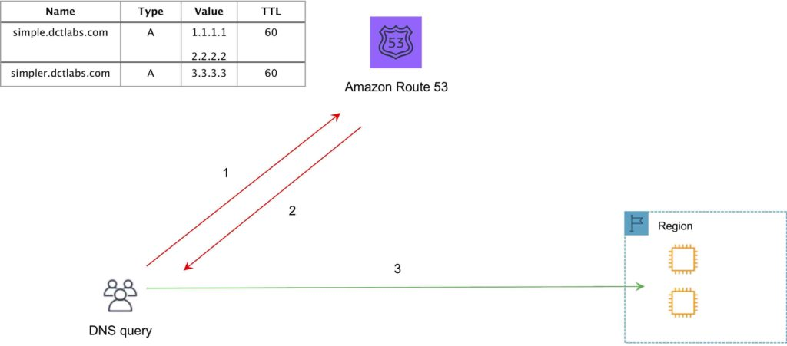
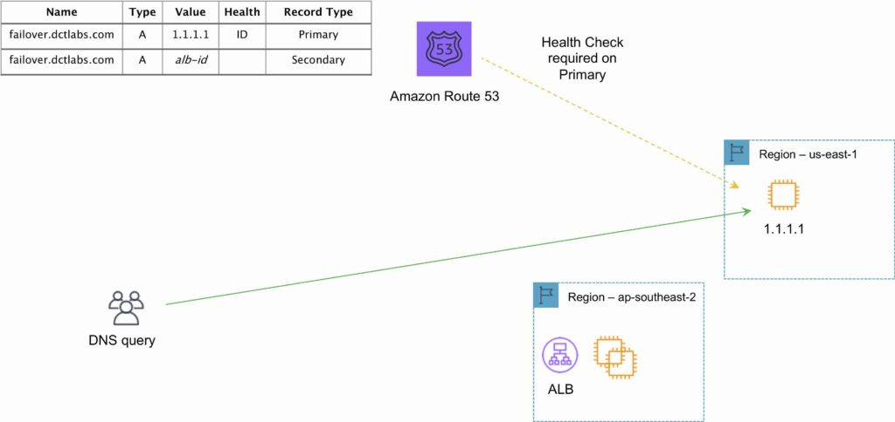
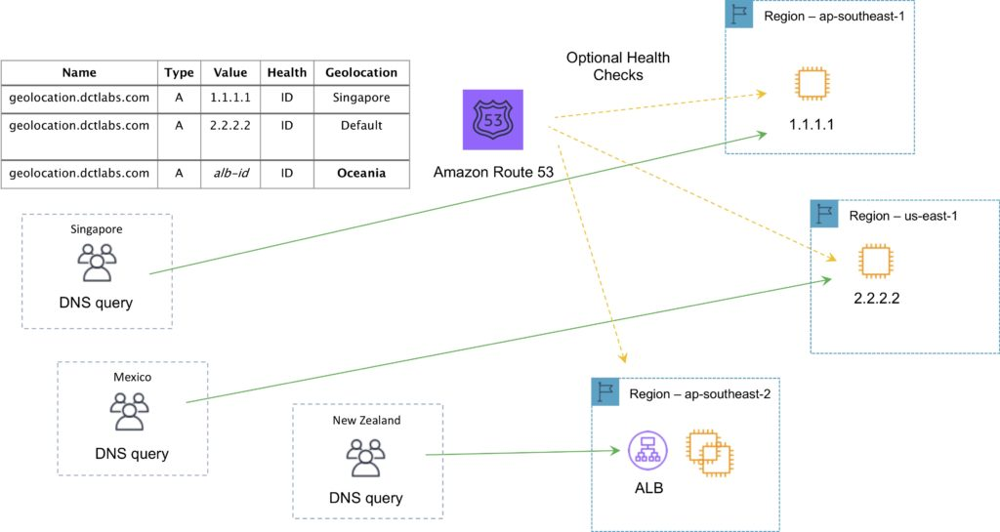
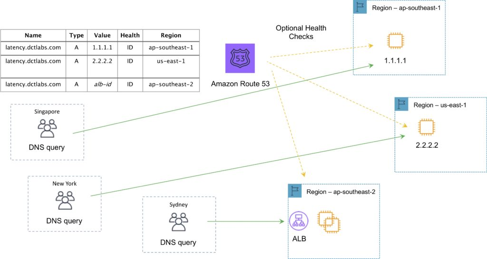
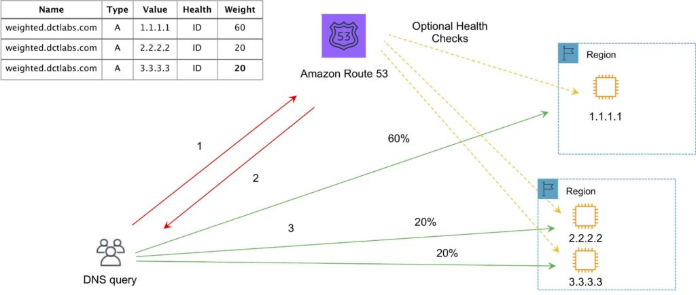
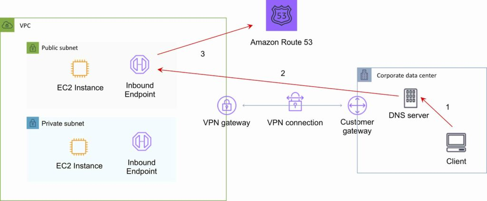
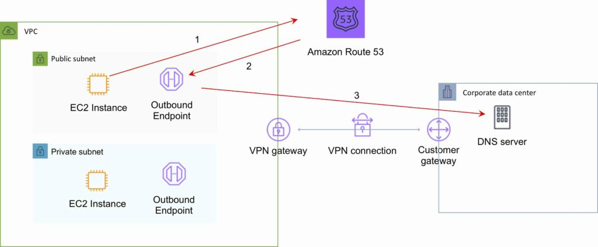

# Amazon Route 53 - Comprehensive Study Notes

**Figure 1: Amazon Route 53 Services Overview - Shows the comprehensive DNS, health checking, and domain registration services provided by Route 53**

## Overview

Amazon Route 53 is a highly available and scalable Domain Name System (DNS) service that offers three main functions:

- **Domain name registry** - Register and manage domain names
- **DNS resolution** - Translate domain names to IP addresses
- **Health checking of resources** - Monitor the health of your resources

### Key Features
- Worldwide distributed DNS service
- Located alongside all AWS edge locations
- Can route Internet traffic for any domain (not just those registered with Route 53)
- 100% uptime SLA
- Primarily uses UDP port 53 (can use TCP)
- Default limit of 50 domain names (can be increased)
- Access control through IAM

## Hosted Zones

A hosted zone is a collection of DNS records for a specified domain, analogous to a traditional DNS zone file.

### Types of Hosted Zones

1. **Public Hosted Zone**
   - Determines how traffic is routed on the Internet
   - Accessible from anywhere on the Internet

2. **Private Hosted Zone**
   - Determines how traffic is routed within a VPC
   - Resources are not accessible outside the VPC
   - Requires specific VPC settings:
     - `enableDnsHostname = true`
     - `enableDnsSupport = true`
   - Requires DHCP options set

### Hosted Zone Characteristics
- Route 53 automatically creates Name Server (NS) and Start of Authority (SOA) records
- Each hosted zone gets 4 unique name servers (delegation set)
- You can create multiple hosted zones with the same name but different records
- Changes to Name Servers may take up to 48 hours due to TTL values

### Cross-Account Access
You can associate a Route 53 private hosted zone in one AWS account with a VPC in another account:
1. From Account A: authorize the association
2. From Account B: create the association
3. Delete the association authorization after creation

## Health Checks

Health checks verify that Internet-connected resources are reachable, available, and functional.

### Health Check Types

| Type | Description |
|------|-------------|
| **HTTP** | Establishes TCP connection, submits HTTP request, expects status code 200-399 |
| **HTTPS** | Same as HTTP but uses HTTPS |
| **HTTP_STR_MATCH** | HTTP check + searches first 5,120 bytes for specified string |
| **HTTPS_STR_MATCH** | HTTPS check + searches first 5,120 bytes for specified string |
| **TCP** | Simply tries to establish TCP connection |
| **CLOUDWATCH_METRIC** | Associated with CloudWatch alarm status |
| **CALCULATED** | Monitors status of other health checks |

### Health Check Targets
- **Endpoints** - IP addresses or domain names
- **Status of other health checks** - Nested health checking
- **Status of CloudWatch alarms** - Integration with CloudWatch

## DNS Records

### Supported Record Types
- **A** (address record) - Maps domain to IPv4 address
- **AAAA** (IPv6 address record) - Maps domain to IPv6 address
- **CNAME** (canonical name record) - Maps domain to another domain
- **CAA** (certification authority authorization)
- **MX** (mail exchange record)
- **NAPTR** (name authority pointer record)
- **NS** (name server record)
- **PTR** (pointer record)
- **SOA** (start of authority record)
- **SPF** (sender policy framework)
- **SRV** (service locator)
- **TXT** (text record)
- **Alias** (Route 53-specific virtual record)

### Alias Records vs CNAME Records

| Feature | CNAME Records | Alias Records |
|---------|---------------|---------------|
| **Cost** | Route 53 charges for queries | No charge for queries to AWS resources |
| **Zone Apex** | Cannot be used at zone apex | Can be used at zone apex |
| **Query Behavior** | Redirects regardless of record type | Only follows when record type matches |
| **Target Restrictions** | Can point to any DNS record anywhere | Only AWS resources (CloudFront, ELB, S3, Elastic Beanstalk) |
| **Visibility** | Visible in DNS reply | Only visible in Route 53 console/API |
| **Resolution** | Followed by recursive resolver | Only followed inside Route 53 |

**Best Practice**: Use Alias records where possible, especially for AWS resources.

## Routing Policies

**Figure 2: Simple Routing Policy - Shows basic DNS resolution with round-robin distribution across multiple IP addresses**

### 1. Simple Routing Policy
- **Function**: Basic DNS response providing IP address associated with a name
- **Behavior**: Uses round-robin for multiple IP addresses
- **Health Checks**: Not supported
- **Use Case**: Basic DNS resolution without traffic management

### 2. Failover Routing Policy

**Figure 3: Failover Routing Policy - Demonstrates active-passive setup where traffic routes to secondary destination when primary fails health checks**

- **Function**: Routes to secondary destination if primary fails
- **Behavior**: Active-passive configuration
- **Health Checks**: Required and associated with routing
- **Use Case**: High availability applications
- **ELB Integration**: When used with Alias records, set "Evaluate Target Health" to "Yes"

### 3. Geolocation Routing Policy

**Figure 4: Geolocation Routing Policy - Shows how users from different geographic locations are routed to region-specific resources**

- **Function**: Routes based on user's geographic location
- **Features**:
  - Content localization and language customization
  - Distribution rights protection
  - Load distribution across regions
  - Routes to smallest geographic region for overlapping areas
  - Default record for unmapped IP addresses

### 4. Geoproximity Routing Policy
- **Function**: Routes based on resource location with optional traffic shifting
- **Requirement**: Requires Route 53 Traffic Flow
- **Use Case**: Advanced geographic routing with bias controls

### 5. Latency-based Routing Policy

**Figure 5: Latency-based Routing Policy - Illustrates how Route 53 uses its latency database to route users to the lowest latency AWS region**

- **Function**: Routes to region with lowest latency
- **Database**: AWS maintains global latency database
- **Setup**: Create latency records for resources in multiple EC2 locations
- **Use Case**: Performance optimization

### 6. Multivalue Answer Routing Policy
- **Function**: Returns up to 8 healthy records selected at random
- **Behavior**: Basic load balancing functionality
- **Health Checks**: Supported
- **Use Case**: Simple load distribution

### 7. Weighted Routing Policy

**Figure 6: Weighted Routing Policy - Shows how traffic is distributed based on assigned weights to different resources**

- **Function**: Routes traffic based on assigned weights
- **Configuration**: Same name and type records with different weights
- **Control**: Set weight to 0 to stop traffic to a resource
- **Use Case**: A/B testing, gradual traffic migration

## Traffic Flow

Route 53 Traffic Flow provides Global Traffic Management (GTM) services for sophisticated routing configurations.

### Features
- **Policy Creation**: Build complex routing policies using multiple routing types
- **Constraints**: Route based on latency, health, load, geo-proximity, and geography
- **Versioning**: Maintain history of routing policy changes
- **Rollback**: Easy reversion to previous policy versions

### Use Cases
- Simple backup pages in S3
- Complex routing considering user location, AWS region proximity, and endpoint health

## Route 53 Resolver

Route 53 Resolver enables bi-directional DNS querying between on-premises and AWS over private connections.

### Inbound Endpoints

**Figure 7: Route 53 Resolver Inbound Endpoints - Shows how on-premises DNS queries can resolve AWS hosted domains through private connectivity**

- **Function**: Allow on-premises DNS queries to resolve AWS hosted domains
- **Requirements**: Direct Connect (DX) or VPN connectivity
- **Configuration**: IP address assignment in each subnet

### Outbound Endpoints (Conditional Forwarding)

**Figure 8: Route 53 Resolver Outbound Endpoints - Demonstrates how AWS can forward DNS queries to on-premises DNS servers using conditional forwarding rules**

- **Function**: Forward DNS queries from AWS to on-premises DNS servers
- **Configuration**: Conditional forwarding rules for specific domains
- **Requirements**: Private connection over DX or VPN

### Active Directory Integration

Two approaches for Microsoft Active Directory DNS integration:

1. **Route 53 Resolver with Conditional Forwarding**:
   - Define outbound Route 53 Resolver
   - Set conditional forwarding rule for AD domain
   - Use AmazonProvidedDNS in VPC DHCP options

2. **Domain Controller DNS**:
   - Configure DHCP options to use Domain Controller IPs as DNS servers
   - Configure AD DNS to forward non-authoritative queries to VPC Resolver

## Pricing Structure

### Basic Charges
- **Hosted Zones**: Per hosted zone per month (no partial months)
- **Queries**: Per DNS query
- **Health Checks**: Different prices for AWS vs non-AWS endpoints
- **Traffic Flow**: Additional charges for advanced routing
- **Resolver ENIs**: Charges for endpoints and queries
- **Domain Names**: Registration and renewal fees

### Free Services
- **Alias Records**: Free when mapped to:
  - Elastic Load Balancers
  - CloudFront distributions
  - Elastic Beanstalk environments
  - S3 website endpoints
- **DNS Records**: No charge for adding records to hosted zones
- **12-Hour Rule**: Hosted zones deleted within 12 hours of creation are not charged

### Premium Pricing
- **Latency-based Routing**: Higher query costs
- **Geo DNS and Geo-proximity**: Premium pricing for advanced routing

## Best Practices

1. **Use Alias Records**: Prefer Alias over CNAME for AWS resources
2. **Health Checks**: Implement comprehensive health checking for high availability
3. **TTL Management**: Set appropriate TTL values for your use case
4. **Geographic Distribution**: Use geolocation/latency routing for global applications
5. **Monitoring**: Integrate with CloudWatch for DNS query monitoring
6. **Security**: Use IAM to control access to Route 53 resources
7. **Cost Optimization**: Use Alias records for AWS resources to avoid query charges

## Limitations and Considerations

- Domain transfers require TLD support
- NS record changes can take up to 48 hours
- Cannot extend Route 53 to on-premises instances
- Private hosted zones require specific VPC settings
- EC2 instances don't automatically register with private hosted zones
- Wildcard entries supported for all record types except NS records