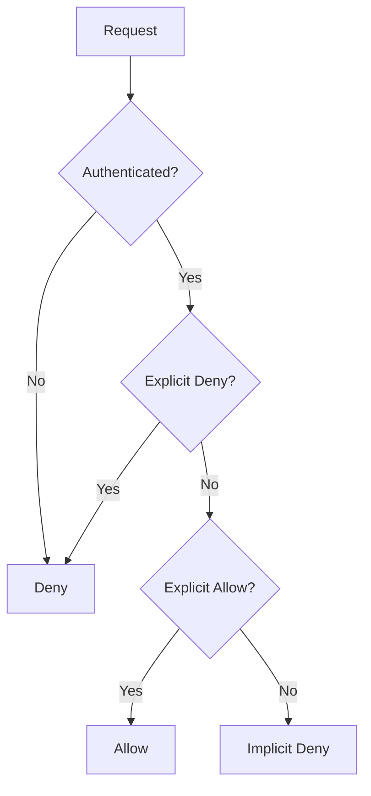

# AWS IAM - Identity and Access Management

!!! info "Overview"
    AWS Identity and Access Management (IAM) is a web service that helps you securely control access to AWS resources. IAM provides centralized control of your AWS account and enables shared access with granular permissions.

## IAM Architecture Overview


*Figure 4: Complete AWS IAM Architecture and Components*

## Core Concepts

### What is IAM?

IAM is used to securely control individual and group access to AWS resources. It makes it easy to provide multiple users secure access to AWS resources.

**Key Features:**
- Centralized control of your AWS account
- Shared access to your AWS account  
- Granular permissions
- Identity federation
- Multi-factor authentication (MFA)
- Temporary credentials

### What IAM Manages

- **Users** - Individual identities with specific permissions
- **Groups** - Collections of users with shared permissions
- **Access policies** - JSON documents defining permissions
- **Roles** - Temporary credentials for services and users
- **User credentials** - Passwords and access keys
- **User password policies** - Complexity requirements
- **Multi-factor authentication (MFA)** - Additional security layer
- **API keys** - For programmatic access (CLI/SDK)

!!! warning "Default Behavior"
    By default, new users are created with **NO access** to any AWS services. They can only login to the AWS console. Permissions must be explicitly granted.

## IAM Components

### 1. IAM Users

An IAM user is an entity that represents a person or service.

**User Components:**
- Username
- Password (for console access)
- Permissions to access resources

**Key Points:**
- Up to 5,000 users per AWS account
- Each user has a unique friendly name and ARN
- Can represent applications (service accounts)
- Should create individual accounts (don't share)

**Authentication Methods:**

=== "Console Password"
    - Password for AWS Management Console access
    - Users can change their own passwords (if allowed)
    - Can be controlled via IAM policies

=== "Access Keys"
    - Combination of Access Key ID and Secret Access Key
    - Up to 2 active access keys per user
    - Used for programmatic access (API, CLI, SDK)
    - Secret key only shown at creation time
    - Can be disabled without deletion

=== "Server Certificates"
    - SSL/TLS certificates for some AWS services
    - AWS recommends using Certificate Manager (ACM) instead
    - Use IAM certificates only for unsupported regions


*Figure 1: Different methods of authentication available with IAM*

### 2. Groups

Groups are collections of users with policies attached to them.

**Important Notes:**
- Groups are **not identities** and cannot be identified as principals in policies
- Use groups to assign permissions to users
- Cannot nest groups (no groups within groups)
- Apply principle of least privilege

### 3. Roles

Roles are created and then "assumed" by trusted entities to obtain temporary permissions.

**Key Characteristics:**
- No permanent credentials (no password or access keys)
- Provide temporary security credentials
- Can be assumed by users, services, or federated identities
- Automatically expire

**Role Types:**

=== "EC2 Instance Roles"
    - Grant applications on EC2 instances permissions to AWS APIs
    - Use instance profiles (container for IAM role)
    - Only one role per EC2 instance at a time
    - Can be assigned at creation or anytime after
    - Applications retrieve credentials from instance metadata

=== "Cross-Account Roles"
    - Allow access between different AWS accounts
    - Requires trust policy and permissions policy
    - No wildcards (*) as principals in trust policies

=== "Federated Roles"
    - For users authenticated by external identity providers
    - Supports SAML, OpenID Connect, etc.

### 4. Policies

Policies are JSON documents that define permissions.

**Policy Types:**

=== "AWS Managed Policies"
    - Created and maintained by AWS
    - Based on common job functions
    - Cannot be modified
    - Can be attached across accounts
    - Examples: Administrator, PowerUser, ReadOnly

=== "Customer Managed Policies"
    - Created and managed by you
    - Standalone policies with their own ARN
    - Can be attached to multiple entities within your account
    - Recommended over inline policies

=== "Inline Policies"
    - Embedded within user, group, or role
    - 1:1 relationship with entity
    - Deleted when entity is deleted
    - Use when permissions should never be accidentally assigned elsewhere

## Authentication & Authorization Flow

### 1. Principals
Entities that can take actions on AWS resources:
- IAM users
- IAM roles  
- Federated users
- Applications

### 2. Requests
Principals send requests containing:
- **Actions** - What they want to do
- **Resources** - What they want to act upon
- **Principal information** - Who is making the request
- **Request context** - Environment data (IP, user agent, etc.)

### 3. Authentication
- **Console**: Username and password
- **API/CLI**: Access key and secret key
- **MFA**: Additional authentication factor when enabled

### 4. Authorization
IAM evaluates policies to allow or deny requests using this logic:



**Policy Evaluation Rules:**
1. By default, all requests are **implicitly denied**
2. **Explicit allow** overrides implicit deny
3. **Explicit deny** overrides any explicit allows
4. Only root user has access to all resources by default


*Figure 2: IAM Policy Evaluation Logic Flow*

## Multi-Factor Authentication (MFA)

!!! tip "Best Practice"
    Enable MFA for all users, especially privileged users. Use U2F or hardware MFA devices for privileged accounts.

**MFA Methods:**
- Virtual MFA devices (apps)
- Hardware MFA devices
- U2F security keys

**Authentication with MFA:**
- **Console**: Username, password, and MFA code
- **API**: Include MFA parameters in AWS STS API requests
- **CLI**: Use `aws sts get-session-token` for temporary credentials

## AWS Security Token Service (STS)

STS provides temporary, limited-privilege credentials.

**Key Features:**
- Global service (endpoint: `https://sts.amazonaws.com`)
- Regional endpoints available for reduced latency
- Credentials work globally regardless of region
- Supports CloudTrail logging

**Temporary Credentials Include:**
- Access Key ID
- Secret Access Key  
- Session Token
- Expiration time

**STS API Actions:**

| API Action | Use Case |
|------------|----------|
| `AssumeRole` | IAM users assuming roles (supports MFA) |
| `AssumeRoleWithSAML` | SAML-authenticated users |
| `AssumeRoleWithWebIdentity` | Web identity token users |
| `GetSessionToken` | IAM users or root user (supports MFA) |
| `GetFederationToken` | IAM users or root user |

**Advantages:**
- No need to distribute long-term credentials
- Provide access without creating AWS identities
- Limited lifetime credentials
- Cannot be reused after expiration

## Identity Federation

### Federation Types

=== "Active Directory Federation"
    - Uses SAML 2.0
    - Grants temporary access based on AD credentials
    - No need for IAM users
    - Single sign-on capability

=== "Web Identity Federation"
    - Use Facebook, Amazon, Google, or other OpenID providers
    - Recommended to use Amazon Cognito
    - For mobile applications

=== "Cross-Account Access"
    - Access resources in different AWS accounts
    - Requires resource-based policy OR role assumption
    - Useful for dev/prod account separation

### STS Federation Scenarios

**Scenario 1: Identity Broker**
1. Identity Broker authenticates with LDAP
2. Broker gets temporary credentials from STS
3. Application uses temporary credentials

**Scenario 2: Role-Based**
1. Identity Broker authenticates with LDAP
2. Broker gets IAM role associated with user
3. Application assumes IAM role via STS
4. Application uses role permissions


*Figure 3: AWS STS Federation Implementation Scenarios*

## Instance Profiles

Instance profiles are containers for IAM roles used with EC2 instances.

**Key Points:**
- One IAM role per instance profile
- One role can be in multiple instance profiles
- Pass role information to EC2 instances at startup

**CLI Commands:**
```bash
# Create instance profile
aws iam create-instance-profile

# Add role to instance profile  
aws iam add-role-to-instance-profile

# List instance profiles
aws iam list-instance-profiles

# Get instance profile info
aws iam get-instance-profile

# Remove role from instance profile
aws iam remove-role-from-instance-profile

# Delete instance profile
aws iam delete-instance-profile
```

## Root Account Best Practices

!!! danger "Root Account Security"
    The root account has complete administrative access and these permissions cannot be restricted.

**Best Practices:**
- Don't use root credentials for daily tasks
- Don't share root credentials  
- Create IAM user with admin permissions instead
- Enable MFA on root account
- Lock away root access keys
- Use root only for billing-related tasks

## IAM Best Practices

### Security Best Practices

1. **Lock away root user access keys**
2. **Use roles to delegate permissions**
3. **Grant least privilege**
4. **Start with AWS managed policies**
5. **Validate your policies** using policy simulator
6. **Use customer managed policies** instead of inline policies
7. **Use access levels** to review permissions
8. **Configure strong password policy**
9. **Enable MFA** for all users
10. **Use roles** for EC2 applications

### Operational Best Practices

11. **Don't share access keys**
12. **Rotate credentials regularly**
13. **Remove unnecessary credentials**
14. **Use policy conditions** for extra security
15. **Monitor activity** in your account

## Important Characteristics

- **Global Service**: IAM is universal and doesn't apply to regions
- **Eventually Consistent**: Changes may take time to propagate
- **Data Replication**: Replicates across multiple data centers
- **PCI DSS Compliant**: Meets compliance requirements
- **API Integration**: Integrates with many AWS services

## Policy Simulator

The IAM Policy Simulator helps you:
- Understand policy effects
- Test policies before deployment
- Validate access control policies
- Troubleshoot permission issues

!!! tip "Testing Policies"
    Always test policies using the Policy Simulator before applying them to production environments.

## Common Use Cases

### Job Function Policies
AWS provides managed policies for common job functions:
- Administrator
- Billing
- Database Administrator  
- Data Scientist
- Developer Power User
- Network Administrator
- Security Auditor
- Support User
- System Administrator
- View-Only User

### Application Authentication
- **Not for application-level authentication**
- Use for AWS service access only
- Applications can use roles via instance profiles
- Temporary credentials for enhanced security

---

*This comprehensive guide covers all essential AWS IAM concepts for effective identity and access management in AWS environments.*