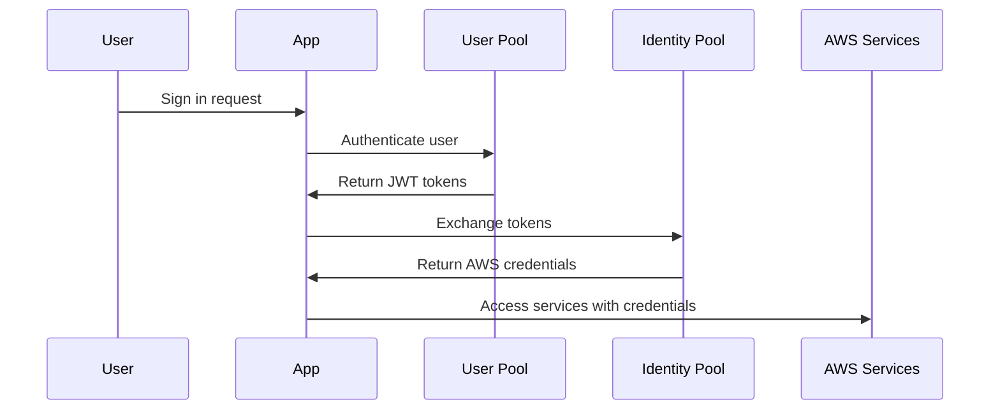

# Amazon Cognito - Authentication & User Management

*Figure 1: Amazon Cognito Service Overview*

!!! info "Overview"
    Amazon Cognito lets you add user sign-up, sign-in, and access control to your web and mobile apps quickly and easily. It provides authentication, authorization, and user management for your applications without requiring you to build your own authentication system.

## Core Concepts

### What is Amazon Cognito?

Amazon Cognito provides comprehensive identity management solutions including:
- **Authentication** - Verifying user identity
- **Authorization** - Controlling access to resources
- **User Management** - Managing user profiles and directories

**Key Benefits:**
- Quick and easy integration
- Scalable to millions of users
- Supports multiple authentication methods
- No need to store credentials locally
- Seamless cross-device experience

### Authentication Methods

Users can authenticate through multiple channels:

=== "Direct Sign-in"
    - Username and password
    - Email and password
    - Phone number and SMS verification

=== "Social Identity Providers"
    - Facebook
    - Google
    - Amazon
    - Twitter

=== "Enterprise Identity Providers"
    - SAML 2.0 providers
    - OpenID Connect providers
    - Custom identity providers

## Web Identity Federation

*Figure 2: Amazon Cognito Authentication and Authorization Flow*

Web Identity Federation enables users to authenticate with external identity providers and access AWS resources.

### How Web Identity Federation Works

1. **User Authentication**: User authenticates with Web Identity Provider (Google, Facebook, etc.)
2. **Token Receipt**: User receives authentication token from provider
3. **Token Exchange**: Token is exchanged for temporary AWS credentials
4. **Resource Access**: User assumes IAM role to access AWS resources

**Key Features:**
- Cognito acts as **Identity Broker** between ID provider and AWS
- No need to write custom authentication code
- Supports multiple identity providers simultaneously
- Temporary credentials for enhanced security

**Supported Identity Providers:**
- Amazon Login
- Facebook Login
- Google Login
- Twitter/Digits
- Any OpenID Connect compatible provider
- Custom identity providers

## Core Components

Amazon Cognito consists of two main components that can be used separately or together:

### 1. User Pools

*Figure 3: Amazon Cognito User Pool Authentication Token Flow*

User pools are **user directories** that provide sign-up and sign-in functionality for your application users.

**Key Characteristics:**
- Think of User Pools like **IAM Users or Active Directory**
- Manage user registration and authentication
- Issue JSON Web Tokens (JWT) after authentication
- Provide built-in user interface components

**User Pool Features:**

=== "Authentication Services"
    - Sign-up and sign-in services
    - Password reset and forgot password flows
    - Email and phone number verification
    - Multi-factor authentication (MFA)
    - SMS-based MFA support

=== "User Interface"
    - Built-in, customizable web UI
    - Ready-to-use sign-in pages
    - Customizable branding and styling
    - Mobile-optimized interfaces

=== "Social Integration"
    - Social sign-in with Facebook, Google
    - Login with Amazon integration
    - SAML identity provider support
    - Multiple provider federation

=== "User Management"
    - User directory management
    - User profile storage and management
    - User attribute customization
    - Group-based permissions

=== "Security Features"
    - Multi-factor authentication (MFA)
    - Compromised credential checks
    - Account takeover protection
    - Advanced security features
    - Phone and email verification

=== "Customization"
    - AWS Lambda triggers for custom workflows
    - User migration capabilities
    - Custom attribute definitions
    - Workflow customization

**User Pool Authentication Flow:**
1. User signs in to your application
2. User Pool authenticates the user
3. User Pool returns JWT tokens (ID, Access, Refresh)
4. Application uses tokens to secure API access

### 2. Identity Pools

*Figure 4: Amazon Cognito Identity Pool Architecture*

Identity pools enable you to create unique identities and provide temporary AWS credentials to access AWS services.

**Key Characteristics:**
- Think of Identity Pools like **IAM Roles**
- Provide temporary, limited-privilege AWS credentials
- Enable access to AWS services directly from client applications
- Support both authenticated and unauthenticated users

**Identity Pool Features:**

=== "Credential Management"
    - Temporary AWS credentials
    - Automatic credential refresh
    - Limited-privilege access
    - Secure credential exchange

=== "Device Tracking"
    - Track association between user identity and devices
    - Support multiple devices per user
    - Cross-device identity management
    - Device-specific permissions

=== "Data Synchronization"
    - Cross-device data synchronization
    - Offline data caching
    - Automatic sync when online
    - Push synchronization via Amazon SNS

**Supported Identity Providers:**
- **Public Providers**: Login with Amazon, Facebook, Google
- **Amazon Cognito User Pools**
- **OpenID Connect Providers**
- **SAML Identity Providers**
- **Developer Authenticated Identities**
- **Unauthenticated Identities** (guest users)

**Identity Pool Authentication Flow:**
1. User authenticates with identity provider
2. Identity Pool receives authentication token
3. Identity Pool exchanges token for temporary AWS credentials
4. User accesses AWS services using temporary credentials

## User Pools vs Identity Pools

!!! tip "Memory Aid"
    - **User Pools** = Like IAM Users or Active Directory (user directory)
    - **Identity Pools** = Like IAM Roles (temporary credentials for AWS access)

| Aspect | User Pools | Identity Pools |
|--------|------------|----------------|
| **Purpose** | User authentication and management | AWS service access credentials |
| **Output** | JWT tokens | Temporary AWS credentials |
| **Use Case** | Sign-up/sign-in to your application | Access AWS services from client |
| **Think of it as** | User directory/database | Credential vending machine |
| **Authentication** | Handles user authentication | Uses existing authentication |
| **Authorization** | Controls app access | Controls AWS resource access |

### Integration Patterns

=== "User Pools Only"
    - Pure application authentication
    - No direct AWS service access
    - JWT tokens for API authorization
    - Custom backend handles AWS access

=== "Identity Pools Only"
    - Direct AWS service access
    - External identity providers
    - No user directory management
    - Temporary credentials only

=== "Both Together"
    - Complete solution
    - User Pools handle authentication
    - Identity Pools provide AWS access
    - Best of both worlds

## Amazon Cognito Sync

Amazon Cognito Sync enables cross-device synchronization of application-related user data.

**Key Features:**
- Synchronize user profile data across devices
- Works across mobile devices and web
- No backend infrastructure required
- Offline data caching capability

**How Sync Works:**
1. **Local Caching**: Client libraries cache data locally
2. **Offline Access**: Apps can read/write data without connectivity
3. **Online Sync**: Data synchronizes when device comes online
4. **Push Notifications**: Amazon SNS notifies other devices of updates

**Sync Capabilities:**
- Cross-device data synchronization
- Automatic conflict resolution
- Push sync for real-time updates
- Offline-first architecture

!!! warning "Service Comparison"
    **AWS AppSync vs Cognito Sync:**
    
    - **AppSync** is the newer, more capable service
    - **AppSync** can sync across users (Cognito Sync cannot)
    - **AppSync** supports more devices and data types
    - **AppSync** is based on GraphQL
    - **Cognito Sync** only syncs across devices for same user

## Implementation Architecture

### Basic Authentication Flow

### Integration with AWS Services

Amazon Cognito integrates seamlessly with:

**API Gateway:**
- Use JWT tokens for API authorization
- Built-in Cognito User Pool authorizers
- Fine-grained access control

**AWS Lambda:**
- Custom authentication flows
- Pre/post authentication triggers
- User migration triggers
- Custom message triggers

**Amazon SNS:**
- Push notifications for sync updates
- SMS delivery for MFA
- Email notifications

**Amazon S3:**
- Fine-grained access control
- User-specific folders
- Temporary credentials for uploads

## Security Features

### Multi-Factor Authentication (MFA)

**MFA Options:**
- SMS-based MFA
- Time-based One-Time Password (TOTP)
- Software token MFA
- Hardware token support

**MFA Configuration:**
- Optional MFA (user choice)
- Required MFA (enforced)
- Adaptive authentication
- Risk-based authentication

### Advanced Security

**Security Features:**
- Compromised credential detection
- Account takeover protection
- Risk-based authentication
- Advanced security metrics
- Anomaly detection

**Compliance:**
- SOC compliance
- PCI DSS compliance
- HIPAA eligibility
- GDPR compliance support

## Migration and Integration

### User Migration

**Migration Options:**
- **Import Tool**: Bulk import existing users
- **Lambda Triggers**: Just-in-time migration
- **API-based Migration**: Programmatic user creation
- **CSV Import**: Simple file-based import

**Migration Considerations:**
- Password migration strategies
- User attribute mapping
- Batch vs real-time migration
- Rollback procedures

### Custom Workflows

Use **AWS Lambda triggers** for:
- Pre-authentication validation
- Post-authentication actions
- Custom user migration
- Pre-signup validation
- Post-confirmation actions
- Custom message delivery

## Pricing Model

**User Pool Pricing:**
- Monthly Active Users (MAU) based
- Free tier: 50,000 MAUs
- Advanced security features additional cost
- SMS charges separate

**Identity Pool Pricing:**
- Identity usage based
- Sync store charges
- Data transfer charges
- AWS service usage charges

## Best Practices

### Security Best Practices

1. **Enable MFA** for sensitive applications
2. **Use HTTPS** for all communications
3. **Implement proper session management**
4. **Regular security monitoring**
5. **Least privilege access** for IAM roles
6. **Regular credential rotation**

### Performance Best Practices

1. **Cache JWT tokens** appropriately
2. **Implement proper retry logic**
3. **Use appropriate token refresh strategies**
4. **Optimize API calls**
5. **Monitor usage patterns**

### Integration Best Practices

1. **Use both User Pools and Identity Pools** for complete solution
2. **Implement proper error handling**
3. **Plan for scaling requirements**
4. **Design for offline scenarios**
5. **Implement proper logging and monitoring**

## Common Use Cases

### Mobile Applications
- Social login integration
- Offline data synchronization
- Cross-device user experience
- Secure API access

### Web Applications
- Single sign-on (SSO)
- Social identity federation
- User self-service portal
- API security

### Serverless Applications
- JWT-based authorization
- Lambda function security
- API Gateway integration
- Event-driven architectures

### Enterprise Applications
- SAML federation
- Active Directory integration
- Multi-tenant applications
- Compliance requirements

---

!!! summary "Key Takeaways"
    - **Amazon Cognito** provides complete identity management for web and mobile apps
    - **User Pools** handle authentication and user directories (like IAM Users)
    - **Identity Pools** provide temporary AWS credentials (like IAM Roles)
    - **Web Identity Federation** enables external provider authentication
    - **Cognito Sync** provides cross-device data synchronization
    - **Security features** include MFA, compromised credential detection
    - **Scalable** to millions of users with pay-per-use pricing

*This comprehensive guide covers all essential Amazon Cognito concepts for building secure, scalable authentication systems.*