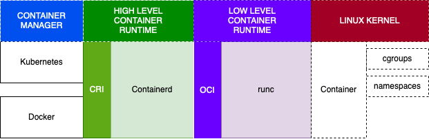
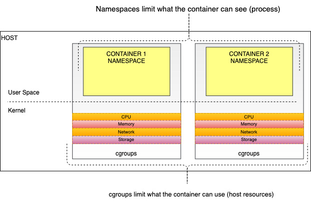
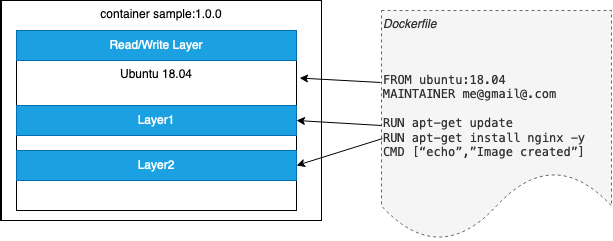
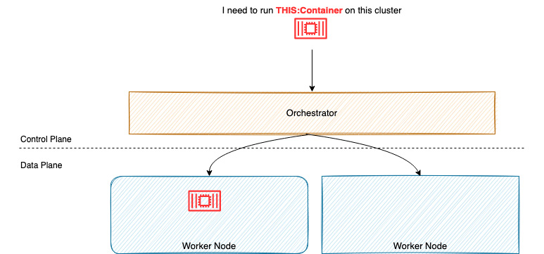
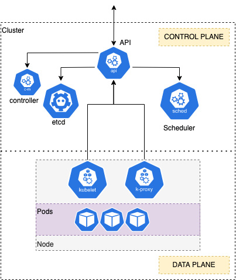

# The Fundamentals of Kubernetes and Containers

## Overview

As organizations adopt agile development and cloud-native application architectures, the need for platforms that can deploy, scale, and provide reliable container services has become critical. Kubernetes has emerged as the de facto platform for hosting container workloads, though it can be complex to install, configure, and manage.

**Elastic Kubernetes Service (EKS)** is a managed service that enables AWS platform users to focus on using a Kubernetes cluster rather than spending time on installation and maintenance.

## Chapter Topics Covered

- A brief history of Docker, containerd, and runc
- A deeper dive into containers
- What is container orchestration?
- What is Kubernetes?
- Understanding Kubernetes deployment architectures

!!! note "Prerequisites"
    This content is intended for IT professionals with experience building and/or running Kubernetes on-premises or on other cloud platforms. Some familiarity with Linux commands and architectures is recommended.

---

## A Brief History of Docker, containerd, and runc

### Evolution of Container Technology

The IT industry has undergone significant changes:

- **1970s-80s**: Large, dedicated mainframes and UNIX systems
- **Early 2000s**: Virtualization movement with Solaris Zones, VMware, and development of cgroups and namespaces in Linux kernel
- **2008**: LXC (Linux Containers) released, providing consistent management of cgroups and namespaces

### Docker (2013)

Docker was initially built on top of LXC and introduced a complete ecosystem around container management:

- **Packaging format**: Dockerfile
- **Union filesystem**: For building lightweight container images
- **Runtime environment**: Managing Docker containers, storage, CPU, RAM limits
- **Docker daemon**: Managing and transferring images
- **API**: Consumed by Docker CLI
- **Registry**: Docker Hub for distributing containerized applications

### containerd (2016)

Docker extracted runtime capabilities into a separate engine called **containerd** and donated it to the Cloud Native Compute Foundation (CNCF). This allowed other container ecosystems like Kubernetes to deploy and manage containers.

- Kubernetes initially used Docker as its container runtime
- Kubernetes 1.15 introduced the Container Runtime Interface (CRI)
- CRI allows Kubernetes to use different runtimes such as containerd

### Open Container Initiative (OCI) and runc

The **Open Container Initiative (OCI)** was founded by Docker and the container industry to provide lower-level interfaces for managing containers:

- Developed the **OCI Runtime Specification**
- Adopted Docker image format as basis for image specifications
- Created **runc** tool to implement Runtime Specification
- runc adopted by most runtime engines as low-level interface


*Figure 1.1 – Container runtimes*

---

## A Deeper Dive into Containers

### Container Fundamentals

A container is a **purely logical construction** consisting of technologies glued together by the container runtime. Two foundational Linux services enable containers:

### Namespaces

**Namespaces** are a Linux kernel feature used to partition kernel resources, allowing processes within the namespace to be isolated from other processes.

Each namespace has its own:
- Process IDs (PIDs)
- Hostname
- Network access
- File system view

### Control Groups (cgroups)

**Control groups** limit resource usage by processes or sets of processes:
- CPU usage
- RAM allocation
- Disk I/O
- Network I/O

Originally developed by Google and incorporated into the Linux kernel.

### Container Definition

A container is defined as: **A set of isolated processes (namespace) with resource limits (cgroups)**


*Figure 1.2 – The container as a combination of cgroup and namespace*

### Union Filesystems (UFS)

A **Union Filesystem** is a special filesystem that can merge/overlay multiple directories/files into a single view:

- Gives appearance of single writable filesystem
- Actually read-only, doesn't allow modification of original content
- **OverlayFS** is most common example (included in Linux kernel, used by Docker)

#### UFS Benefits

- Very efficient way to merge content for container images
- Each discrete content set is considered a **layer**
- Layers can be reused between container images
- Docker uses Dockerfile to create layered files based on base images


*Figure 1.3 – Sample Docker image*

In the example above:
- `FROM` command creates initial layer from ubuntu 18.04 image
- `RUN` commands create discrete layers
- Docker adds thin read/write layer for running container changes
- `MAINTAINER` and `CMD` commands don't generate layers

---

## How to Use Docker

### Basic Docker Commands

#### Running a Container
```bash
$ docker run hello-world
Unable to find image 'hello-world:latest' locally
latest: Pulling from library/hello-world
2db29710123e: Pull complete
...
Status: Downloaded newer image for hello-world:latest
Hello from Docker!
```

#### Listing Containers
```bash
$ docker ps -a
CONTAINER ID   IMAGE        COMMAND    CREATED       STATUS                    PORTS     NAMES
39bad0810900   hello-world  "/hello"   10 minutes ago Exited (0) 10 minutes ago           distracted_tereshkova
```

#### Viewing Docker Information
```bash
$ docker info
…
buildx: Docker Buildx (Docker Inc., v0.8.1)
compose: Docker Compose (Docker Inc., v2.3.3)
scan: Docker Scan (Docker Inc., v0.17.0)
……
containerd version: 2a1d4dbdb2a1030dc5b01e96fb110a9d9f150ecc
runc version: v1.0.3-0-gf46b6ba
init version: de40ad0
```

!!! info "Docker Installation"
    For Docker installation and setup instructions, refer to the [Docker Get Started guide](https://docs.docker.com/get-started/).

---

## What is Container Orchestration?

Container orchestration aims to **schedule, deploy, and manage hundreds or thousands of containers** across your environment.

### Container Orchestration Platforms

#### Docker Swarm
- Cluster management and orchestration solution from Docker
- [Documentation](https://docs.docker.com/engine/swarm/)

#### Kubernetes (K8s)
- Open source container orchestration system
- Originally designed by Google, now maintained by CNCF
- Strong ecosystem for deployment, scheduling, scaling, monitoring
- [Official site](https://kubernetes.io/)

#### Amazon Elastic Container Service (ECS)
- Highly secure, reliable, and scalable container orchestration by AWS
- Integrated with AWS services (CloudFormation, IAM, ELB)
- [More information](https://ecs.aws/)

### Container Orchestration Architecture


*Figure 1.4 – An overview of container orchestration*

Container orchestration typically consists of:

**Control Plane (Brain/Scheduler/Orchestrator)**
- Decides where to put containers

**Data Plane (Workers)**
- Runs the actual containers

### Orchestrator Features

- **Maintains desired state** for entire cluster system
- **Provisions and schedules** containers
- **Reschedules containers** when worker becomes unavailable
- **Recovery from failure**
- **Scales containers** in/out based on workload metrics, time, or external events

---

## What is Kubernetes?

Kubernetes is an **open source container orchestrator** originally developed by Google, now the de facto container platform for many organizations.

### Kubernetes Architecture


*Figure 1.5 – An overview of Kubernetes*

#### Control Plane Components

- **API Server**: Exposes Kubernetes operations
- **Scheduler**: Schedules containers (Pods) across worker nodes
- **etcd**: Datastore for all cluster data and state
- **Controller**: Manages jobs, failures, and restarts

#### Worker Nodes (Data Plane)

Each node runs:
- **kubelet agent**: Ensures containers are running on specific node
- **kube-proxy**: Manages networking for the node

### Key Advantage

All resources are defined as **objects** that can be:
- Created
- Read
- Updated
- Deleted

---

## Key Kubernetes API Resources

### Pod

A **Pod** is an abstract object defined as one or more containers sharing the same:
- Linux namespace
- cgroups
- Network resources
- Storage resources

#### Example Pod Definition
```yaml
apiVersion: v1
kind: Pod
metadata:
  name: nginx
spec:
  containers:
  - name: nginx
    image: nginx:1.14.2
    ports:
    - containerPort: 80
```

### Deployment

A **Deployment** maintains multiple Pods across multiple nodes and keeps them running even during node failures.

#### Example Deployment Definition
```yaml
apiVersion: apps/v1
kind: Deployment
metadata:
  name: nginx-deployment
  labels:
    app: nginx
spec:
  replicas: 3
  selector:
    matchLabels:
      app: nginx
  template:
    metadata:
      labels:
        app: nginx
    spec:
      containers:
      - name: nginx
        image: nginx:1.14.2
        ports:
        - containerPort: 80
```

### Service

A **Service** exposes Pods outside the cluster. By default, Pods and Deployments are only accessible from inside the cluster.

#### Example NodePort Service
```yaml
kind: Service
apiVersion: v1
metadata:
  name: nginx-service
spec:
  type: NodePort
  selector:
    app: nginx
  ports:
    port: 80
    nodePort: 30163
```

This Service:
- Exposes port 30163 on any host in the cluster
- Maps back to any Pod with label `app=nginx`
- Translates to port 80 (what nginx Pod listens on)

---

## Understanding Kubernetes Deployment Architectures

### Developer Deployment

**Local development** options:

#### minikube
- Deploys full control plane on virtual machine
- Local machine acts as both control plane and data plane

#### Kind
- Deploys full control plane on Docker container
- Everything runs on development machine

**Advantages:**
- Easy to build and test applications
- Can test Deployment manifests locally

**Limitations:**
- Only one worker node
- Complex multi-node scenarios not possible

### Non-Production Deployments

Typically feature:
- **Non-resilient control plane**
- Single master node hosting control plane components
- Multiple worker nodes
- Helps test multi-node application architectures

**Exception:** Integration/operational environments may need at least two master nodes to test control plane failure scenarios.

### Self-Built Production Environments

#### Resilient Control Plane Requirements

Follow the **"rule of 3"**:
- Deploy 3, 6, or 9 control nodes
- Ensures odd number for majority during failure events
- Control plane components are mainly stateless
- Configuration stored in etcd

#### Load Balancer Setup
- Deploy across API controllers for resilience
- Key design decision: How to provide resilient etcd layer

#### Stacked etcd Model
- etcd deployed directly on master nodes
- etcd and Kubernetes topologies tightly coupled
- If one node fails, both API layer and data persistence affected

#### External etcd Model
- etcd cluster hosted on separate machines
- Decouples etcd from other Kubernetes components
- Failure in either API or etcd clusters won't impact the other
- Requires twice as many machines to manage

### Managed Service Environments

#### AWS EKS Benefits

- **AWS provides the control plane**
- Connect worker nodes using self-managed or AWS-managed node groups
- AWS provisions and manages:
  - At least two API servers (in two distinct Availability Zones)
  - Separate etcd autoscaling group across three Availability Zones

#### Service Level Agreement
- **99.95% uptime** guarantee
- AWS fixes control plane issues
- Less flexibility but no management overhead
- Suitable for test, non-production, and production workloads

!!! warning "Cost Consideration"
    There is a cost associated with each EKS cluster.

---

## Summary

This chapter explored fundamental concepts of containers and Kubernetes:

- **Core technical concepts** used by Docker, containerd, and runc on Linux systems
- **Scaling deployments** using container orchestration systems like Kubernetes
- **Kubernetes components** and API resources
- **Different deployment architectures** for development and production environments

The next chapter will dive deeper into Amazon Elastic Kubernetes Service (Amazon EKS) and its key benefits.

---

## Further Reading

- [Understanding the EKS SLA](https://aws.amazon.com/eks/sla/)
- [Understanding the Kubernetes API](https://kubernetes.io/docs/concepts/overview/kubernetes-api/)
- [Getting started with minikube](https://minikube.sigs.k8s.io/docs/start/)
- [Getting started with Kind](https://kind.sigs.k8s.io/docs/user/quick-start/)
- [EKS control plane best practice](https://aws.github.io/aws-eks-best-practices/reliability/docs/controlplane/)
- [Open Container Initiative document](https://opencontainers.org/)