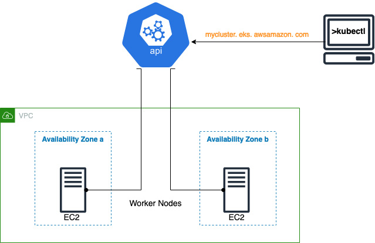
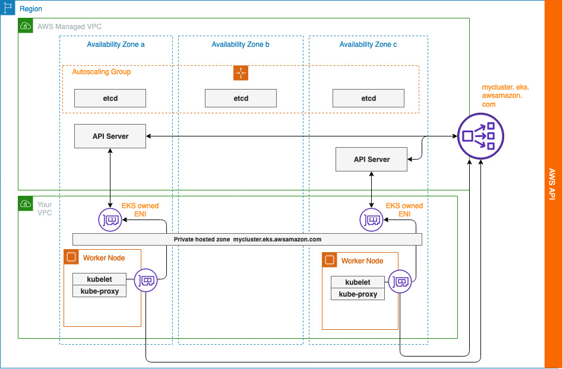
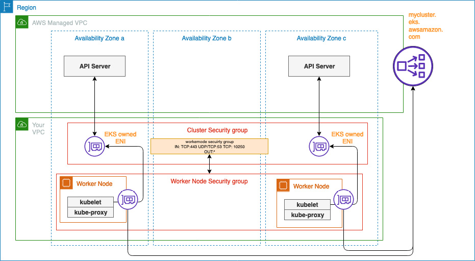

# Introducing Amazon EKS

## Overview

Building and managing a Kubernetes cluster manually can be a very complex and time-consuming task. Using a managed Kubernetes service removes the heavy lifting and allows users to focus on application development and deployment.

This chapter explores **Elastic Kubernetes Service (EKS)** and its technical architecture to understand its benefits and drawbacks.

## Chapter Topics Covered

- What is Amazon EKS?
- Understanding the EKS architecture
- Investigating the Amazon EKS pricing model
- Common mistakes when using EKS

## Technical Requirements

You should have familiarity with:

- What Kubernetes is and how it works
- AWS foundational services:
  - Virtual Private Cloud (VPC)
  - Elastic Computing Cloud (EC2)
  - Elastic Block Storage (EBS)
  - Elastic Load Balancer (ELB)
- Standard Kubernetes deployment tools

---

## What is Amazon EKS?

### The Genesis of EKS

According to **Cloud Native Computing Foundation (CNCF)** data, by the end of 2017, nearly **57% of Kubernetes environments** were running on AWS.

#### Pre-EKS Challenges

Before EKS, running Kubernetes on AWS required:

- Building clusters using tools like **Rancher** or **Kops** on EC2 instances
- Constant monitoring and management
- Deploying open source tools (Prometheus, Grafana)
- Operational staff ensuring availability and managing upgrades
- Regular release cadence: **three releases per year** (as of June 2021)

#### EKS Launch

As AWS service roadmap is driven by customer requirements, the effort needed to build and run Kubernetes on AWS led to **EKS release in June 2018**.

### What is EKS?

**Amazon EKS is Kubernetes!** AWS takes the open source code, adds AWS-specific plugins for identity and networking, and allows deployment in your AWS account.

- **AWS manages the control plane**
- **You connect compute and storage resources**
- **Run Pods and store Pod data**

### EKS Adoption

Leading organizations using Amazon EKS:
- Snap Inc.
- HSBC
- Delivery Hero
- Fidelity Investments

!!! info "Cloud Native Computing Foundation (CNCF)"
    CNCF is a Linux Foundation project founded in 2015, responsible for driving Kubernetes development and other cloud-native projects. CNCF has over 600 members including AWS, Google, Microsoft, Red Hat, SAP, Huawei, Intel, Cisco, IBM, Apple, and VMware.

---

## Why Use Amazon EKS?

### Primary Advantage

**No control plane management** - AWS handles:
- Deployment
- Scaling
- Fixing
- Upgrading (single-click operation)

The operational savings cannot be underestimated for production environments or when managing multiple clusters.

### AWS Ecosystem Integration

#### Network Integration
- **Pods are first-class network citizens**
- Have VPC network addresses
- Managed and controlled like any other AWS resources

#### Identity Integration
- **Pods can be allocated specific IAM roles**
- Simplifies how Kubernetes applications connect to AWS services (e.g., DynamoDB)

#### Monitoring Integration
- **Control and data plane logs/metrics sent to CloudWatch**
- Reporting, management, and visualization without additional servers

#### Flexible Compute and Storage
- **Mix compute options**: EC2 and/or Fargate
- **Mix storage options**: EBS and/or EFS
- Support variety of performance, cost, and security requirements

!!! important "Key Understanding"
    EKS is predominantly a **managed control plane**. The data plane uses standard AWS services (EC2 and Fargate) to provide the runtime environment for Pods. The data plane is typically managed by operational/development teams.

---

## Self-managed Kubernetes vs Amazon EKS

| Feature | Self-managed Kubernetes | Amazon EKS |
|---------|------------------------|-------------|
| **Full Control** | Yes | Mostly (no direct access to control plane servers) |
| **Kubernetes Version** | Community release | Community release |
| **Version Support** | 3 most recent minor releases (~1 year patch support for 1.19+, ~9 months for 1.18 and older) | **14 months support** after first being available on EKS |
| **Network Access Control** | Manually set up and configure VPC controls | EKS creates standard security groups and supports public IP whitelisting |
| **Authentication** | Manually set up and configure Kubernetes RBAC | **Integrated with AWS IAM** |
| **Scalability** | Manually setup and configure scaling | **Managed control plane** and standard compute/storage scaling |
| **Security** | Manually patched | **Control plane patching done by AWS** |
| **Upgrade** | Manually update and replace components | **Single-click upgrade** for control plane, managed node groups support simpler upgrades |
| **Monitoring** | Manual monitoring and platform support | **EKS monitoring and replacement** of unhealthy nodes, integrated with CloudWatch |

*Table 2.1 – Comparing self-managed Kubernetes and EKS*

---

## Understanding the EKS Architecture

### High-Level Architecture

Every EKS cluster has a **single endpoint URL** used by tools like kubectl. This URL hides all control plane servers deployed on an **AWS-managed VPC** across multiple Availability Zones.

The **data plane** typically consists of EC2 workers deployed across multiple Availability Zones with kubelet and kube-proxy agents configured to point to the cluster endpoint.


*Figure 2.1 – High-level overview of EKS architecture*

### EKS Control Plane Architecture

#### Control Plane Components

When a new cluster is created:

- **New control plane** created in AWS-owned VPC in separate account
- **Minimum of two API servers** per control plane
- **Spread across two Availability Zones** for resilience
- **Exposed through public Network Load Balancer (NLB)**
- **etcd servers spread across three Availability Zones**
- **Configured in autoscaling group** for resilience

#### Access and Connectivity

- **No direct access** to cluster servers for administrators/users
- **Only access K8s API through load balancer**
- **API servers integrated** with worker nodes via Elastic Network Interfaces (ENIs)
- **kubelet agent** uses Route 53 private hosted zone to resolve ENI IP addresses


*Figure 2.2 – Detailed EKS architecture*

!!! warning "Important Architecture Note"
    Since there's currently no private EKS endpoint, **worker nodes need internet access** to get cluster details through AWS EKS DescribeCluster API. This means subnets with worker nodes need either an internet/NAT gateway or route to the internet.

### Cluster Security

#### Security Groups

When a new cluster is created:

- **New security group created** controlling access to API server ENIs
- **Cluster security group** must allow network addresses needing API server access
- **Public clusters**: ENIs only used by worker nodes
- **Private clusters**: ENIs also used for client (kubectl) access

#### Worker Node Security

- **Separate security groups** configured for worker nodes
- **Security group referencing** feature allows referencing existing security groups
- **Minimum required access** from worker node security group:
  - HTTPS (TCP 443)
  - DNS (TCP/UDP 53)
  - kubelet commands and logs (TCP 10250)


*Figure 2.3 – EKS security groups*

---

## Understanding Your Cluster Through Command Line

### Discovering Clusters

#### List Available Clusters
```bash
$ aws eks list-clusters
{
    "clusters": [
        "mycluster13DCA0395"
    ]
}
```

#### Get Cluster Details
```bash
$ aws eks describe-cluster --name mycluster13DCA0395
{
    "cluster": {
        "status": "ACTIVE",
        "endpoint": "https://12.gr7.eu-central-1.eks.amazonaws.com",
        "name": "mycluster13DCA0395",
        "endpointPublicAccess": true,
        "endpointPrivateAccess": true
    }
}
```

### Configuring kubectl Access

#### Update kubeconfig
```bash
$ aws eks update-kubeconfig --name mycluster13DCA0395
Updated context arn:aws:eks:eu-central-1:676687:cluster/mycluster13DCA0395 in /../.kube/config
```

!!! important "Access Requirements"
    You need **IAM privileges to AWS EKS** to perform these commands, along with **K8s RBAC privilege** for kubectl commands, even with network access to the cluster endpoint.

### Exploring Cluster Resources

#### Get Cluster Nodes
```bash
$ kubectl get nodes
NAME           STATUS   ROLES    AGE   VERSION
ip-x.x.x.x.    Ready    <none>   25d   v1.21.5-eks-9017834
ip-x.x.x.x.    Ready    <none>   25d   v1.21.5-eks-9017834
```

#### Get Persistent Volumes
```bash
$ kubectl get pv --sort-by=.spec.capacity.storage
No resources found
```

#### Get All Pods
```bash
$ kubectl get po --all-namespaces
NAMESPACE     NAME              READY   STATUS    RESTARTS   AGE
kube-system   aws-node-d2vpk    1/1     Running   0          1d
kube-system   aws-node-ljdz6    1/1     Running   0          1d
kube-system   coredns-12        1/1     Running   0          1d
kube-system   coredns-12        1/1     Running   0          1d
kube-system   kube-proxy-bhw6p  1/1     Running   0          1d
kube-system   kube-proxy-fdqlb  1/1     Running   0          1d
```

This output shows:
- **Two worker nodes**
- **No physical volumes configured**
- **Key cluster services**:
  - **coredns**: Cluster DNS services
  - **kube-proxy**: Cluster networking
  - **aws-node**: AWS VPC CNI

---

## Amazon EKS Pricing Model

### Pricing Resources

- [Amazon EKS Pricing](https://aws.amazon.com/eks/pricing/)
- [AWS Pricing Calculator](https://calculator.aws)

!!! note "Pricing Updates"
    AWS pricing changes periodically. Always check the latest updates on the Amazon EKS pricing page for current details.

### Cost Structure

A single cluster incurs **two types of costs**:

1. **Fixed monthly costs** for EKS control plane
2. **Variable costs** from computing, networking, and storage resources

### Fixed Control Plan Costs

**Control plane pricing**: `$0.10 per hour`

**Monthly calculation**:
```
1 cluster × $0.10 USD per hour × 730 hours per month = $73.00 USD
```

This cost is **irrespective of scaling or failure recovery activities** managed by AWS.

### Variable Costs

The control plane needs compute resources to schedule and host Pods, requiring storage and networking based on **variable cost model**.

#### EC2 Compute Option

Costs fluctuate based on:
- **Size and number** of EC2 instances
- **Amount of storage** attached to instances
- **Region** of deployment
- **Pricing model**: On-demand, reserved instances, spot instances, or saving plans

#### Fargate Compute Option

Costs fluctuate based on:
- **Number of Fargate instances**
- **Instance operating system/CPU processor**
- **Region** of deployment
- **Per CPU/RAM per instance/hour** used
- **Amount of GB storage per instance**

### Network Cost Optimization

AWS charges for **egress traffic**, **cross-AZ traffic**, and **network services**. Best practices:

#### Application Design
- **Keep traffic inside worker nodes** when possible
- **Use Pod affinity labels** (EC2 only) to coexist services on same nodes

#### VPC Design
- **Keep traffic in same Availability Zones**
- **Deploy multiple NAT gateways** (one per AZ) to reduce cross-AZ charges
- **Full understanding of application network profile** needed

#### AWS Service Integration
- **Use private endpoints** for AWS API services (e.g., DynamoDB) to reduce egress costs

---

## Cost Estimation Examples

### Example 1: EKS Cluster with EC2 Worker Nodes

**Scenario**: EKS cluster in AWS US East Region (N. Virginia, us-east-1)

**Configuration**:
- 3 on-demand Linux EC2 instances (m5.large)
- Each with 20 GB EBS storage gp2 volume
- Cluster available all month (30 days, 730 hours)

**Cost Calculation**:
```
Control Plane: 1 cluster × $0.10 USD per hour × 730 hours = $73.00 USD
EC2 Instances: 3 instances × $0.096 USD × 730 hours = $210.24 USD
EBS Storage: 30 GB × $0.10 USD × 3 instances = $9.00 USD

Total Monthly Cost: $292.24 USD
```

!!! tip "Cost Optimization"
    In reality, these costs can be significantly reduced using saving plans, reserved instances, and storage options like gp3.

### Example 2: EKS Cluster with AWS Fargate

**Scenario**: Same cluster control plane/region

**Configuration**:
- 15 Pods running on 15 Fargate instances
- Each with 1 vCPU, 2 GB memory, 20GB ephemeral storage
- 15 tasks per day (730 hours/month ÷ 24 hours/day = 456.25 tasks/month)

**Cost Calculation**:
```
Control Plane: 1 cluster × $0.10 USD per hour × 730 hours = $73.00 USD
vCPU Hours: 456.25 tasks × 1 vCPU × 1 hour × $0.04048 = $18.47 USD
GB Hours: 456.25 tasks × 2.00 GB × 1 hour × $0.004445 = $4.06 USD
Storage: 20 GB - 20 GB (no additional charge) = $0.00 USD

Total Monthly Cost: $95.53 USD
```

### Cost Comparison Analysis

- **EC2 Cost**: $292.24
- **Fargate Cost**: $95.53

**Key Considerations**:
- Fargate example: 15 Pods executing 1 hour/day
- EC2: Pay for compute nodes regardless of Pod execution time
- **Mixed environments** common: EC2 for long-running Pods, Fargate for batch operations or enhanced security

---

## Common Mistakes When Using EKS

### 1. Leaving Clusters Running

**Problem**: Forgetting to shut down unused clusters
**Solution**: 
- Shut down clusters when not needed
- Remove or scale in node groups
- Dev/test environments cost real money

### 2. Not Having Access

**Problem**: Only AWS user account that created cluster has initial access
**Solution**: 
- Add users, groups, or roles to **aws-auth ConfigMap**
- Required for kubectl access by other users
- See Chapter 6: Securing and Accessing Clusters on EKS

### 3. Running Out of Pod IP Addresses

**Problem**: With AWS CNI, every Pod gets VPC IP address
**Solution**:
- Configure VPC and EKS cluster correctly
- Prevent IP address exhaustion
- See Chapter 7: Networking in EKS

### 4. Cluster IP Address Not Accessible

**Problem**: Network connectivity issues
**Considerations**:
- **Private clusters**: Only accessible from AWS and connected private networks
- **Public clusters**: Accessible from internet
- **Firewall rules** between client and API servers
- **Security group configurations**

---

## Summary

This chapter described how **EKS is a managed version of Kubernetes** with key differences:

### AWS Responsibilities
- **Manage and scale control plane** (API servers, etcd)
- **Control plane patching and updates**
- **High availability and resilience**

### User/Administrator Responsibilities
- **Deploy compute and storage resources**
- **Host Pods on the cluster**
- **Manage data plane components**

### Key Takeaways

- **Technical architecture** of AWS-managed control plane
- **Limited ability** to modify control plane servers
- **Fixed control plane costs** vs **variable compute/storage costs**
- **Common mistakes** to avoid for first-time users

The next chapter will cover creating an EKS cluster and setting up the environment using different tools.

---

## Further Reading

- [EKS Price Reductions](https://aws.amazon.com/about-aws/whats-new/2020/01/amazon-eks-announces-price-reduction/)
- [A Deep Dive into Amazon EKS](https://www.youtube.com/watch?v=cipDJwDWWbY)
- [AWS EKS SLA](https://aws.amazon.com/eks/sla/)