# Building Your First EKS Cluster

## Overview

Although EKS is a managed service from AWS, there are multiple ways to create clusters using the console, Command-Line Interface (CLI), and Infrastructure as Code (IaC). This chapter focuses on prerequisites for building a cluster and the basic configuration needed to build your first cluster.

## Chapter Topics Covered

- Understanding the prerequisites for building an EKS cluster
- Understanding different configuration options for an EKS cluster
- Enumerating automation options
- Creating your first EKS cluster

## Technical Requirements

### Prerequisites

- Familiarity with cloud automation (ideally CloudFormation)
- Experience with programming languages or software development
- **AWS account** to launch EKS resources

!!! warning "AWS Charges"
    These activities will result in AWS charges. Make sure to delete all resources after building them.

---

## Understanding Prerequisites for Building an EKS Cluster

### AWS Account Setup

By default, the email address and password used to create the AWS account are the **root user's credentials** with privileges to do everything in the AWS Account.

**AWS Best Practice**: Enable Multi-Factor Authentication (MFA) on root account and never use this account except in emergencies.

### Required Activities

Complete these activities once you have an AWS account and root user access:

1. **Configure AWS CLI environment** with temporary root credentials
2. **As root user, create**:
   - EKS admin policy using least privileges
   - EKS cluster Admin group and assign EKS Admin role
   - New user and add to EKS cluster Admin group
   - Access credentials and add to AWS CLI configuration
3. **Install kubectl** on your workstation

### Step 1: Configure AWS CLI with Temporary Root Credentials

Instead of using `aws configure` (which persists credentials), use environment variables:

```bash
export AWS_ACCESS_KEY_ID=<root access key>
export AWS_SECRET_ACCESS_KEY=<root secret access key>
export AWS_DEFAULT_REGION=<working region>
```

### Step 2: Create EKS Admin Policy

#### Option A: Use AWS-Managed AdministratorAccess Role

```bash
$ export EKSARN=$(aws iam list-policies --query 'Policies[?PolicyName==`AdministratorAccess`].{ARN:Arn}' --output text)
```

!!! note "Security Consideration"
    AdministratorAccess role is very broad and provides more privileges than needed. Ideally, create an EKS admin role with reduced permissions following the least-privilege security model.

#### Option B: Create Custom EKS Admin Policy

**Minimum required permissions**:

| AWS Resource | Minimal Permission Set |
|--------------|----------------------|
| **EC2 API** | `ec2:RunInstances`, `ec2:RevokeSecurityGroupIngress`, `ec2:RevokeSecurityGroupEgress`, `ec2:DescribeRegions`, `ec2:DescribeVpcs`, `ec2:DescribeTags`, `ec2:DescribeSubnets`, `ec2:DescribeSecurityGroups`, `ec2:DescribeRouteTables`, `ec2:DescribeLaunchTemplateVersions`, `ec2:DescribeLaunchTemplates`, `ec2:DescribeKeyPairs`, `ec2:DescribeInternetGateways`, `ec2:DescribeImages`, `ec2:DescribeAvailabilityZones`, `ec2:DescribeAccountAttributes`, `ec2:DeleteTags`, `ec2:DeleteSecurityGroup`, `ec2:DeleteKeyPair`, `ec2:CreateTags`, `ec2:CreateSecurityGroup`, `ec2:CreateLaunchTemplateVersion`, `ec2:CreateLaunchTemplate`, `ec2:CreateKeyPair`, `ec2:AuthorizeSecurityGroupIngress`, `ec2:AuthorizeSecurityGroupEgress` |
| **EKS API** | `eks:UpdateNodegroupVersion`, `eks:UpdateNodegroupConfig`, `eks:UpdateClusterVersion`, `eks:UpdateClusterConfig`, `eks:UntagResource`, `eks:TagResource`, `eks:ListUpdates`, `eks:ListTagsForResource`, `eks:ListNodegroups`, `eks:ListFargateProfiles`, `eks:ListClusters`, `eks:DescribeUpdate`, `eks:DescribeNodegroup`, `eks:DescribeFargateProfile`, `eks:DescribeCluster`, `eks:DeleteNodegroup`, `eks:DeleteFargateProfile`, `eks:DeleteCluster`, `eks:CreateNodegroup`, `eks:CreateFargateProfile`, `eks:CreateCluster` |
| **KMS API** | `kms:ListKeys` |
| **IAM API** | `iam:PassRole`, `iam:ListRoles`, `iam:ListRoleTags`, `iam:ListInstanceProfilesForRole`, `iam:ListInstanceProfiles`, `iam:ListAttachedRolePolicies`, `iam:GetRole`, `iam:GetInstanceProfile`, `iam:DetachRolePolicy`, `iam:DeleteRole`, `iam:CreateRole`, `iam:AttachRolePolicy` |

**Example Policy Document** (KMS permissions only for simplicity):

```json
{
    "Version": "2012-10-17",
    "Statement": [
        {
            "Sid": "KMSPermissions",
            "Effect": "Allow",
            "Action": ["kms:ListKeys"],
            "Resource": "*"
        }
    ]
}
```

**Create the policy**:

```bash
$ aws iam create-policy --policy-name bespoke-eks-policy --policy-document file://<mypolicyfile.json>
$ export EKSARN=$(aws iam list-policies --query 'Policies[?PolicyName==`bespoke-eks-policy`].{ARN:Arn}' --output text)
```

### Step 3: Create EKS Admin Group

```bash
$ aws iam create-group --group-name EKS-Admins
$ aws iam attach-group-policy --policy-arn $EKSARN --group-name EKS-Admins
```

### Step 4: Create New User

```bash
$ aws iam create-user --user-name <MYUSERNAME>
$ aws iam add-user-to-group --user-name <MYUSERNAME> --group-name EKS-Admins
$ aws iam update-login-profile --user-name <MYUSERNAME> --password <password>
```

**Create access credentials**:

```bash
$ aws iam create-access-key --user-name <MYUSERNAME>
{
    "AccessKey": {
        "UserName": "<MYUSERNAME>",
        "Status": "Active",
        "CreateDate": "2022-08-19T11:01:07Z",
        "SecretAccessKey": "67ghjghjhjihk",
        "AccessKeyId": "hgjgjgjhgjhgj"
    }
}
```

Copy the credentials and use `aws configure` to add them to your CLI configuration.

!!! info "Additional Setup Required"
    - [Console access setup](https://docs.aws.amazon.com/IAM/latest/UserGuide/console_controlling-access.html)
    - [Enable MFA](https://docs.aws.amazon.com/IAM/latest/UserGuide/id_credentials_mfa.html)

### Step 5: Install kubectl

Follow the [kubectl installation guide](https://docs.aws.amazon.com/eks/latest/userguide/install-kubectl.html).

---

## Understanding EKS Configuration Options

Kubernetes is extensible by default, which contributes to its popularity. Beyond standard API objects (Pods, Services), you can extend the API with custom resources, controllers, operators, and plugins.

### EKS Configuration Domains

| Configuration Domain | Description | Chapter Reference |
|---------------------|-------------|------------------|
| **Control Plane** | EKS managed control plane (always required) | This chapter |
| **Basic Networking** | Default AWS EKS VPC plugin (CNI) | Chapter 7 (detailed) |
| **Base Node Group** | Small node group on EC2 for key cluster resources | This chapter |
| **Pod Storage Services** | Storage configuration | Chapter 12 |
| **Additional Node Groups** | Multiple node group configurations | Chapter 8 |
| **Fargate Profiles** | Serverless compute profiles | Chapter 15 |
| **Kubernetes Applications** | Application deployments | Chapters 11, 13, 14 |
| **Advanced Networking** | Complex networking concepts | Chapter 8 |
| **Service Mesh** | Service mesh implementation | Chapter 16 |

---

## Enumerating Automation Options

### Evolution of Infrastructure Automation in AWS

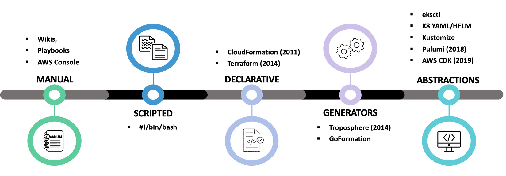
*Figure 3.1 – Automation options*

#### Stage 1: Manual Configuration
- **Method**: Playbooks, wikis, AWS console
- **Challenge**: Difficult to repeat, manual changes required

#### Stage 2: Shell Scripts
- **Method**: AWS CLI automation
- **Challenge**: Not idempotent, same command can produce different results

#### Stage 3: Infrastructure as Code (IaC)
- **AWS CloudFormation (2011)**: Safe infrastructure resource creation
- **HashiCorp Terraform (2014)**: Popular alternative with own markup language
- **Challenge**: Complex markup languages to learn

#### Stage 4: Code Generators and Abstractions
- **AWS CDK**: Generate CloudFormation using programming languages (Python, TypeScript)
- **eksctl**: Simple interface for EKS cluster provisioning
- **Kubernetes Tools**: Helm charts, Kustomize for Kubernetes resource abstraction

### Choosing the Right Automation Tool

**General Rule**: **Don't Repeat Yourself (DRY)**

If creating/deleting clusters regularly, use automation with the highest level of abstraction possible.

#### Tool Recommendations

**High-Level Abstractions** (Recommended):
- **AWS CDK**: No need to learn CloudFormation, uses programming languages
- **eksctl**: No CloudFormation knowledge required, EKS-specific

**Cross-Cloud Support**:
- **Terraform**: Supports AWS, Microsoft Azure, Google Cloud Platform, on-premises resources

---

## Creating Your First EKS Cluster

### Verify Credentials

```bash
$ aws sts get-caller-identity
{
    "UserId": "<MYUSERNAME>",
    "Account": "11112222333",
    "Arn": "arn:aws:sts::11112222333:<MYUSERNAME>/IAM_ROLE"
}
```

---

## Option 1: Creating EKS Cluster with AWS Console

### Prerequisites
1. Open browser and navigate to [AWS Console](https://aws.amazon.com/)
2. Sign in with credentials created in prerequisites

### Step-by-Step Process

#### Step 1: Create Cluster Service Role
1. Type **IAM** in search bar, select **IAM | Roles**
2. Click **Create Role** button
3. Create cluster Service role allowing cluster to make calls to other AWS Services
4. Link to **AmazonEKSClusterPolicy** managed policy
5. Reference: [Service IAM Role Documentation](https://docs.aws.amazon.com/eks/latest/userguide/service_IAM_role.html)

#### Step 2: Access EKS Service
1. Select desired region for EKS cluster
2. Type **EKS** in search bar
3. Select **Elastic Kubernetes Service**

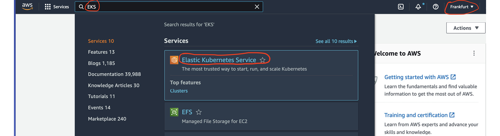
*Figure 3.2 – Select EKS*

#### Step 3: Start Cluster Creation
1. Click **Add cluster | Create** button

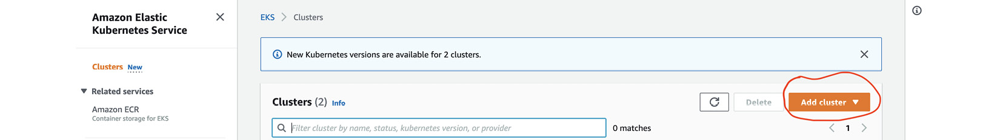
*Figure 3.3 – Add cluster*

#### Step 4: Configure Cluster Basic Settings
1. Enter **cluster name** in Name field
2. Select **Kubernetes version** from dropdown
3. Select **Service role** created in Step 1
4. Click **Next**

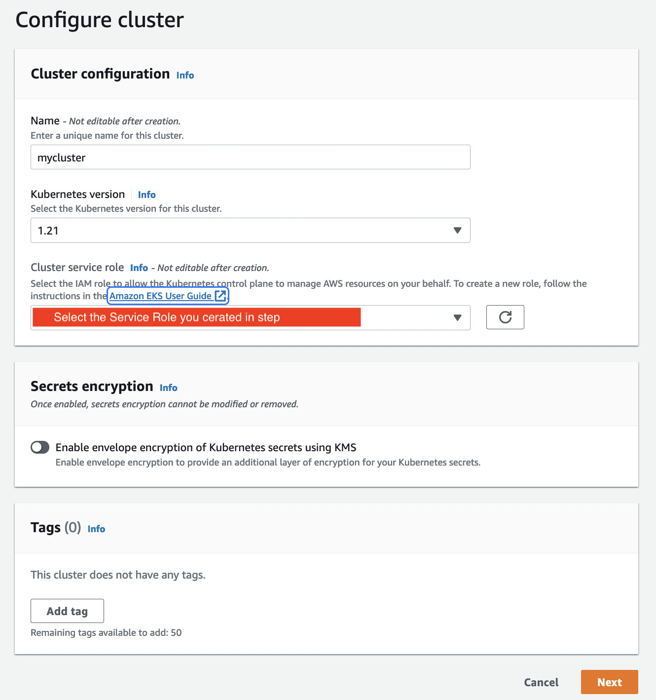
*Figure 3.4 – Configure cluster*

#### Step 5: Configure Networking - VPC and Security Groups
1. Select **VPC and subnets** for control plane
2. Select **security group** for worker nodes
3. If resources don't exist, use VPC console link (open in new tab)

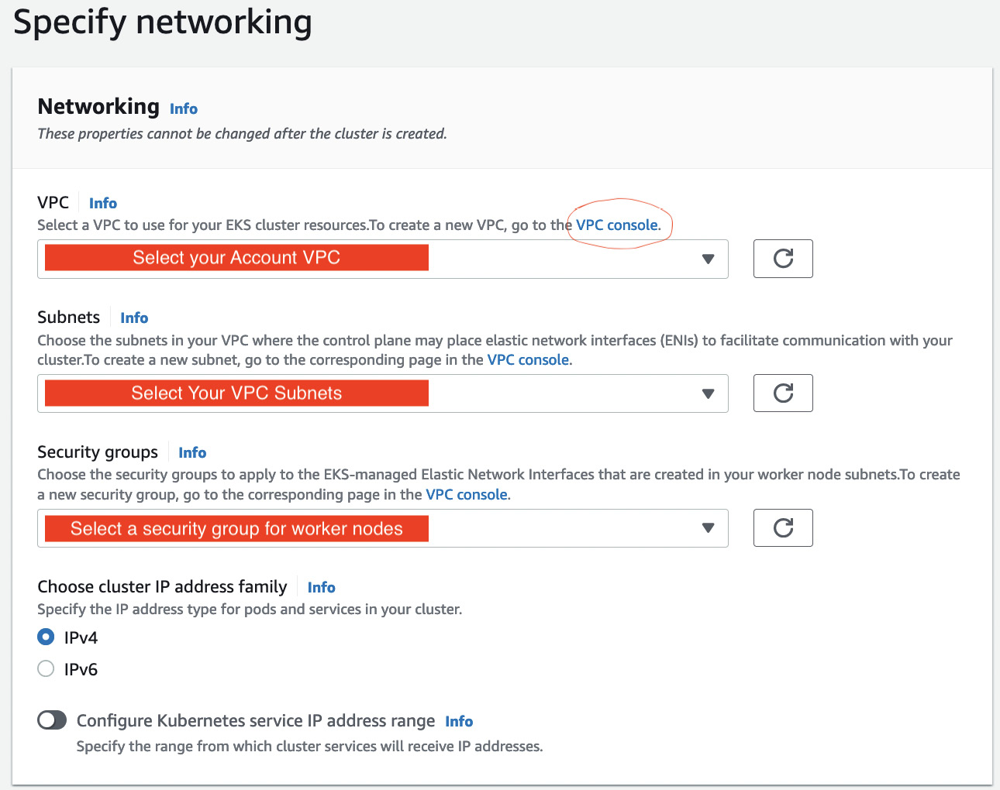
*Figure 3.5 – Enter VPC and security group details*

#### Step 6: Configure Cluster Endpoints
1. Select cluster endpoint type
2. Keep **Public** default (cluster API accessible from internet)


*Figure 3.6 – Cluster endpoints*

#### Step 7: Complete Networking Configuration
1. Leave defaults (relate to Kubernetes version)
2. Click **Next**

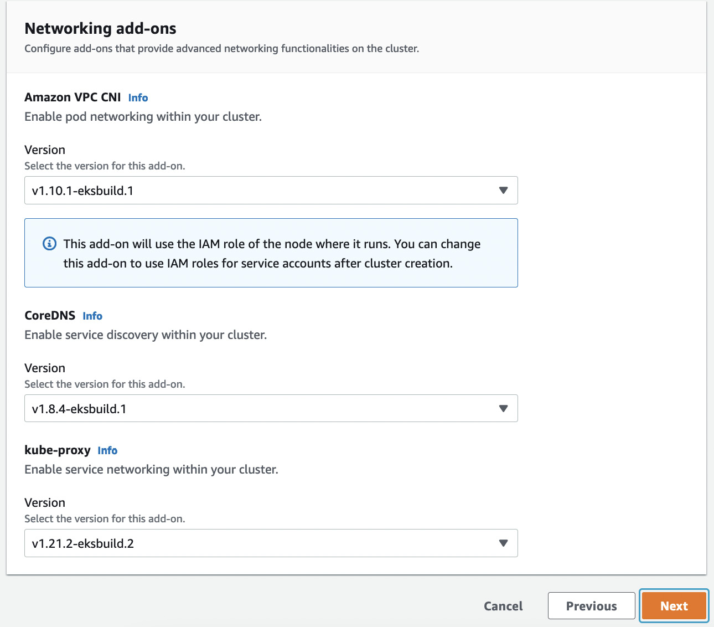
*Figure 3.7 – Complete networking section*

#### Step 8: Enable Logging
1. Enable **Audit logging** to CloudWatch logs
2. Click **Next**

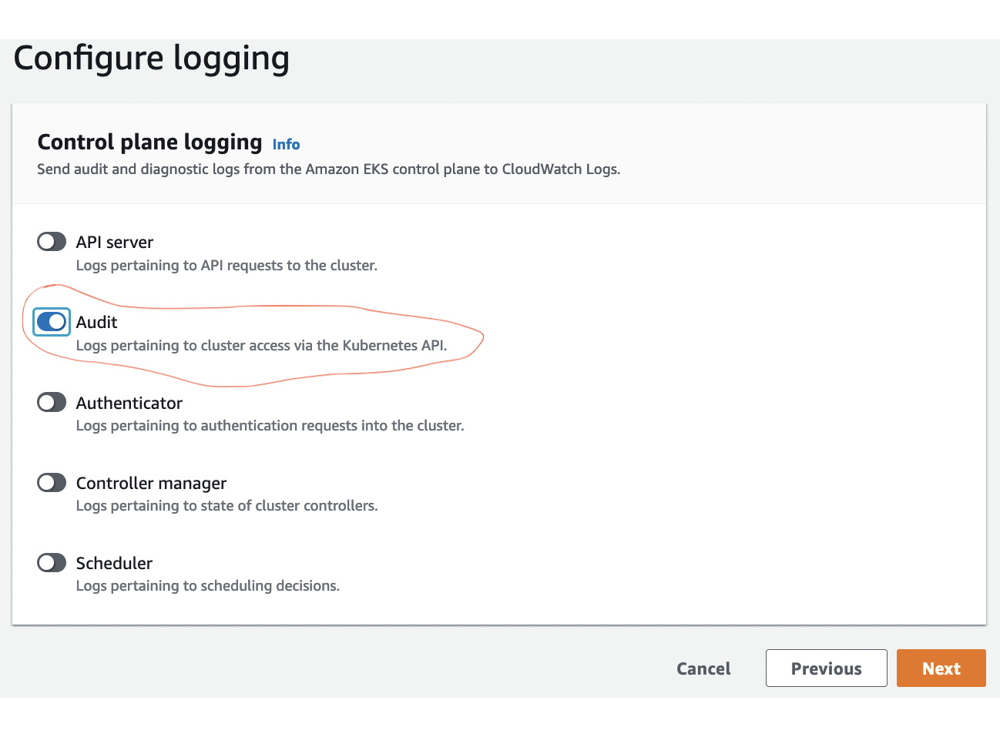
*Figure 3.8 – Control plane logging*

#### Step 9: Review and Create
1. Review cluster settings
2. Click **Create** button
3. **Duration**: 20-30 minutes
4. **Process**: Sets up control plane (API and etcd servers) in AWS-owned VPC, connects through ENIs to your VPC


*Figure 3.9 – An active cluster*

#### Step 10: Configure kubectl Access
```bash
$ aws eks update-kubeconfig --cluster <CLUSTERNAME> --region <YOURREGION>
```

**Verify no nodes attached**:
```bash
$ kubectl get nodes
No resources found
```

#### Step 11: Add Node Group
1. Click cluster name link
2. Click **Compute** tab
3. Click **Add node group** button

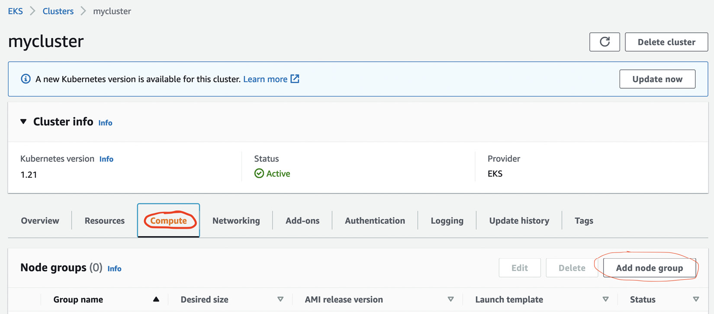
*Figure 3.10 – Compute*

#### Step 12: Configure Node Group
1. Enter **node group name**
2. Select **EC2 worker IAM role**
3. If role doesn't exist, create using [Node Role Documentation](https://docs.aws.amazon.com/eks/latest/userguide/create-node-role.html)

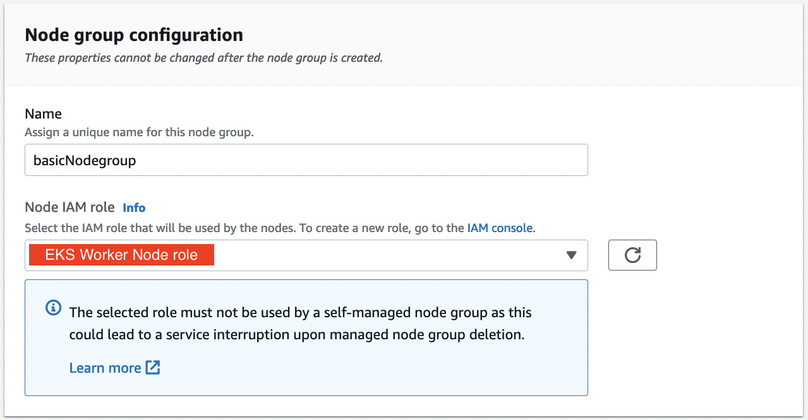
*Figure 3.11 – Node group configuration*

#### Step 13: Set Compute Configuration
1. Accept defaults:
   - Two **t3.medium** EC2 instances
   - **Autoscaling group**
   - **EKS-optimized Amazon Linux** OS image
2. Click **Next**

#### Step 14: Configure Node Group Networking
1. Select **subnets** for EC2 worker nodes
2. Select **at least two subnets/availability zones**
3. Click **Next**

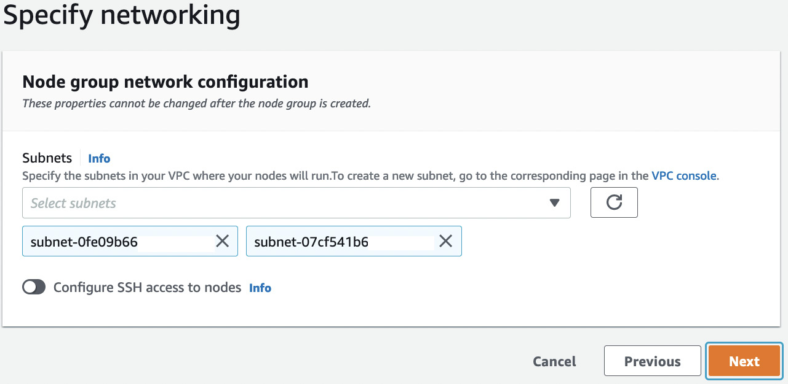
*Figure 3.12 – Node group networking*

#### Step 15: Review and Create Node Group
1. Review settings
2. Click **Create** button
3. **Duration**: 10-20 minutes
4. **Process**: Creates two EC2 instances, configures Kubernetes agents (kubelet, kubeproxy), connects to control plane

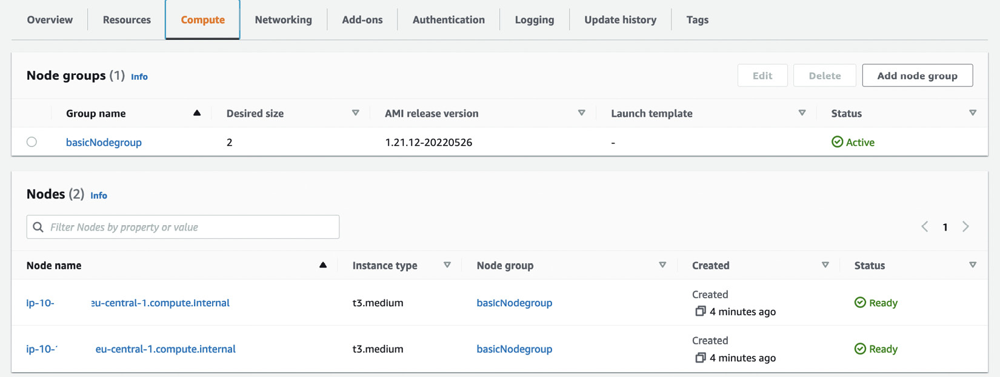
*Figure 3.13 – Active node group*

#### Step 16: Verify Node Group
```bash
$ kubectl get nodes
NAME           STATUS   ROLES    AGE   VERSION
ip-x.x.x.x     Ready    <none>   5m    v1.22.x-eks-xxxxx
ip-x.x.x.x     Ready    <none>   5m    v1.22.x-eks-xxxxx
```

#### Step 17: Cleanup
1. Delete node group first
2. Delete cluster

!!! info "Console Interface Updates"
    AWS console interface may change. Check [EKS cluster creation documentation](https://docs.aws.amazon.com/eks/latest/userguide/create-cluster.html) and [managed node groups documentation](https://docs.aws.amazon.com/eks/latest/userguide/create-managed-node-group.html) for latest steps.

---

## Option 2: Creating EKS Cluster with AWS CLI

### Prerequisites
- Install AWS CLI: [Installation Guide](https://docs.aws.amazon.com/cli/latest/userguide/getting-started-install.html)
- Reuse cluster Service role and subnets from Option 1 (create if they don't exist)

### Step-by-Step Process

#### Step 1: Create Control Plane
```bash
$ aws eks create-cluster \
  --region <MYREGION> \
  --name mycluster \
  --kubernetes-version 1.22 \
  --role-arn <MYSERVICEROLEARN> \
  --resources-vpc-config subnetIds=subnet-1,subnet-2,securityGroupIds=sg-a
```

**Duration**: 20-30 minutes


*Figure 3.14 – Active cluster*

#### Step 2: Verify Control Plane
```bash
$ aws eks update-kubeconfig --name mycluster --region <MYREGION>
$ kubectl get nodes
No resources found
```

#### Step 3: Create Node Group
```bash
$ aws eks create-nodegroup \
  --region <MYREGION> \
  --cluster-name mycluster \
  --nodegroup-name basicCLI \
  --scaling-config minSize=2,maxSize=2,desiredSize=2 \
  --subnets subnet-1 subnet-2 \
  --ami-type AL2_x86_64 \
  --node-role <EKSWORKERNODEROLEARN>
```

**Duration**: 10-20 minutes

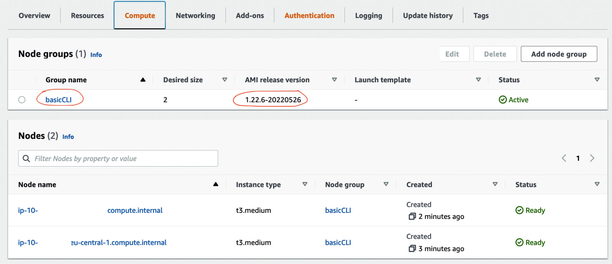
*Figure 3.15 – A CLI node group*

#### Step 4: Verify Node Group
```bash
$ kubectl get nodes
NAME           STATUS   ROLES    AGE   VERSION
ip-x.x.x.x     Ready    <none>   5m    v1.22.x-eks-xxxxx
ip-x.x.x.x     Ready    <none>   5m    v1.22.x-eks-xxxxx
```

#### Step 5: Cleanup
```bash
$ aws eks delete-nodegroup --cluster-name <CLUSTER_NAME> --nodegroup-name <NODEGROUP_NAME> --region <REGION>
$ aws eks delete-cluster --name <CLUSTER_NAME> --region <REGION>
```

### CLI Advantages
- **Simpler** than console clicking
- **Scriptable** with environment variables
- **Parameterizable** inputs

### CLI Limitations
- **Not guaranteed idempotent**
- **Problematic** script execution on failures
- **Better approach**: Use Infrastructure as Code (IaC)

---

## Option 3: Creating EKS Cluster with Terraform

### Prerequisites
- Install Terraform: [Installation Guide](https://learn.hashicorp.com/tutorials/terraform/install-cli)

### Overview
Terraform is an open source project by HashiCorp consisting of a single binary for validating, deploying, and deleting AWS infrastructure resources.

### Step-by-Step Process

#### Step 1: Clone Official Example
```bash
$ git clone https://github.com/hashicorp/learn-terraform-provision-eks-cluster
$ cd learn-terraform-provision-eks-cluster
```

This complete solution creates **53 resources** including:
- New VPC
- Two managed worker node groups
- All associated roles and permissions

#### Step 2: Modify Configuration Files

| Terraform File | Required Changes |
|----------------|------------------|
| `./vpc.tf` | Change region variable:<br/>`variable "region" {`<br/>`  default = "eu-central-1"`<br/>`  description = "AWS region"`<br/>`}` |
| `./eks-cluster.tf` | Change EKS version:<br/>`module "eks" {`<br/>`  cluster_version = "1.22"`<br/>`}` |

#### Step 3: Initialize Terraform
```bash
$ terraform init
```
- Creates local state
- Downloads remote module files (VPC module, etc.)
- Success message: "Terraform has been successfully initialized!"

#### Step 4: Plan Deployment
```bash
$ terraform plan
```
**Major advantage**: See what resources will be created before deployment, and what will change when modifying .tf files.

#### Step 5: Apply Configuration
```bash
$ terraform apply -auto-approve
```
**Duration**: 20-30 minutes

**Creates**:
- New IAM role
- EKS cluster in new VPC
- Internet and NAT gateways
- Two managed node groups with three EC2 instances

#### Step 6: Verify Deployment
```bash
$ aws eks update-kubeconfig --name <cluster-name> --region <region>
$ kubectl get nodes
NAME           STATUS   ROLES    AGE   VERSION
ip-x.x.x.x     Ready    <none>   5m    v1.22.x-eks-xxxxx
ip-x.x.x.x     Ready    <none>   5m    v1.22.x-eks-xxxxx
ip-x.x.x.x     Ready    <none>   5m    v1.22.x-eks-xxxxx
```

#### Step 7: Cleanup
```bash
$ terraform destroy -auto-approve
```
Terraform automatically determines deletion order.

### Terraform Advantages
- **Powerful** resource management
- **Idempotent** operations
- **Declarative** configuration
- **Plan before apply**

### Terraform Limitations
- Requires learning **Terraform syntax and markup language**
- **Complex** for simple use cases

---

## Option 4: Creating EKS Cluster with eksctl

### Overview
**eksctl** is an open source project co-developed between Weaveworks and AWS. It's a single binary that creates AWS resources but can **only be used for EKS clusters**.

### Prerequisites
- Install eksctl: [Installation Guide](https://docs.aws.amazon.com/eks/latest/userguide/eksctl.html)

### Step-by-Step Process

#### Step 1: Test Installation
```bash
$ eksctl info
```

#### Step 2: Create Basic Cluster
```bash
$ eksctl create cluster --name mycluster --region eu-central-1
```

**Process**:
- Creates VPC, EKS cluster, node group, and associated resources
- Uses **CloudFormation** under the covers
- Creates **two CloudFormation stacks** with 29+ AWS resources
- Stack naming: `eksctl-xx`

#### Step 3: Verify CloudFormation Stacks
```bash
$ aws cloudformation list-stacks
```
You'll see stacks called `eksctl-xx`:
- **Main stack**: VPC and core resources
- **Node group stack**: Specific to node group

#### Step 4: Verify Deployment
```bash
$ aws eks update-kubeconfig --name mycluster --region eu-central-1
$ kubectl get nodes
NAME           STATUS   ROLES    AGE   VERSION
ip-x.x.x.x     Ready    <none>   5m    v1.22.x-eks-xxxxx
ip-x.x.x.x     Ready    <none>   5m    v1.22.x-eks-xxxxx
```

#### Step 5: Custom Configuration Example
```bash
$ eksctl create cluster \
  --name mycluster \
  --instance-types m5.xlarge \
  --nodes 2 \
  --region eu-central-1
```

#### Step 6: View All Options
```bash
$ eksctl create cluster --help
```

#### Step 7: Cleanup
```bash
$ eksctl delete cluster --name mycluster --region eu-central-1
```

**Built-in features**: Node draining during deletion

### eksctl Advantages
- **Higher level abstraction** than Terraform
- **EKS-specific** optimizations
- **CloudFormation state management**
- **Built-in best practices**

### eksctl Limitations
- **EKS-only** tool (not as versatile as Terraform)
- Limited to AWS EKS resources

---

## Option 5: Creating EKS Cluster with AWS CDK

### Overview
AWS CDK uses CloudFormation under the cover but has **four main advantages** over eksctl:

1. **Standard programming languages** (Python, TypeScript, Golang) instead of markup
2. **Language control constructs** (IF-THEN-ELSE, FOR loops) and existing libraries
3. **Non-EKS resources** (DynamoDB, etc.)
4. **Standard language tools** for testing and linting (pylint, pytest)

### Python CDK Example

| Python Code | Description |
|-------------|-------------|
| `my_vpc = ec2.Vpc.from_lookup(self,"clusterVPC",vpc_id=params['VPC'])` | Uses CDK ec2.Vpc object to retrieve VPC details from AWS account |
| `eks_master_role = iam.Role.from_role_arn(self,"iderole",params['IDEROLE'])` | Uses CDK iam.Role object to retrieve role details for cluster admin role |
| `security_group = ec2.SecurityGroup.from_lookup_by_id(self,"idesg",params['IDESG'])` | Uses CDK SecurityGroup object to retrieve existing security group |
| `my_subnets=[]`<br/>`for subnet in params['SUBID']:`<br/>`  my_subnets.append(ec2.Subnet.from_subnet_id(self,f"1{subnet.split('-')[1]}",subnet_id=subnet))` | Creates subnet list using standard FOR loop, iterates over subnet IDs, creates subnet objects |
| `eks.Cluster(self,params['CLUSTERNAME'],`<br/>`  masters_role=eks_master_role,`<br/>`  security_group=security_group,`<br/>`  version=eval(f"eks.KubernetesVersion.{params['VERSION']}"),`<br/>`  vpc=my_vpc,`<br/>`  vpc_subnets=my_subnets,`<br/>`  endpoint_access=eval(f"eks.EndpointAccess.{params['CLUSTERTYPE']}"))` | Creates cluster using retrieved resources and configuration from params dictionary |

### CDK Commands

| Command | Purpose |
|---------|---------|
| `cdk bootstrap` | Initialize AWS region for CDK deployments |
| `cdk synth` | Create CloudFormation templates |
| `cdk diff` | Understand what will be deployed or changed |
| `cdk deploy` | Create and deploy CloudFormation templates |

### CDK Advantages
- **Highest level of abstraction**
- **Programming language familiarity**
- **Complex logic support**
- **Testing and linting capabilities**

!!! info "CDK Learning Resources"
    For detailed CDK exploration, visit the [CDK Workshop](https://cdkworkshop.com/).

---

## Summary

This chapter examined the **prerequisites and configuration** needed for Amazon EKS cluster deployment:

### Key Learnings

1. **Prerequisites Setup**:
   - Deployment user configuration
   - IAM roles and policies
   - CLI tool installation

2. **Configuration Options**:
   - Different EKS configuration domains
   - Framework and tool availability

3. **Five Deployment Options**:
   - AWS Console (manual)
   - AWS CLI (scriptable)
   - Terraform (cross-cloud IaC)
   - eksctl (EKS-specific)
   - AWS CDK (programming language-based)

### Automation Tool Selection

**Recommendation Hierarchy** (highest to lowest abstraction):
1. **AWS CDK** - Programming languages, maximum flexibility
2. **eksctl** - EKS-specific, simple interface
3. **Terraform** - Cross-cloud, powerful but complex markup
4. **AWS CLI** - Scriptable but not idempotent
5. **AWS Console** - Manual, good for learning

### Results Achieved

After completing this chapter, you have:
- **Provisioned EKS cluster** in your AWS account
- **Running cluster** with worker nodes
- **kubectl and AWS CLI** installed and configured
- **Understanding** of different deployment approaches

The next chapter will cover deploying and running containerized applications on Amazon EKS.

---

## Further Reading

- [Making AWS API calls safely](https://docs.aws.amazon.com/AWSEC2/latest/APIReference/Run_Instance_Idempotency.html)
- [CDK Deep Dive](https://cdkworkshop.com/)
- [CloudFormation Overview](https://docs.aws.amazon.com/AWSCloudFormation/latest/UserGuide/Welcome.html)
- [Terraform Overview](https://www.terraform.io/intro)
- [Getting Started with eksctl](https://eksctl.io/)