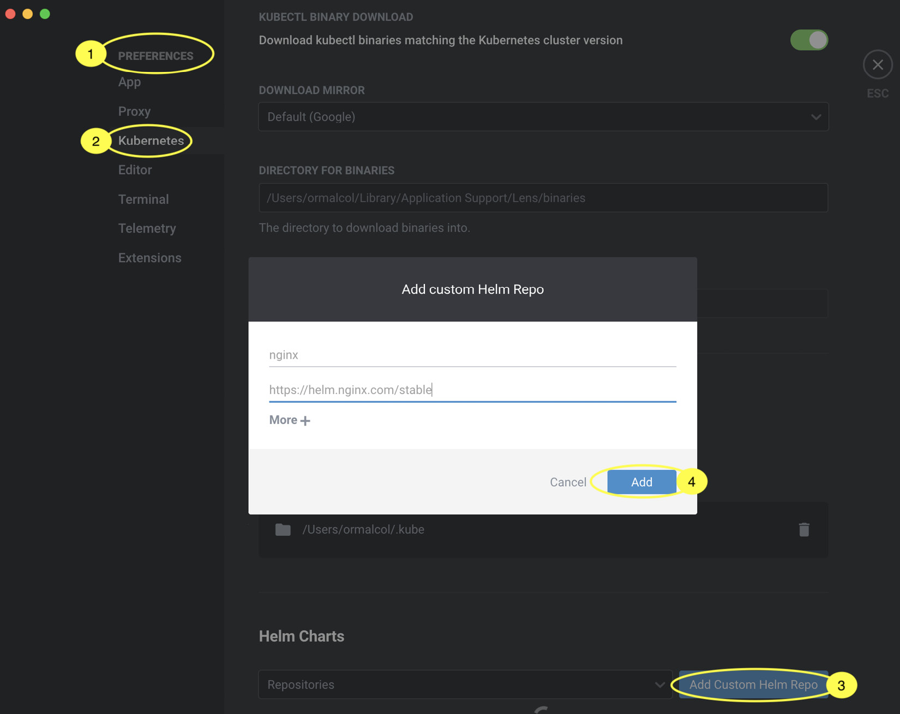
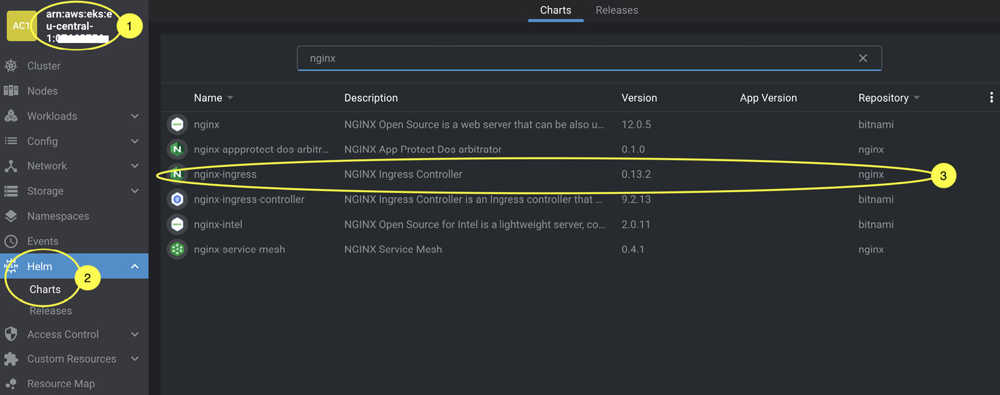
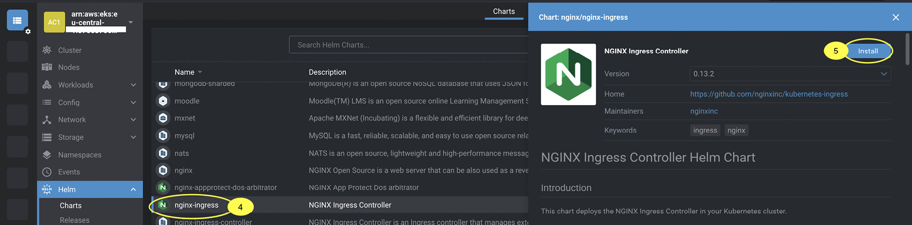
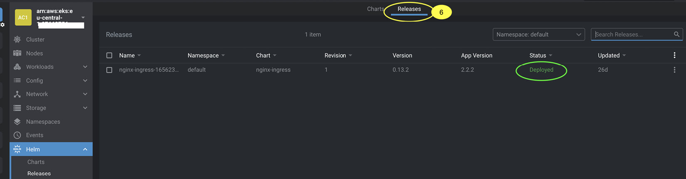

# Using Helm to Manage Kubernetes Applications

## Overview

This chapter introduces Helm, a tool for defining, installing, and upgrading complex Kubernetes applications. Helm allows easy customization of deployments for different environments, solving the limitation of fixed manifest files in kubectl deployments.

## Topics Covered

- Understanding Helm and its architecture
- Installing the Helm binary
- Deploying a sample Kubernetes application with Helm
- Creating, deploying, updating, and rolling back a Helm chart
- Deleting an application via Helm
- Deploying a Helm chart with Lens

!!! note
    Helm is an abstraction on top of Kubernetes, so there's no difference between using Helm on EKS or another Kubernetes distribution. This chapter focuses on basic Helm functionality.

## Technical Requirements

Before starting, ensure the following:

- Working EKS cluster with administrative access
- kubectl installed and properly configured
- Network connectivity to EKS API endpoint
- Familiarity with YAML, basic networking, and EKS architecture

## Understanding Helm and Its Architecture

As applications become more complex with multiple components, dependencies, and frequent deployments, standard Kubernetes YAML templates become insufficient. Helm serves as the package management tool for Kubernetes, similar to APT/YUM on Linux, Homebrew on Mac, or Chocolatey on Windows.

### Helm Components

Helm consists of four main components:

1. **Charts**: A package of pre-configured Kubernetes resources
2. **Releases**: A specific instance of a chart deployed to the cluster using Helm
3. **Repositories**: A group of published charts available to others
4. **Helm binary**: A tool used to deploy charts/releases

### The Benefits of Helm

#### Primary Benefits

- **Simplifies Kubernetes resource creation and deployment**
- **Enables DRY (Don't Repeat Yourself) approach**
- **Allows default attributes with override capability**
- **Supports different use cases and environments**
- **Easy sharing through Helm Chart Repositories**

#### Example Use Case

Instead of manually creating manifests for Prometheus in development and production environments, you can simply:

```bash
helm repo add prometheus-community https://prometheus-community.github.io/helm-charts
helm install stable/prometheus
```

#### Alternatives to Helm

- **Kustomize**: Builds on layers of YAML
- **Custom operators**: Manage application lifecycle (e.g., Kafka operator)

Helm remains the simplest way to customize and deploy applications.

### Getting to Know Helm Charts

A **chart** is the basic configuration item in Helm - a template consisting of a Kubernetes application used by Helm.

#### Chart Structure

Charts have a standard file and directory structure:

```
mychartname/
|
|- .helmignore
|
|- Chart.yaml
|
|- values.yaml
|
|- charts/
|
|- templates/
```

Create this structure using:
```bash
helm create <mychartname>
```

#### Chart Components

| Component | Description |
|-----------|-------------|
| `.helmignore` | Works like `.gitignore`, specifies files/directories to ignore |
| `Chart.yaml` | Holds metadata about the chart (version, etc.) |
| `values.yaml` | Stores values used for deployment (default values, multiple files for different environments) |
| `charts/` | Directory for storing dependent charts |
| `templates/` | Contains actual manifests for application deployment (pods, configmaps, secrets, etc.) |

#### Template Variables

Values are transposed into charts using the `{{ define }}` directive, making templates more flexible than standard Kubernetes manifests.

**Example ConfigMap Template:**
```yaml
apiVersion: v1
kind: ConfigMap
metadata:
  name: {{ .Release.Name }}-configmap
data:
  myvalue: "Hello World"
```

If chart name is `CM1`, the resulting ConfigMap will be named `CM1-configmap`.

## Installing the Helm Binary

Helm supports multiple operating systems and can be easily installed.

### Installation Instructions

Refer to official documentation: [https://helm.sh/docs/intro/install/](https://helm.sh/docs/intro/install/)

### Linux Installation

```bash
curl -L https://git.io/get_helm.sh | bash -s -- --version v3.8.2
```

!!! important
    At the time of writing, Helm 3.9.x had issues with AWS authenticator plugin, so v3.8.2 is recommended. Ensure `/usr/local/bin/` is in your PATH.

### Prerequisites

- kubectl must be configured for Amazon EKS
- Refer to Chapter 3 for kubectl configuration guidance

## Deploying a Sample Kubernetes Application with Helm

### NGINX Ingress Controller Example

Previously deployed using kubectl:
```bash
kubectl create -f https://raw.githubusercontent.com/kubernetes/ingress-nginx/...
```

### Helm Deployment Process

1. **Add public stable repository:**
```bash
helm repo add nginx-stable https://helm.nginx.com/stable
```

2. **Refresh repository information:**
```bash
helm repo update
```

3. **Show available charts:**
```bash
helm search repo nginx-stable
```

4. **Install chart:**
```bash
helm install my-release nginx-stable/nginx-ingress
```

5. **View chart release:**
```bash
helm list
helm history my-release
```

6. **View Kubernetes resources:**
```bash
kubectl api-resources --verbs=list -o name | xargs -n 1 kubectl get --show-kind -l app.kubernetes.io/instance=my-release --ignore-not-found -o name
```

## Creating, Deploying, Updating, and Rolling Back a Helm Chart

### Creating a New Chart

Create a new chart directory with relevant files and templates:

```bash
helm create myhelmchart
```

### Default Configuration

The default `values.yaml` file contains:

```yaml
replicaCount: 1
image:
  repository: nginx
service:
  type: ClusterIP
```

This creates a single NGINX pod with ClusterIP service (internal cluster access only).

### Deploying the Chart

Deploy with service type override:

```bash
helm install example ./myhelmchart --set service.type=NodePort
```

This overrides `service.type` value to `NodePort`, exposing the service outside the cluster.

### Validating Deployment

```bash
kubectl api-resources --verbs=list -o name | xargs -n 1 kubectl get --show-kind -l app.kubernetes.io/instance=example --ignore-not-found -o name
```

**Expected output:**
```
endpoints/example-myhelmchart
pod/example-myhelmchart-cb76665d4-sq4lk
serviceaccount/example-myhelmchart
service/example-myhelmchart
deployment.apps/example-myhelmchart
replicaset.apps/example-myhelmchart-cb76665d4
endpointslice.discovery.k8s.io/example-myhelmchart-8kw8t
```

### Testing the Service

Extract IP address and port, then test:

```bash
export NODE_PORT=$(kubectl get --namespace default -o jsonpath="{.spec.ports[0].nodePort}" services example-myhelmchart)
curl http://$NODE_IP:$NODE_PORT
```

### Updating the Deployment

1. **Modify `values.yaml`:**
   - Increase `replicaCount:` to `2`
   - Change `service.type` to `NodePort`

2. **Modify `Chart.yaml`:**
   - Update `version` to `0.2.0`

3. **Validate changes:**
```bash
helm lint
```

4. **Deploy changes:**
```bash
helm upgrade example ./myhelmchart
```

5. **Validate deployment:**
```bash
helm history example
```

**Expected output:**
```
REVISION  UPDATED   STATUS      CHART                 APP VERSION  DESCRIPTION
1         Sat xx    superseded  myhelmchart-0.1.0    1.16.0       Install complete
2         Sat xx    deployed    myhelmchart-0.2.0    1.16.0       Upgrade complete
```

6. **Verify two pods exist:**
```bash
kubectl get pod | grep example
```

### Rolling Back

Roll back to previous revision:

```bash
helm rollback example 1
```

Where `1` represents the target revision number.

!!! important
    This is a major advantage of Helm over basic Kubernetes manifests - each change is versioned and deployed as a new revision, allowing easy rollbacks.

### Revision Storage

- `helm list` shows all revisions in the cluster
- Revisions are stored as Kubernetes Secrets in the release namespace

## Deleting an Application via Helm

### Process

1. **List all deployments:**
```bash
helm list --all-namespaces
```

**Example output:**
```
NAME        NAMESPACE  REVISION  UPDATED    STATUS     CHART                    APP VERSION
cm1         default    1         2022-      deployed   myhelmchart-0.1.0       1.16.0
example     default    4         2022-      deployed   myhelmchart-0.2.0       1.16.0
my-release  default    1         2022-      deployed   nginx-ingress-0.13.2    2.2.2
```

2. **Uninstall specific deployment:**
```bash
helm uninstall example
```

This removes all resources created by the chart.

!!! warning
    This removes all deployment history as well. Ensure you remove all Helm charts using the `helm uninstall` command.

## Deploying a Helm Chart with Lens

Lens provides a graphical interface for managing Helm charts. Refer to Chapter 4 for Lens setup guidance.

### Default Repositories

Lens fetches available Helm repositories from:
- Public Artifact Hub (https://artifacthub.io/)
- Bitnami

### Adding Custom Repository


*Figure 5.1 – Adding a custom Helm repository in Lens*

1. **Access Preferences:**
   - Choose `Lens | Preferences` from main toolbar
   - Select `Kubernetes`
   - Select `Add custom Helm Repo`

2. **Add NGINX repository:**
   - URL: `https://helm.nginx.com/stable`
   - Works same as `helm repo add` command

### Deploying Charts


*Figure 5.2 – Finding the required chart in Lens*

1. **Navigate to Charts:**
   - Select your cluster
   - Choose `Helm | Charts`
   - Shows all available charts from added repositories

2. **Filter and Select:**
   - Filter for NGINX
   - See charts from Bitnami and NGINX
   - Click on desired NGINX chart

### Installing Charts


*Figure 5.3 – Installing a chart in Lens*

1. **Installation Process:**
   - Click on chart
   - Click `Install` in new panel
   - Fill in details or leave unchanged
   - Click `Install` again

### Managing Releases


*Figure 5.4 – Viewing Releases in Lens*

1. **View Releases:**
   - Click `Releases` tab
   - See all deployed Helm charts

2. **Manage Releases:**
   - Use kebab menu (three dots) on right
   - Options: upgrade, delete release

### Lens vs. Command Line

- **Lens**: Provides graphical interface for same functions as Helm binary
- **Integration**: Combines Kubernetes resources (kubectl) and Helm releases views
- **Recommendation**: Learn both kubectl and Helm for production multi-cluster work

## Key Takeaways

- **Package Management**: Helm serves as Kubernetes package manager, simplifying complex application deployments
- **Template Flexibility**: Charts use variables and templates for customization across environments
- **Version Management**: Built-in versioning and rollback capabilities
- **Repository System**: Easy sharing and discovery of applications through chart repositories
- **Tool Integration**: Works with both command-line tools and graphical interfaces like Lens

## Summary

This chapter covered Helm usage for accelerating Kubernetes application deployment and improving template creation efficiency. We learned to:

- Install and use Helm CLI
- Deploy applications from public repositories
- Create, customize, and deploy custom charts
- Modify configurations and deploy new revisions
- Roll back to previous revisions
- Delete applications from clusters
- Use Lens for graphical Helm management

Helm provides essential package management capabilities for Kubernetes, enabling efficient application lifecycle management with built-in versioning and rollback features.

## Further Readings

* **An example operator:**  
  [https://docs.confluent.io/5.5.1/installation/operator/index.html](https://docs.confluent.io/5.5.1/installation/operator/index.html)

* **Understanding Helm in more detail:**  
  [https://helm.sh/docs/](https://helm.sh/docs/)