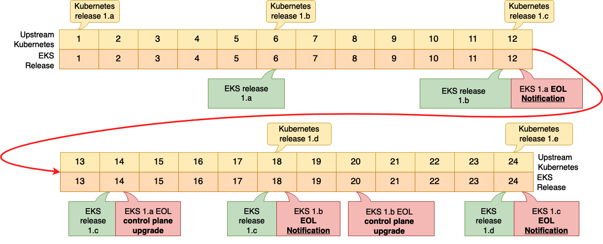
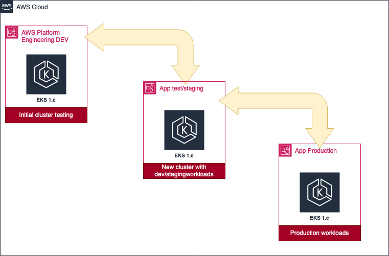
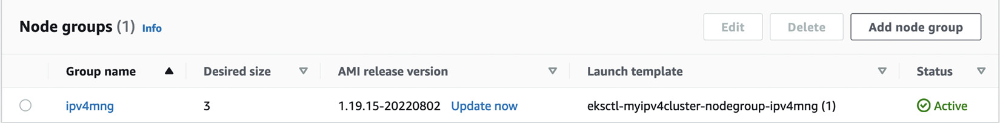
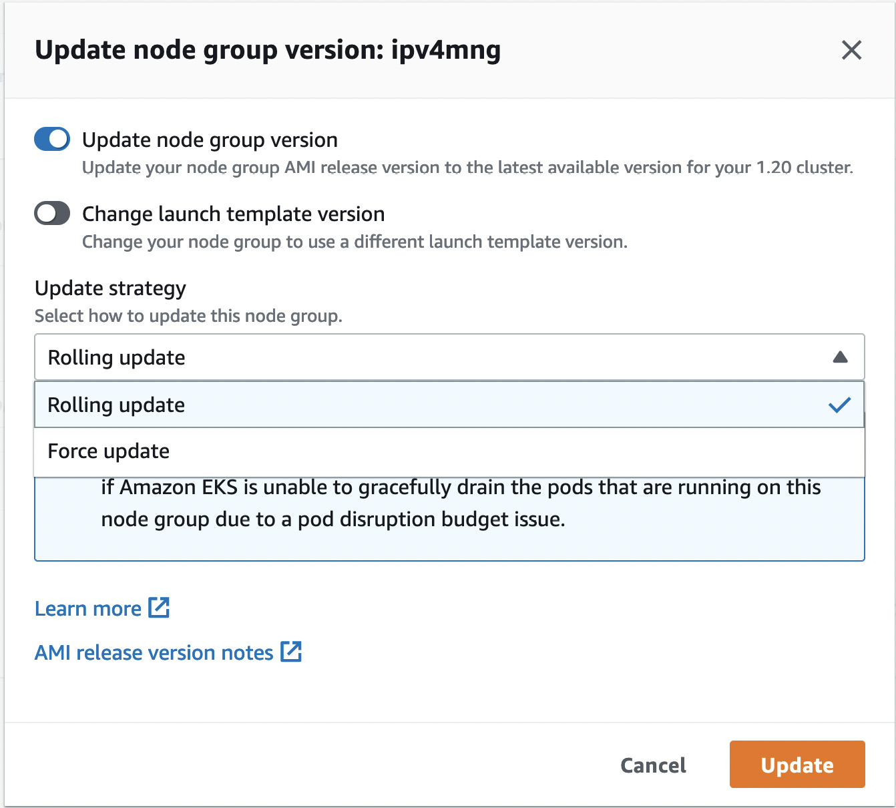
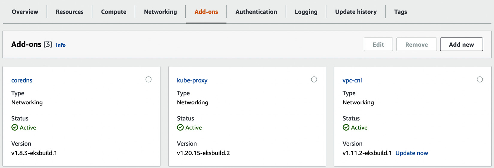
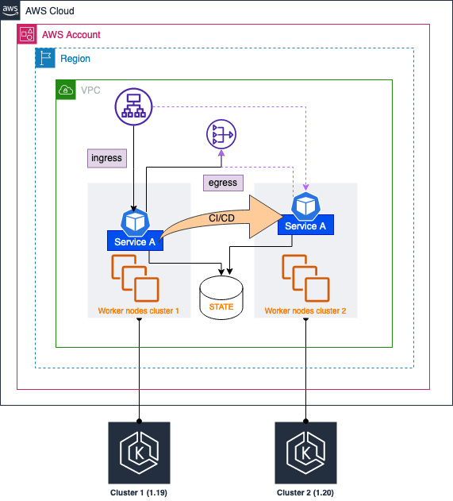

# Upgrading EKS Clusters

The Kubernetes community releases new versions approximately three times per year and maintains release branches for the three most recent minor releases. AWS maintains at least four production-ready Kubernetes versions at any given time. Given these different release schedules, you will eventually need to upgrade your EKS clusters either to use new features or because AWS no longer supports your current version.

The good news is that as EKS is a managed service, AWS handles most of the upgrade work for you!

## Overview

This chapter covers the complete EKS upgrade process:

- **Reasons for upgrading EKS** and key focus areas
- **In-place control plane upgrades** with minimal downtime
- **Node and component upgrades** including critical system components
- **Multi-cluster migration strategies** for blue/green deployments

## Technical Requirements

Before starting this chapter, ensure you have:

- Network connectivity to your EKS API endpoint
- AWS CLI and `kubectl` binary installed on your workstation
- Good understanding of VPC networking and network objects (ENIs)
- Familiarity with YAML, basic networking, and EKS architecture

## Reasons for Upgrading EKS and Key Focus Areas

### Release Lifecycle Overview

EKS is a community project that constantly evolves with major releases approximately three times per year. Each release typically contains at least one significant change.

**Examples of Major Changes:**
- **Kubernetes 1.21** (April 2021): Deprecated Pod security policies in favor of external admission control
- **Version Support**: Community supports only the three most recent minor releases
- **Patch Support**: Older releases receive 1 year of patches, then no support

### AWS Release Schedule

Amazon follows a structured process:

1. **Upstream Integration**: Takes Kubernetes release and tests with AWS platform
2. **Validation Period**: Tests with AWS components (VPC CNI, etc.)
3. **Release Timeline**: ~6 months after community release
4. **Support Duration**: 14 months of support per version


*Figure 10.1 – Example Kubernetes release schedule*

### End-of-Life Process

- **12 months**: AWS notifies customers via console and Health Dashboard
- **14 months**: Automatic control plane upgrade to earliest supported version
- **Your responsibility**: Worker nodes, add-ons, and core components

!!! warning "No Rollback Available"
    Version upgrades cannot be rolled back. To revert, you must deploy a new cluster with the previous version.

### Key Upgrade Considerations

Before upgrading, evaluate these critical areas:

#### API and Functionality Changes
- Are Kubernetes APIs being deprecated?
- Do deployment manifests need updates?
- Are Kubernetes component upgrades required (e.g., kubelet replacement)?

#### Add-on Compatibility  
- Do add-ons need upgrading for the new release?
- Are third-party DaemonSets compatible?
- What about custom controllers and operators?

#### New Feature Implementation
- Is new functionality required (e.g., OPA to replace Pod policies)?
- Are there architectural changes needed?
- What about security policy updates?

#### Security Patches
- Are there critical security updates?
- Do compliance requirements mandate upgrades?
- Are there vulnerability fixes?

!!! tip "Best Practice"
    Always test upgrades in lower environments before modifying production. Read release notes thoroughly and understand the impact on your workloads.

## In-Place Control Plane Upgrades

### Upgrade Strategy

While AWS will eventually upgrade your control plane automatically, a proactive approach is recommended to avoid service disruptions.

### Structured Upgrade Approach

A well-organized upgrade process involves multiple teams:


*Figure 10.2 – Structured upgrade approach*

#### Platform Engineering Team Responsibilities
- Create new Infrastructure as Code (IaC) templates
- Update version strings in Terraform, CDK, or eksctl configurations  
- Develop detailed add-on upgrades (Argo CD, Flux, etc.)
- Test compatibility with AWS services

#### Development Team Responsibilities
- Test workloads in lower environments (testing/staging)
- Validate application compatibility
- Update deployment configurations if needed
- Plan production deployment

### Executing Control Plane Upgrades

#### Using eksctl

For clusters created with eksctl, upgrade with a single command:

```bash
eksctl upgrade cluster myipv4cluster --version=1.20 --approve
```

!!! important "Version Restrictions"
    - Without `--approve`, eksctl shows changes without applying them
    - You cannot skip minor versions (e.g., 1.19 → 1.22)
    - Must upgrade sequentially: 1.19 → 1.20 → 1.21 → 1.22

#### Upgrade Timeline and Impact

- **Duration**: Up to 20 minutes
- **API Access**: May be intermittent during upgrade
- **Workload Impact**: Existing workloads should remain unaffected
- **Change Window**: Plan appropriate maintenance window

#### Post-Upgrade Requirements

After control plane upgrade:

1. **Immediate**: Upgrade worker nodes to match cluster version
2. **Mandatory**: eksctl enforces node version matching
3. **Sequential**: Complete before moving to next version

## Upgrading Nodes and Critical Components

### Manual Node Upgrade Complexity

Upgrading individual worker nodes manually requires:

1. **Capacity Planning**: Add new workers to maintain cluster capacity
2. **Pod Drainage**: Safely evict Pods from nodes being upgraded
3. **Scheduling Control**: Remove nodes from scheduler during upgrade
4. **OS Updates**: Upgrade operating system binaries and patches
5. **Kubernetes Agents**: Update kubelet and other components
6. **Re-registration**: Add upgraded nodes back to scheduler
7. **Component Updates**: Upgrade kube-proxy, CoreDNS, etc.

!!! note "Managed Node Groups Advantage"
    This complexity is why managed node groups are recommended—they automate this entire process.

### Upgrading Managed Node Groups

#### Console-Based Upgrade

After upgrading the cluster control plane, managed node groups show an "Update now" link:


*Figure 10.3 – Node group updates*

#### Update Strategy Options

The upgrade dialog provides several configuration options:


*Figure 10.4 – Node group update strategy*

##### Available Options:

**Node Replacement:**
- **Update node group version**: Replace with latest AMI
- **Change launch template version**: Use different autoscaling template

**Update Strategies:**
- **Rolling update** (default): Respects Pod disruption budgets, fails if Pods cannot drain gracefully
- **Force update**: Attempts graceful drain, but terminates nodes if drainage fails

#### Programmatic Upgrade with eksctl

```bash
eksctl upgrade nodegroup \
  --name=ipv4mng \
  --cluster=myipv4cluster \
  --kubernetes-version=1.20
```

#### Monitoring Upgrade Progress

Watch the replacement status:

```bash
kubectl get nodes --watch
```

Example output showing version transition:
```
NAME       STATUS       ROLES    AGE   VERSION
ipx.eu-central-1.compute.internal      Ready                    <none>   15m   v1.20.15-eks-ba74326
ip-192-168-40-12.eu-central-1.compute.internal   Ready,SchedulingDisabled   <none>   26d   v1.19.15-eks-9c63c4
ipy.eu-central-1.compute.internal      Ready                    <none>   15m   v1.20.15-eks-ba74326
ipz.eu-central-1.compute.internal      Ready                    <none>   15m   v1.20.15-eks-ba74326
```

### Upgrading Self-Managed Node Groups

#### Upgrade Approaches

**Immutable Infrastructure** (Recommended):
- Change AMI in launch template
- Use autoscaling groups for replacement
- Manually handle scheduling and drainage

**Simplified Alternative**:
1. Create new node group with updated version
2. Migrate Pods to new node group
3. Delete old node group

#### Manual Process Requirements

For self-managed upgrades, you're responsible for:

- Removing nodes from scheduler (`SchedulingDisabled`)
- Draining Pods safely
- Scaling operations (out and in)
- All tasks that managed groups automate

### Updating Core Components

Even after node upgrades, critical components need separate updates:

- **kube-proxy**: Kubernetes network proxy
- **CoreDNS**: Cluster DNS service  
- **vpc-cni**: AWS VPC networking

#### Checking Current Versions

Verify kube-proxy version:

```bash
kubectl get daemonset kube-proxy --namespace kube-system \
  -o=jsonpath='{$.spec.template.spec.containers[:1].image}'
```

Example output (outdated):
```
1122334.dkr.ecr.eu-central-1.amazonaws.com/eks/kube-proxy:v1.19.16-eksbuild.2
```

#### Upgrading with eksctl

Update kube-proxy:

```bash
eksctl utils update-kube-proxy --cluster=myipv4cluster --approve
```

Verify upgrade:
```bash
kubectl get daemonset kube-proxy --namespace kube-system \
  -o=jsonpath='{$.spec.template.spec.containers[:1].image}'
```

Updated output:
```
1122334.dkr.ecr.eu-central-1.amazonaws.com/eks/kube-proxy:v1.20.15-eksbuild.2
```

## EKS Add-ons Management

### Add-ons Overview

AWS introduced EKS add-ons to simplify operational software updates:

- **Core Components**: kube-proxy, CoreDNS, vpc-cni
- **Monitoring**: AWS Distro for OpenTelemetry (ADOT)
- **Security**: Various security-focused add-ons

### Console Management

The Add-ons tab shows configured components with update options:


*Figure 10.5 – Cluster add-ons*

### Programmatic Add-on Updates

Update vpc-cni add-on:

```bash
eksctl update addon \
  --name vpc-cni \
  --cluster myipv4cluster \
  --version 1.11.3 \
  --force
```

Example output:
```
2022-09-11 10:47:40 []  Kubernetes version "1.20" in use by cluster "myipv4cluster"
2022-09-11 10:47:41 []  new version provided v1.11.3-eksbuild.1
2022-09-11 10:47:41 []  updating addon
2022-09-11 10:50:50 []  addon "vpc-cni" active
```

!!! warning "Force Updates"
    The `--force` flag overwrites cluster configuration. Always test in lower environments before production use.

## Multi-Cluster Migration Strategy

### Blue/Green Cluster Deployment

An alternative to in-place upgrades involves deploying a new cluster and migrating workloads—sometimes called blue/green cluster deployment.

### Process Overview

Typical in-place upgrade involves three steps:
1. **Control plane upgrade**
2. **Worker node replacement** with updated AMIs and kubelet
3. **Core component upgrades** (kube-proxy, CoreDNS, vpc-cni)

This process requires Pod drainage and reallocation, potentially causing interruptions.

### Multi-Cluster Architecture


*Figure 10.6 – Multi-cluster solution*

!!! info "Cost Consideration"
    This approach is least cost-effective as you pay for two control planes. It may be suitable for minimizing disruption in critical environments.

### Migration Challenges and Solutions

#### Workload Migration

**Challenge**: How to move workloads between clusters?

**Solution**: 
- Use kubectl/Helm context switching
- Same manifests deploy to either cluster
- CI/CD pipeline automation for deployment
- Example: Service A runs on Cluster 1 (v1.19), then deploys to Cluster 2 (v1.20)

#### Network Connectivity

**Egress (Outbound) Traffic:**
- Use internal or external VPC NAT Gateway
- Masks Pod IP addresses from both clusters
- Handles IP address changes transparently

**Ingress (Inbound) Traffic:**
- Elastic Load Balancer (ELB/ALB/NLB) masks Pod/node IP changes
- AWS Load Balancer Controller creates per-service load balancers
- TargetGroupBinding reuses existing ALB/NLB target groups

#### TargetGroupBinding Example

```yaml
apiVersion: elbv2.k8s.aws/v1beta1
kind: TargetGroupBinding
metadata:
  name: testappt
  namespace: mynamespace
spec:
  serviceRef:
    name: testapp
    port: 80
  targetGroupARN: arn:aws:elasticloadbalancing:eu-west-1:1122224:targetgroup/example/fc3409bc5e613beb
```

#### State Management

**Challenge**: How to manage application state?

**Solution**:
- Configure databases outside clusters using AWS services
- **RDS**: For relational database state
- **EFS**: For filesystem state  
- **External Services**: Both clusters can reference same state stores

### Migration Benefits and Drawbacks

#### Benefits
- **Minimal Disruption**: Near-seamless transitions
- **Rollback Capability**: Easy to revert if issues arise
- **Testing Flexibility**: Validate new version before switching
- **Risk Mitigation**: Separate clusters reduce upgrade risks

#### Drawbacks  
- **Higher Cost**: Dual control plane expenses
- **Increased Complexity**: More infrastructure to manage
- **Resource Overhead**: Duplicate networking and security setup
- **Operational Burden**: Managing two clusters simultaneously

## Upgrade Best Practices

### Planning and Preparation

1. **Read Release Notes**: Understand changes and potential impacts
2. **Test Thoroughly**: Validate in development/staging environments
3. **Backup Strategy**: Ensure data and configuration backups
4. **Communication Plan**: Inform stakeholders of upgrade windows

### Risk Mitigation

1. **Pod Disruption Budgets**: Configure to prevent service interruptions
2. **Health Checks**: Ensure robust application health monitoring
3. **Rollback Plan**: Define procedures for handling upgrade failures
4. **Monitoring**: Enhanced observability during upgrade process

### Automation Recommendations

1. **Infrastructure as Code**: Use Terraform, CDK, or eksctl configurations
2. **CI/CD Integration**: Automate testing and deployment processes
3. **Add-on Management**: Leverage EKS add-ons for component updates
4. **Managed Services**: Prefer managed node groups over self-managed

## Summary

This chapter explored the complete EKS upgrade lifecycle:

### Key Upgrade Drivers
- **New Features**: Access to latest Kubernetes capabilities
- **Security Patches**: Critical vulnerability fixes
- **Support Requirements**: AWS version deprecation timelines
- **Compliance Needs**: Regulatory or organizational mandates

### Upgrade Components
- **Control Plane**: Managed by AWS with single-command upgrades
- **Worker Nodes**: Managed node groups simplify replacement process
- **Core Components**: kube-proxy, CoreDNS, vpc-cni require separate updates
- **Add-ons**: EKS add-ons streamline operational software management

### Upgrade Strategies
- **In-Place Upgrades**: Most common and cost-effective approach
- **Blue/Green Deployment**: Higher cost but minimal disruption
- **Managed vs. Self-Managed**: Managed services reduce complexity significantly

### Best Practices
- **Sequential Upgrades**: Cannot skip minor versions
- **Testing First**: Always validate in lower environments
- **Proactive Approach**: Don't wait for AWS auto-upgrades
- **Documentation**: Maintain upgrade procedures and lessons learned

### Next Steps

With a solid understanding of EKS upgrades, you can:

1. **Develop Upgrade Procedures**: Create standardized processes for your organization
2. **Implement Automation**: Use IaC tools for repeatable upgrades
3. **Plan Regular Cadence**: Establish routine upgrade schedules
4. **Monitor AWS Announcements**: Stay informed about new versions and deprecations

The upgrade process, while initially complex, becomes routine with proper planning and the right tools. Managed services like EKS add-ons and managed node groups significantly reduce operational overhead.


## Further Reading

* **Pod Disruption Budgets:**  
  [https://kubernetes.io/docs/concepts/workloads/pods/disruptions/](https://kubernetes.io/docs/concepts/workloads/pods/disruptions/)

* **Managed Node Group Update Process:**  
  [https://docs.aws.amazon.com/eks/latest/userguide/managed-node-update-behavior.html](https://docs.aws.amazon.com/eks/latest/userguide/managed-node-update-behavior.html)

* **AWS Load Balancer Controller TargetGroupBinding:**  
  [https://kubernetes-sigs.github.io/aws-load-balancer-controller/v2.1/guide/targetgroupbinding/targetgroupbinding/](https://kubernetes-sigs.github.io/aws-load-balancer-controller/v2.1/guide/targetgroupbinding/targetgroupbinding/)

* **EKS Add-ons:**  
  [https://docs.aws.amazon.com/eks/latest/userguide/eks-add-ons.html](https://docs.aws.amazon.com/eks/latest/userguide/eks-add-ons.html)

* **Kubernetes Cluster Upgrades:**  
  [https://kubernetes.io/docs/tasks/administer-cluster/cluster-upgrade/](https://kubernetes.io/docs/tasks/administer-cluster/cluster-upgrade/)

* **AWS EKS Version Support:**  
  [https://docs.aws.amazon.com/eks/latest/userguide/kubernetes-versions.html](https://docs.aws.amazon.com/eks/latest/userguide/kubernetes-versions.html)