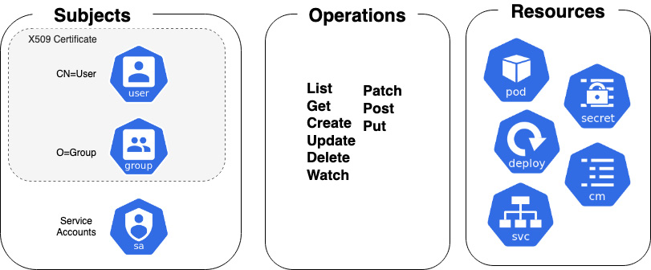
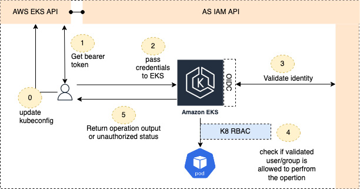
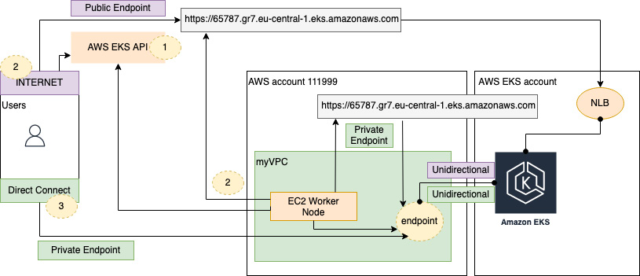

# Securing and Accessing Clusters on EKS

## Overview

This chapter introduces the general concepts for authentication and authorization in Kubernetes, and discusses the differences between these concepts and Elastic Kubernetes Service (EKS). We'll explore how to configure EKS and client tools to securely communicate.

**Key Concepts:**
- **Authentication** verifies the identity of a user or service
- **Authorization** manages what authenticated users can do

## Topics Covered

- Understanding key Kubernetes concepts
- Configuring EKS cluster access
- Managing security and access controls

---

## Understanding Key Kubernetes Concepts

### User Categories in Kubernetes

Kubernetes clusters have two categories of users:

1. **Service accounts** - Managed by Kubernetes
2. **Normal users** - Administrators, developers, etc.

### Authentication Methods

Kubernetes supports multiple authentication plugins. The most common is **client certificates**.

#### Client Certificate Authentication Flow

Users are authenticated when they provide a valid certificate signed by the cluster's certificate authority (CA).

**Certificate Information Extraction:**
- **Username**: Extracted from the Common Name field (`/CN=bob`)
- **Group**: Extracted from the Organization field (`/O=dev`)

Once authenticated, the **Role-Based Access Control (RBAC)** subsystem determines authorization.


*Figure 6.1 – Standard Kubernetes RBAC sub-system*

### Generating User Certificates

To generate a certificate for a normal user:

```bash
# Generate PKI private key
$ openssl genrsa -out myuser.key 2048

# Generate Certificate Signing Request (CSR)
$ openssl req -new -key myuser.key -out myuser.csr

# Encode CSR in base64
$ cat myuser.csr | base64 | tr -d "\n"
```

#### Certificate Signing Request Example

```yaml
apiVersion: certificates.k8s.io/v1
kind: CertificateSigningRequest
metadata:
  name: myuser
spec:
  request: <BASE64.csr>
  signerName: kubernetes.io/kube-apiserver-client
  expirationSeconds: 86400  # one day
  usages:
  - client auth
```

---

## Understanding the Default EKS Authentication Method

### AWS IAM Integration

EKS offloads user and certificate management to **AWS Identity and Access Management (IAM)** service by default.

#### Default Cluster Creator Permissions

When you create an EKS cluster:
- The IAM entity that creates the cluster automatically gets `system:masters` permissions
- This becomes the system administrator role for the EKS cluster
- Without additional configuration, only the cluster creator can perform functions on the cluster

!!! warning "Common Issue"
    A typical error occurs when a CI/CD pipeline creates the cluster with a different IAM identity than regular users, leaving them without Kubernetes privileges.

### EKS Authentication Flow



*Figure 6.2 – EKS authentication flow*

#### Detailed Authentication Steps

**Step 0: Cluster Configuration**
```bash
$ aws eks update-kubeconfig --name mycluster
```
- Retrieves cluster configuration
- Updates kubeconfig file with cluster's TLS certificate and context
- Uses `DescribeCluster` API operation

**Step 1: Bearer Token Generation**
```bash
$ aws eks get-token --cluster-name mycluster
```
- Generate bearer token for each EKS API (kubectl) request
- Can be fetched manually or automatically using AWS IAM Authenticator

**Step 2: Token Validation**
- Bearer token validated against AWS IAM service
- Uses token-authentication-webhook via IAM authenticator service
- If valid, request passes to Kubernetes RBAC subsystem

**Step 3: Authorization Bridge**
- IAM policies have no direct bearing on EKS cluster permissions
- `aws-auth` ConfigMap provides mappings between IAM principals and Kubernetes subjects

**Step 4: Response**
- Operation authorized and returned to client, or
- "Not authorized" response returned

---

## Configuring the aws-auth ConfigMap for Authorization

The `aws-auth` ConfigMap manages the relationship between AWS IAM identity and Kubernetes identity/permissions.

!!! important
    Without a corresponding entry in the `aws-auth` ConfigMap, IAM users or groups won't have any permissions to perform Kubernetes operations, regardless of IAM role/policy permissions.

### OpenID Connect (OIDC) Integration

EKS uses OIDC identity providers for authentication/authorization:

```bash
# Validate cluster OIDC identity
$ aws eks describe-cluster --name my-cluster --query "cluster.identity.oidc.issuer" --output text
```

**OIDC Provider Options:**
- AWS IAM
- Other OIDC-compliant providers (GitHub Enterprise, GitLab)
- Only one OIDC identity provider per cluster

---

## Accessing the Cluster Endpoint

### Endpoint Configuration Types

EKS endpoints can be configured as:
- **Public only**
- **Private only** 
- **Both public and private**


*Figure 6.3 – EKS endpoint access*

### Endpoint Access Steps

1. **DNS Name Retrieval**
   - Obtain EKS cluster's DNS name
   - Usually done via `update-kubeconfig` CLI command
   - Worker nodes call AWS EKS API for cluster configuration

2. **Public Endpoint Access**
   - DNS resolves to public Network Load Balancer (NLB)
   - Hosted in AWS-managed VPC
   - All communication goes through public endpoint

3. **Private Endpoint Access**
   - DNS resolves to private endpoint in customer's VPC
   - Uses privately hosted Route 53 zone (managed by AWS)
   - Only accessible within VPC or through private connections

4. **Hybrid Configuration**
   - Both endpoints can be enabled simultaneously
   - Users access via public NLB
   - API server/worker node communication via private endpoint

---

## Configuring EKS Cluster Access

### Configuring .kube/config

The kubeconfig file is central to cluster access and contains three main sections:

#### Clusters Section
```yaml
clusters:
- cluster:
    certificate-authority-data: xx==
    server: https://65787.gr7.eu-central-1.eks.amazonaws.com
    name: arn:aws:eks:eu-central-1:111999:cluster/mycluster
```

#### Contexts Section
```yaml
contexts:
- context:
    cluster: arn:aws:eks:eu-central-1:111999:cluster/mycluster
    user: arn:aws:eks:eu-central-1:111999:cluster/myuser
    name: arn:aws:eks:eu-central-1:111999:cluster/mycontext
```

#### Users Section
```yaml
users:
- name: arn:aws:eks:eu-central-1:111999:cluster/myuser
  user:
    exec:
      apiVersion: client.authentication.k8s.io/v1alpha1
      args:
      - --region
      - eu-central-1
      - eks
      - get-token
      - --cluster-name
      - mycluster
      command: aws
```

### Validating Configuration

```bash
# View current configuration
$ kubectl config view

# View current context
$ kubectl config view -o template --template='{{ index . "current-context" }}'
```

---

## Configuring the aws-auth ConfigMap

### ConfigMap Parameters

Each entry in the `aws-auth` ConfigMap supports:

| Parameter | Description |
|-----------|-------------|
| `groups` | List of Kubernetes groups to which the role is mapped |
| `rolearn` | ARN of the IAM role associated with the user bearer token |
| `username` | Username within Kubernetes to map to the IAM role |

### Example Configuration

```yaml
- groups:
  - system:masters
  rolearn: arn:aws:iam::111999:role/myIAMrole
  username: creatorAccount
```

### Modification Methods

#### Direct Modification (Not Recommended)
```bash
# Using kubectl
$ kubectl edit cm aws-auth -n kube-system

# Using eksctl
$ eksctl create iamidentitymapping --cluster mycluster --region=eu-central-1 --arn arn:aws:iam::111999:role/myIAMrole --group system:masters --username creatorAccount
```

#### Recommended CI/CD Approach

1. **Deploy EKS cluster** using infrastructure-as-code tool
2. **Export aws-auth ConfigMap** to version-controlled repository:
   ```bash
   kubectl get cm aws-auth -n kube-system -o yaml > aws-auth.yaml
   ```
3. **Code review process** for adding new groups/users/role mappings
4. **Update cluster** using CI/CD pipeline:
   ```bash
   kubectl patch configmap/aws-auth -n kube-system --patch "$(cat /tmp/aws-auth.yml)"
   ```

!!! tip "Best Practice"
    Always manage the `aws-auth` ConfigMap through version control and audited CI/CD pipelines rather than direct modification.

---

## Protecting EKS Endpoints

### Private vs Public Endpoints

**Recommendation**: Use private EKS endpoints when possible.

#### Public Endpoint Security Risks
- If TLS certificates and IAM/RBAC permissions are compromised
- Cluster becomes accessible from anywhere in the world
- Should be restricted using public access CIDR ranges

#### Public Access Restriction Example
```bash
$ aws eks describe-cluster --name mycluster
{
    "cluster": {
        "endpointPublicAccess": true,
        "publicAccessCidrs": ["203.0.113.5/32"]
    }
}
```

### Security Group Configuration

EKS API network interfaces are protected by separate security groups:

```bash
$ aws eks describe-cluster --name mycluster
{
    "cluster": {
        "securityGroupIds": ["sg-5656576d"],
        "clusterSecurityGroupId": "sg-5657657s"
    }
}
```

**Security Group Types:**
- **API security groups**: Protect API endpoints (`securityGroupIds`)
- **Cluster security group**: Protect worker nodes (`clusterSecurityGroupId`)

---

## Summary

### Key Takeaways

1. **EKS Integration**: EKS integrates with AWS IAM by default for authentication
2. **Bearer Token**: Client tools like kubectl must generate bearer tokens for authentication
3. **aws-auth ConfigMap**: Critical for mapping IAM identities to Kubernetes RBAC permissions
4. **Version Control**: Always manage aws-auth ConfigMap through version-controlled CI/CD pipelines
5. **Endpoint Security**: Prefer private clusters and use IP whitelisting/security groups for additional protection
6. **Default Permissions**: Only cluster creator has default permissions - additional users must be explicitly configured

### Security Best Practices

- ✅ Use private EKS endpoints when possible
- ✅ Implement IP whitelisting for public endpoints
- ✅ Manage aws-auth ConfigMap through version control
- ✅ Use separate security groups for API and worker node protection
- ✅ Regularly audit and review access permissions
- ⚠️ Avoid direct modification of aws-auth ConfigMap
- ⚠️ Ensure CI/CD pipeline IAM identities have appropriate cluster access

---

## Next Steps

The next chapter will discuss Kubernetes networking and how EKS can be configured to use an AWS Virtual Private Cloud (VPC).

## Further Readings

* **Overview of the AWS IAM authenticator:**  
  [https://docs.aws.amazon.com/eks/latest/userguide/install-aws-iam-authenticator.html](https://docs.aws.amazon.com/eks/latest/userguide/install-aws-iam-authenticator.html)

* **Overview of webhook authentication in K8s:**  
  [https://kubernetes.io/docs/reference/access-authn-authz/authentication/#webhook-token-authentication](https://kubernetes.io/docs/reference/access-authn-authz/authentication/#webhook-token-authentication)

* **Overview of the AWS OIDC Provider Integration:**  
  [https://github.com/awsdocs/amazon-eks-user-guide/blob/master/doc_source/authenticate-oidc-identity-provider.md](https://github.com/awsdocs/amazon-eks-user-guide/blob/master/doc_source/authenticate-oidc-identity-provider.md)