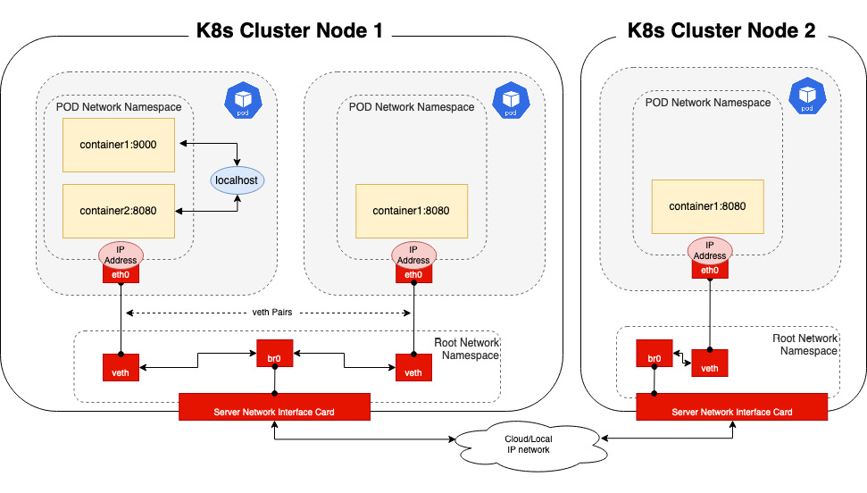
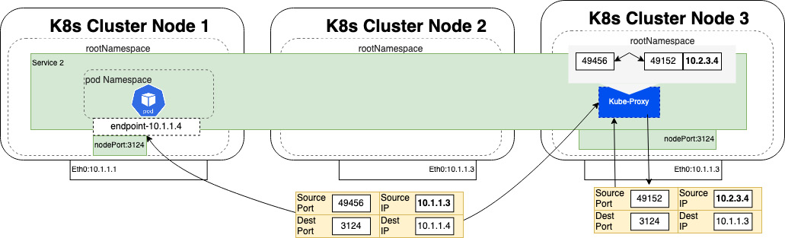
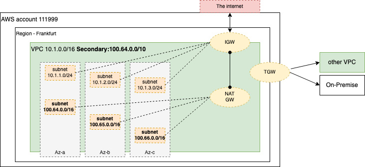
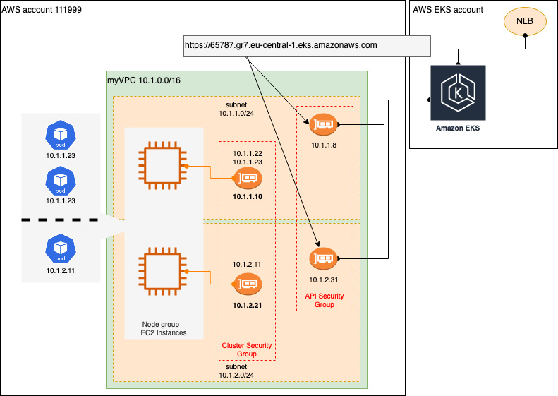
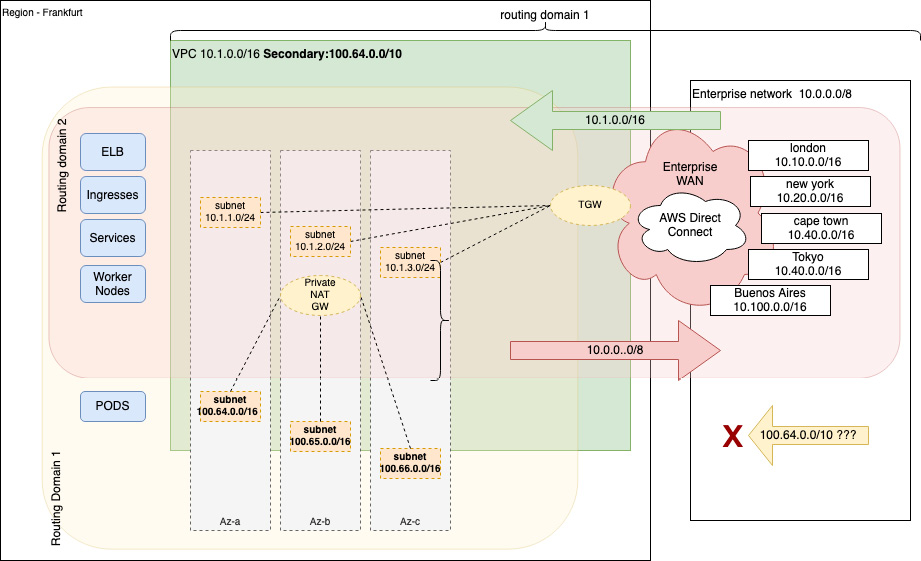

# EKS Networking

## Overview

Kubernetes (K8s) isn't prescriptive about external networking, allowing multiple network plugins and configurations to meet security, latency, and operational requirements. This chapter covers standard K8s Pod and cluster networking, AWS VPC networking, and EKS-specific networking implementations.

## Understanding Networking in Kubernetes

### Basic Networking Rules

Kubernetes follows clearly defined networking rules that all network plugins must implement:

- **Every Pod gets its own IP address**
- **Containers within a Pod share the Pod IP address**
- **Pods can communicate with all other Pods in the cluster using Pod IP addresses (without NAT)**
- **Isolation of Pods at the network level is performed using network policies**

### Container Network Interface (CNI)

All K8s network implementations must support the Container Network Interface (CNI) specification, which is a Cloud Native Computing Foundation (CNCF) project. The CNI specification provides:

- Guides and libraries for writing plugins to configure network interfaces in containers
- Support for Pod connection to external networks
- Pod IP address allocation

By default, a single K8s cluster supports only one CNI, though multiple CNIs are possible.

### Network Implementation in Kubernetes


*Figure 7.1 – Basic Pod networking*

#### Pod Communication Patterns

1. **Container-to-Container within a Pod**
   - Containers share the same network namespace and port space
   - Communication via localhost (127.0.0.1) address

2. **Pod-to-Pod Communication**
   - Each Pod has a corresponding interface (veth) in the root network namespace
   - Uses veth pairs as virtual network cables between Pod and host networking
   - Pods use cluster DNS to resolve service names to IP addresses
   - ARP protocol maps IP addresses to Pod Ethernet addresses

3. **Cross-Node Pod Communication**
   - Cluster DNS resolves IP addresses
   - If ARP request fails, packet is routed out of host to find target IP

#### CNI Integration with kubelet

When a new Pod is created:
1. kubelet sends ADD command to CNI
2. CNI inserts network interface into container network namespace (eth0)
3. Creates veth interface and attaches to Bridge0 and eth0 interfaces
4. Assigns IP address and sets up relevant routes

### Kubernetes Services


*Figure 7.2 – Nodeport services*

Kubernetes adds abstraction on top of basic Pod networking through services:

- **Service Selection**: Services select Pods based on labels
- **DNS and Networking**: Creates new DNS name, virtual IP, assigns dynamic port on each node
- **Traffic Routing**: Uses iptables or IP Virtual Server (IPVS) to rewrite service addresses to Pod addresses
- **Load Balancing**: kube-proxy manages services, requests, and load balancing

#### NAT Operations


*Figure 7.3 – K8s source/destination NAT*

**Source NAT (SNAT)**: Replaces source IP address with node's Ethernet address
**Destination NAT (DNAT)**: Replaces destination IP address with Pod IP address

Traffic flow example:
1. Traffic received on node 3 from client (10.2.3.4) for nodeport service port 3124
2. kube-proxy performs SNAT (maps source IP to local node's Ethernet address) and DNAT (maps service address to Pod IP)
3. Packet sent to target node based on ARP request for Pod IP address
4. Pod response sent back to originating node based on source IP address mapping

## Getting to Grips with Basic AWS Networking


*Figure 7.4 – Basic VPC structure*

### VPC Structure

- **Region**: Geographic location (London, Frankfurt, Oregon)
- **Availability Zone (AZ)**: Basic unit of network reliability in AWS
- **VPC**: Regional construct defined by IP CIDR range (e.g., 10.1.0.0/16)
- **Subnets**: Assigned from VPC, map to one AZ

### IP Address Ranges

**RFC1918 Private Addressing**:
- 10.0.0.0 – 10.255.255.255 (10/8 prefix)
- 172.16.0.0 – 172.31.255.255 (172.16/12 prefix)
- 192.168.0.0 – 192.168.255.255 (192.168/16 prefix)

**Additional Supported Ranges**:
- 100.64.0.0/10
- 198.19.0.0/16

### Essential AWS Networking Services

- **Internet Gateway (IGW)**: Maps between public IP addresses and VPC addresses
- **NAT Gateway (NATGW)**: Provides outbound-only access via IGW
- **Transit Gateway (TGW)**: Routes between VPCs and connects to on-premises workloads

## Understanding EKS Networking


*Figure 7.5 – EKS networking (basic)*

### Key Components

- **Managed Control Plane**: EKS control plane managed by AWS in separate VPC
- **VPC CNI**: Default CNI for EKS clusters
- **ENIs**: Elastic Network Interfaces assigned IP addresses from VPC subnets
- **Security Groups**: One for worker nodes, one for EKS control plane/APIs

### VPC CNI Characteristics

**Advantages**:
- Pods are first-class citizens in AWS VPC
- Pod networking behaves exactly like EC2 instances
- Traffic can be routed and controlled through AWS network gateways

**Disadvantages**:
- Can quickly exhaust subnet addresses due to ephemeral nature of Pods
- Problematic with small VPC or subnet IP ranges

### IP Address Limitations

EC2 instance types have specific limits:
- **m4.4xlarge**: Up to 8 ENIs, 30 IP addresses per ENI = 120 addresses per worker node
- **m5.large**: Up to 3 ENIs, 10 IP addresses per ENI = 29 Pods per node

Calculation: `3 ENIs * (10 IP addresses - 1) + 2 (CNI and kube-proxy Pods) = 29 Pods per node`

## Advanced EKS Networking Options

### Non-routable Secondary Addresses


*Figure 7.6 – Non-routable Pod networking*

Uses secondary IP ranges (e.g., 100.64.0.0/10) that are:
- Private and not routable outside VPC
- Use NATGW for outbound traffic with source NAT
- Not reachable from enterprise network
- Not advertised by Transit Gateway

### Prefix Addressing

Available in VPC CNI version 1.9.0 or later for AWS Nitro-based EC2 instances:

**Standard Addressing**: `3 ENIs * (10 IP addresses - 1) + 2 = 29 Pods per node`
**Prefix Addressing**: `3 ENIs * (9 prefixes per ENI * 16 IPs per prefix) + 2 = 434 Pods per node`

**Note**: Kubernetes scalability guide recommends maximum of 110 Pods per node.

### IPv6 Support

- Automatically provides public /56 IPv6 CIDR block
- Each subnet gets /64 range (2^64 ≈ 18 quintillion addresses)
- Eliminates IP exhaustion issues
- Requires IPv4/IPv6 dual-stack management
- Uses host-local CNI plugin paired with VPC CNI

## Configuring EKS Networking using the VPC CNI

### Managing the CNI Plugin

#### Check Current CNI Version
```bash
export CNI_VER=$(kubectl describe daemonset aws-node --namespace kube-system | grep Image | cut -d "/" -f 2 | sed -e 's/amazon-k8s-cni-init:\(.*\)-eksbuild.1/\1/')
echo $CNI_VER
```

#### Deploy Specific CNI Version
```bash
kubectl apply -f https://raw.githubusercontent.com/aws/amazon-vpc-cni-k8s/v1.9.1/config/v1.9/aws-k8s-cni.yaml
```

#### Enable Prefix Assignment
```bash
kubectl set env daemonset aws-node -n kube-system ENABLE_PREFIX_DELEGATION=true
```

### Using EKS Add-ons

#### Create Add-on
```bash
eksctl create addon --name vpc-cni --version $CNI_VER --cluster $CLUSTERNAME --force
```

#### List Add-ons
```bash
eksctl get addons --cluster $CLUSTERNAME --region $AWS_REGION
```

#### Update Add-on
```bash
eksctl update addon --name vpc-cni --version 1.9.3 --cluster $CLUSTERNAME --region $AWS_REGION --force
```

### Configuration Options

#### Disable CNI Source NAT
```bash
kubectl set env daemonset aws-node -n kube-system AWS_VPC_K8S_CNI_EXTERNALSNAT=true
```

#### Enable Custom Networking
```bash
kubectl set env daemonset aws-node -n kube-system AWS_VPC_K8S_CNI_CUSTOM_NETWORK_CFG=true
```

#### ENIConfig Example
```yaml
apiVersion: crd.k8s.amazonaws.com/v1alpha1
kind: ENIConfig
metadata:
  name: eu-central-1a
spec:
  securityGroups:
    - sg-67346437643864389
  subnet: subnet-7847489798437
```

#### Apply ENIConfig Automatic Mapping
```bash
kubectl set env daemonset aws-node -n kube-system ENI_CONFIG_LABEL_DEF=topology.kubernetes.io/zone
```

## Common Networking Issues

| Issue | Solution |
|-------|----------|
| Worker nodes cannot join cluster | Check subnet IP access to internet (IGW/NATGW) and EKS API ENIs. Verify route tables and security groups |
| Pods cannot be assigned VPC IP address | Check VPC has enough free IP addresses. Assign secondary CIDR range, enable prefix addressing, or use larger EC2 instances |
| Pods unable to resolve K8S DNS names | Ensure worker node subnets allow outbound/inbound UDP port 53. Verify VPC has enableDNSHostnames and enableDNSSupport set to true |
| AWS load balancers cannot be deployed | Tag worker node subnets with kubernetes.io/role/elb or kubernetes.io/role/internal-elb |

## Key Takeaways

- **EKS uses AWS VPC CNI by default**, integrating Pods as native VPC citizens
- **Pod networking uses VPC devices** (IGW, TGW, NATGW) and controls (Security Groups, NACLs)
- **IP exhaustion challenges** can be addressed through non-routable subnets, prefix addressing, or IPv6
- **Configuration management** through kubectl commands or EKS add-ons
- **Custom networking** enables different security groups or subnets for enhanced security or IP management

## Further Readings

* **AWS VPC CNI repository:**  
  [https://github.com/aws/amazon-vpc-cni-k8s](https://github.com/aws/amazon-vpc-cni-k8s)

* **What is an EC2 ENI?:**  
  [https://docs.aws.amazon.com/AWSEC2/latest/UserGuide/using-eni.html](https://docs.aws.amazon.com/AWSEC2/latest/UserGuide/using-eni.html)

* **Overview of EKS and IPv6:**  
  [https://aws.amazon.com/blogs/containers/amazon-eks-launches-ipv6-support/](https://aws.amazon.com/blogs/containers/amazon-eks-launches-ipv6-support/)

* **Supported CNIs on EKS:**  
  [https://docs.aws.amazon.com/eks/latest/userguide/alternate-cni-plugins.html](https://docs.aws.amazon.com/eks/latest/userguide/alternate-cni-plugins.html)

* **Private NAT Gateways:**  
  [https://aws.amazon.com/about-aws/whats-new/2021/06/aws-removes-nat-gateways-dependence-on-internet-gateway-for-private-communications/](https://aws.amazon.com/about-aws/whats-new/2021/06/aws-removes-nat-gateways-dependence-on-internet-gateway-for-private-communications/)

* **Using Transit Gateway:**  
  [https://docs.aws.amazon.com/whitepapers/latest/building-scalable-secure-multi-vpc-network-infrastructure/transit-gateway.html](https://docs.aws.amazon.com/whitepapers/latest/building-scalable-secure-multi-vpc-network-infrastructure/transit-gateway.html)

* **EC2 Max Pods Details by instance type:**  
  [https://github.com/awslabs/amazon-eks-ami/blob/master/files/eni-max-pods.txt](https://github.com/awslabs/amazon-eks-ami/blob/master/files/eni-max-pods.txt)

* **Kubernetes scaling limits:**  
  [https://github.com/kubernetes/community/blob/master/sig-scalability/configs-and-limits/thresholds.md](https://github.com/kubernetes/community/blob/master/sig-scalability/configs-and-limits/thresholds.md)

* **Overview of EKS add-ons:**  
  [https://aws.amazon.com/blogs/containers/introducing-amazon-eks-add-ons/](https://aws.amazon.com/blogs/containers/introducing-amazon-eks-add-ons/)