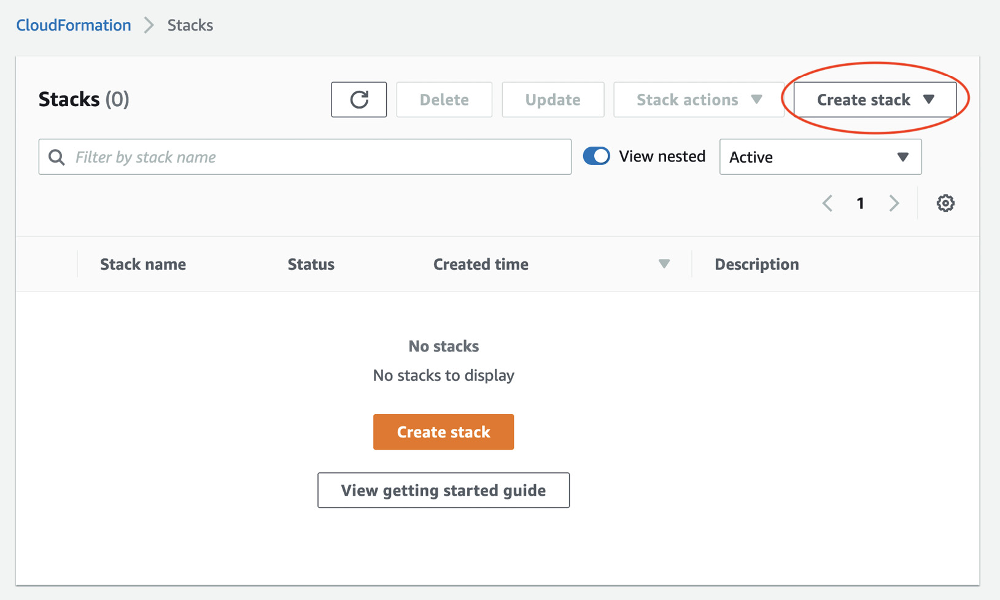
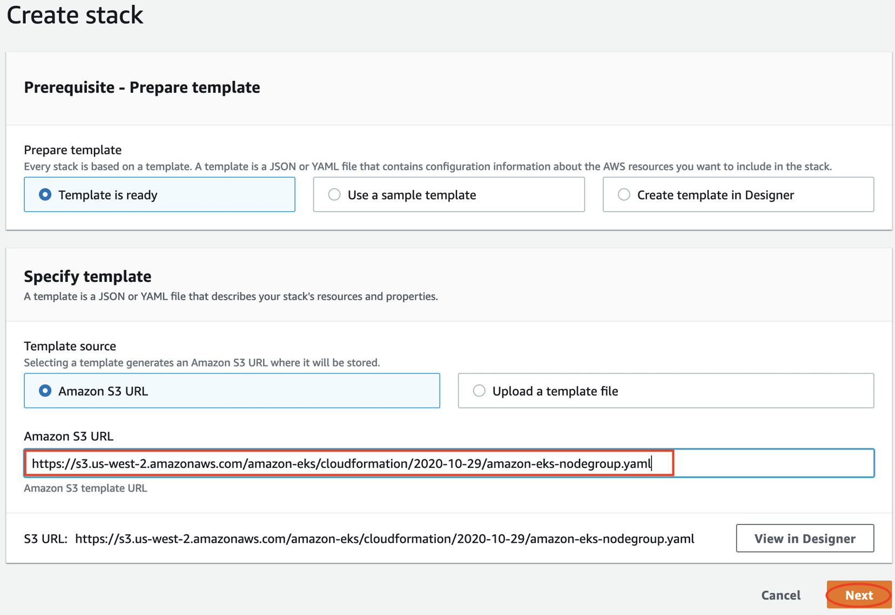
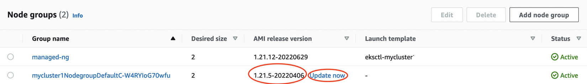

# Managing Worker Nodes on EKS

## Overview

This chapter focuses on configuring, deploying, and managing different EC2 configurations in EKS. We'll explore the benefits of using EKS-optimized images and managed node groups over self-managed images and instances.

## Topics Covered

- Launching a node with Amazon Linux
- Launching self-managed Amazon Linux nodes with CloudFormation
- Launching self-managed Bottlerocket nodes with eksctl
- Understanding managed nodes with eksctl
- Building a custom Amazon Machine Image (AMI) for EKS

## Prerequisites

- Familiarity with YAML, basic networking, and EKS architecture
- Active EKS cluster with administrative access
- Network connectivity to EKS API endpoint
- AWS CLI and kubectl installed on workstation

## Launching a Node with Amazon Linux

### Prerequisites for Worker Nodes

A worker node is an EC2 instance used by EKS to host Pods. Every worker node requires:

1. **IAM role** for AWS API communication (EKS, EC2, etc.)
2. **Security group** allowing communication to EKS control plane
3. **Operating system image** with Kubernetes agents (kubelet, etc.)
4. **Init/boot script** to register with specific EKS cluster

### IAM Role and Permissions

Each worker node requires an IAM role with three AWS managed policies:

- `AmazonEKSWorkerNodePolicy`
- `AmazonEKS_CNI_Policy`
- `AmazonEC2ContainerRegistryReadOnly`

**Optional for SSH access via Systems Manager:**
- `AmazonSSMManagedInstanceCore`

!!! important
    The worker node role must be added to the `aws-auth` ConfigMap to allow instances to register with the cluster. For self-managed nodes, you must modify the ConfigMap manually.

### Security Groups

- Every EC2 ENI needs at least one security group
- Worker nodes typically have their own security group
- Worker node security group is referenced in main EKS cluster security group
- Allows kubelet agent to register, send updates, and receive instructions

### AWS AMIs

#### Amazon EKS-optimized Amazon Linux AMIs

- Built on Amazon Linux 2
- Configured for Amazon EKS
- Includes Docker (replaced with containerd in later versions), kubelet, and AWS IAM authenticator
- Must align AMI with Kubernetes version
- Find AMI IDs at: [EKS Optimized AMI documentation](https://docs.aws.amazon.com/eks/latest/userguide/eks-optimized-ami.html)

**Example**: For x86, Kubernetes 1.21 in eu-central-1: `ami-03fa8a7508f8f3ccc`

#### Amazon EKS-optimized Bottlerocket AMIs

- Open source Linux-based OS purpose-built for running containers
- Contains bare-minimum packages (reduced attack surface)
- Includes containerd and kubelet
- Must align AMI with Kubernetes version
- Find AMI IDs at: [Bottlerocket AMI documentation](https://docs.aws.amazon.com/eks/latest/userguide/eks-optimized-ami-bottlerocket.html)

**Example**: For x86, Kubernetes 1.21 in eu-central-1: `ami-0674d57b3d6b6ef14`

### Bootstrap Scripts

- Configures various agents and EC2 metadata
- Runs once during initialization
- AWS-published script: [bootstrap.sh](https://github.com/awslabs/amazon-eks-ami/blob/master/files/bootstrap.sh)
- Must be integrated into EC2 boot process or run manually

### Creating a Standalone Worker Node

!!! warning
    This example is for illustration only. In practice, always use EC2 Auto Scaling for failure recovery and scaling.

#### Step-by-step Process

1. **Collect existing cluster information:**
   - Security group, IAM role, VPC, and subnet from existing node group

2. **Create EC2 instance:**
```bash
aws ec2 run-instances --image-id ami-03fa8a7508f8f3ccc \
  --count 1 --instance-type t3.large --key-name <my-key> \
  --security-group-ids <worker-node-sg-id> \
  --subnet-id <subnet-id> --iam-instance-profile Name=<instance-profile-name> \
  --tag-specifications \
  'ResourceType=instance,Tags=[{Key=Name,Value=standalone-worker}]'
```

3. **SSH to instance and verify AWS permissions:**
```bash
export AWS_DEFAULT_REGION=<myregion>
aws eks describe-cluster --name <clustername>
```

4. **Run bootstrap script as root:**
```bash
curl -o bootstrap.sh https://raw.githubusercontent.com/awslabs/amazon-eks-ami/master/files/bootstrap.sh
chmod +x bootstrap.sh
./bootstrap.sh <clustername>
```

5. **Verify node registration:**
```bash
kubectl get nodes --watch
```

6. **Check aws-auth ConfigMap:**
```bash
kubectl get cm aws-auth -n kube-system -o json
```

7. **Add cluster tag to EC2 instance:**
   - Tag: `kubernetes.io/cluster/<clustername>`
   - Value: `owned`

## Launching Self-managed Amazon Linux Nodes with CloudFormation

AWS provides a CloudFormation template for creating self-managed node groups:
**Template URL**: `https://s3.us-west-2.amazonaws.com/amazon-eks/cloudformation/2020-10-29/amazon-eks-nodegroup.yaml`


*Figure 8.1 – Launching a CloudFormation stack*


*Figure 8.2 – The Create stack window*

### Key CloudFormation Parameters

| Parameter | Description |
|-----------|-------------|
| ClusterName | Name of existing cluster |
| ClusterControlPlaneSecurityGroup | Security group used by cluster control plane |
| NodeGroupName | Unique name for the node group |
| NodeAutoScalingGroupMinSize | Minimum number of nodes in auto scaling group |
| Desired capacity of Node Group ASG | Desired number of nodes in auto scaling group |
| NodeAutoScalingGroupMaxSize | Maximum number of nodes (at least 1 greater than desired) |
| NodeInstanceType | EC2 instance type for worker nodes |
| NodeVolumeSize | Worker node EBS volume size |
| KeyName | EC2 key pair for SSH access |
| DisableIMDSv1 | Set to true or false |
| VpcId | VPC of the worker instances |
| Subnets | Subnets where workers can be created |

*Table 8.1 – CloudFormation parameter list*

### Post-Deployment Configuration

After CloudFormation deployment, add the new IAM role to aws-auth ConfigMap:

```bash
kubectl edit cm aws-auth -n kube-system
```

Add to `mapRoles` section:
```yaml
mapRoles: |
- groups:
  - system:bootstrappers
  - system:nodes
  rolearn: arn:aws:iam::<ACCOUNTID>:role/<instanceROLE>
  username: system:node:{{EC2PrivateDNSName}}
```

Verify node registration:
```bash
kubectl get nodes --watch
```

## Launching Self-managed Bottlerocket Nodes with eksctl

Bottlerocket provides enhanced security with two operating system partitions for simplified upgrades with minimal downtime.

### eksctl Installation

Install eksctl from: [eksctl documentation](https://docs.aws.amazon.com/eks/latest/userguide/eksctl.html)

!!! note
    Prior to version 0.40.0, eksctl could only modify clusters created by eksctl. Later versions support subset operations on any cluster, including adding node groups.

### Configuration File Structure

#### Cluster and VPC Configuration
```yaml
---
apiVersion: eksctl.io/v1alpha5
kind: ClusterConfig
metadata:
  name: myclusterName
  region: eu-central-1
  version: '1.21'
vpc:
  id: "vpc-123454"
  subnets:
     private:
        private1:
           id:  "subnet-11222"
        private2:
           id:  "subnet-11333"
  securityGroup: "sg-4444444"
```

#### Node Group Configuration
```yaml
iam:
  withOIDC: true
nodeGroups:
  - name: ng-bottlerocket
    instanceType: m5.large
    privateNetworking: true
    desiredCapacity: 2
    amiFamily: Bottlerocket
    ami: auto-ssm
    iam:
       attachPolicyARNs:
          - arn:aws:iam::aws:policy/AmazonEKSWorkerNodePolicy
          - arn:aws:iam::aws:policy/AmazonEC2ContainerRegistryReadOnly
          - arn:aws:iam::aws:policy/AmazonSSMManagedInstanceCore
          - arn:aws:iam::aws:policy/AmazonEKS_CNI_Policy
    ssh:
        allow: true
        publicKeyName: mykeypair
    subnets:
      - subnet-11222
      - subnet-11333
```

!!! important
    - For existing clusters, include the `vpc:` section
    - `securityGroup` refers to cluster security group, not worker node security group
    - For private clusters, set `privateNetworking: true`
    - Use `nodeGroups` keyword for self-managed nodes
    - Save configuration as `bottlerocket.yaml`

### Deployment Commands

Create node group:
```bash
eksctl create nodegroup --config-file=bottlerocket.yaml
```

Monitor node registration:
```bash
kubectl get nodes --watch
```

!!! note
    eksctl automatically tags nodes and modifies aws-auth ConfigMap for successful registration.

## Understanding Managed Nodes with eksctl

Managed node groups leverage auto scaling groups for automated upgrades and modifications. The EKS control plane handles the upgrade process automatically.

### Managed Node Group Upgrade Process

1. **Random node selection**: Control plane selects a node and drains Pods
2. **Node cordoning**: Prevents new Pod scheduling and removes from active nodes
3. **Termination request**: Sends termination to Auto Scaling group, triggering new node with updated launch template
4. **Repetition**: Repeats until all nodes use new launch template


*Figure 8.3 – Node groups window*

### Managed Node Group Configuration

#### Cluster and VPC Configuration (Same as Above)
```yaml
---
apiVersion: eksctl.io/v1alpha5
kind: ClusterConfig
metadata:
  name: myclusterName
  region: eu-central-1
  version: '1.21'
vpc:
  id: "vpc-123454"
  subnets:
     private:
        private1:
           id:  "subnet-11222"
        private2:
           id:  "subnet-11333"
  securityGroup: "sg-4444444"
iam:
  withOIDC: true
```

#### Managed Node Group Section
```yaml
managedNodeGroups:
  - name: managed-ng
    labels: { role: workers }
    instanceType: m5.large
    privateNetworking: true
    desiredCapacity: 2
    iam:
       attachPolicyARNs:
          - arn:aws:iam::aws:policy/AmazonEKSWorkerNodePolicy
          - arn:aws:iam::aws:policy/AmazonEC2ContainerRegistryReadOnly
          - arn:aws:iam::aws:policy/AmazonSSMManagedInstanceCore
          - arn:aws:iam::aws:policy/AmazonEKS_CNI_Policy
    ssh:
        allow: true
        publicKeyName: mykeypair
    subnets:
      - subnet-11222
      - subnet-11333
```

!!! important
    - Change `nodeGroups:` to `managedNodeGroups:`
    - Remove Bottlerocket-specific `amiFamily:` and `ami:` keys
    - Optionally add `labels:` key
    - Save as `managed-ng.yaml`

### Deployment Commands

Create managed node group:
```bash
eksctl create nodegroup --config-file=managed-ng.yaml
```

Monitor node registration:
```bash
kubectl get nodes --watch
```

### Management Benefits

- Visible in AWS Console under EKS | Clusters | mycluster | Compute tab
- Shows Active status for healthy node groups
- Automatic upgrades available via "Update now" link
- Handles kubelet, containerd, and AMI updates automatically

## Building a Custom AMI for EKS

Custom AMIs may be needed for security hardening, Kubernetes agent binary updates, or specific organizational requirements.

### Using HashiCorp Packer

We'll use Packer, an open source tool for creating operating system images.

#### Installation and Setup

1. **Install Packer**: Follow [Packer AWS Get Started Guide](https://learn.hashicorp.com/collections/packer/aws-get-started)

2. **Clone AWS EKS AMI repository**:
```bash
git clone https://github.com/awslabs/amazon-eks-ami
cd amazon-eks-ami
```

3. **Build custom AMI** (ensure default VPC in region):
```bash
make 1.21 aws_region=<yourRegion>
```

4. **Validate image creation**:
```bash
aws ec2 describe-images --owners self --output json --region <yourRegion>
```

### Build Process

The Packer build process:
- Takes 15-20 minutes
- Spins up new EC2 instance
- Connects via SSH from Packer machine
- Configures instance using `/scripts` directory scripts
- Converts EBS volume to AMI
- Terminates build instance

### Customization Options

Customize by modifying:
- **Makefile**: Build parameters
- **Packer build file**: `eks-worker-al2.json`
- **Scripts**: Add/modify scripts in `/scripts` directory

!!! note
    Detailed customization requires knowledge of Packer and Linux. See [AWS Knowledge Center article](https://aws.amazon.com/premiumsupport/knowledge-center/eks-custom-linux-ami/) for more details.

## Key Takeaways

- **Worker node requirements**: IAM role, security groups, Kubernetes agents, and bootstrap scripts
- **AMI options**: Amazon Linux (easiest), Bottlerocket (more secure), or custom AMIs
- **Deployment methods**: AWS CLI/Console, CloudFormation, or eksctl
- **Management approaches**: Self-managed (full control) vs. managed node groups (simplified operations)
- **Upgrade automation**: Managed node groups handle complex upgrade procedures automatically
- **Customization**: Packer enables creation of custom AMIs for specific requirements

## Summary

This chapter explored EC2-based worker node requirements and various deployment methods. We learned about Amazon Linux and Bottlerocket AMIs, self-managed vs. managed node groups, and custom AMI creation. Managed node groups significantly reduce operational burden for updates and maintenance, making them the preferred choice for most use cases.

## Further Readings

* **Deeper dive into Amazon Linux EKS-optimized AMIs:**  
  [https://docs.aws.amazon.com/eks/latest/userguide/eks-optimized-ami.html](https://docs.aws.amazon.com/eks/latest/userguide/eks-optimized-ami.html)

* **Deeper dive into Bottlerocket EKS-optimized AMIs:**  
  [https://docs.aws.amazon.com/eks/latest/userguide/eks-optimized-ami-bottlerocket.html](https://docs.aws.amazon.com/eks/latest/userguide/eks-optimized-ami-bottlerocket.html)

* **eksctl user guide:**  
  [https://eksctl.io/](https://eksctl.io/)

* **Deeper dive into EC2 auto scaling:**  
  [https://docs.aws.amazon.com/autoscaling/ec2/userguide/what-is-amazon-ec2-auto-scaling.html](https://docs.aws.amazon.com/autoscaling/ec2/userguide/what-is-amazon-ec2-auto-scaling.html)