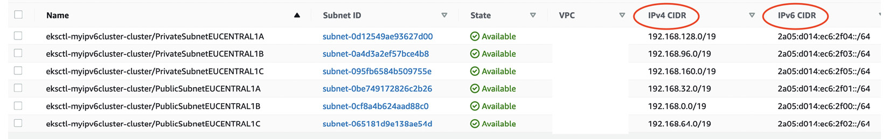
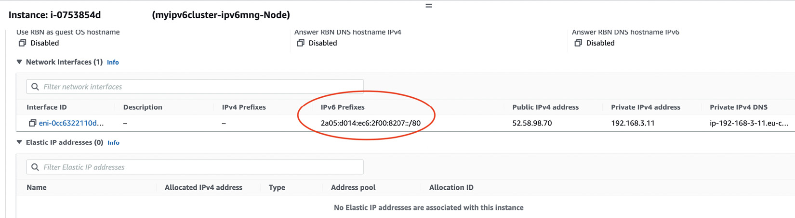
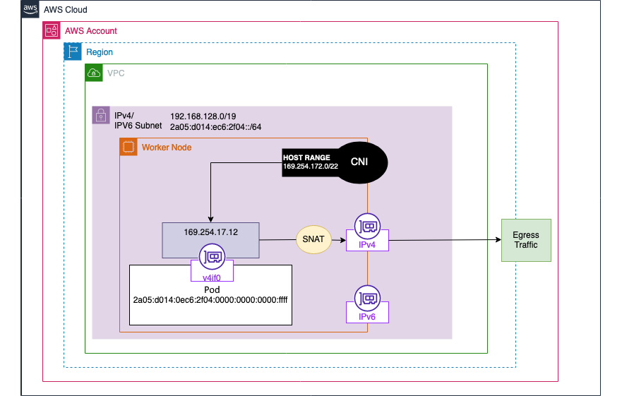
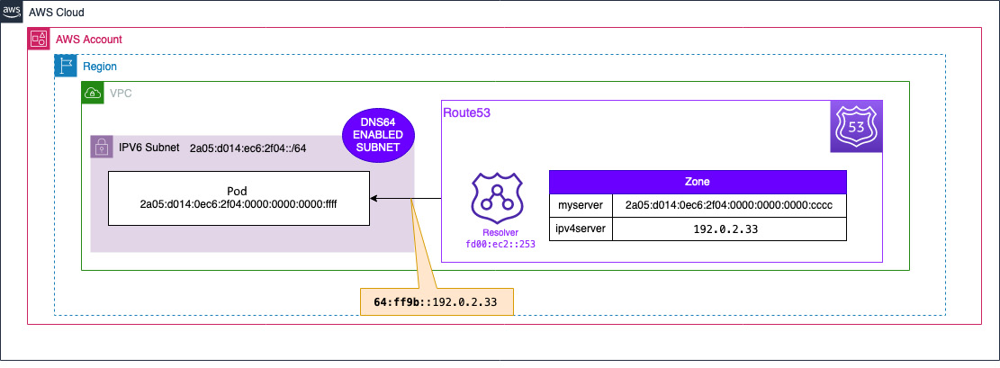
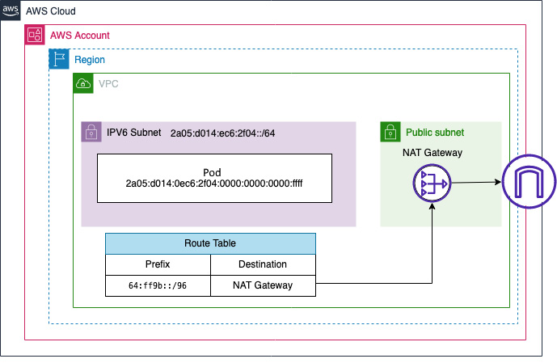
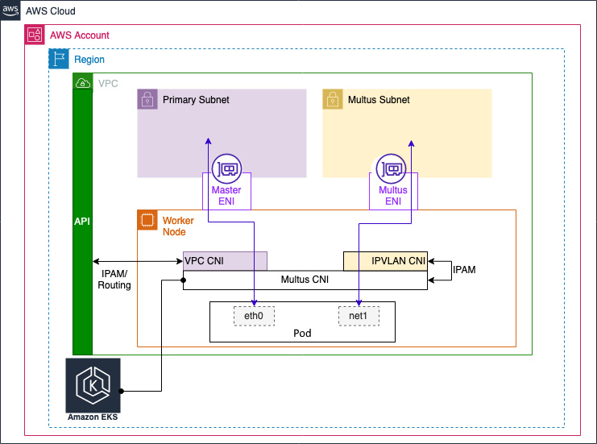
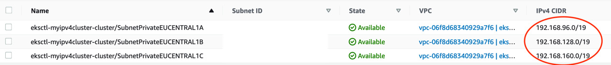
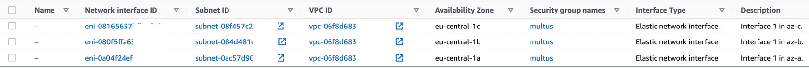

# Advanced Networking with EKS

In previous chapters, we reviewed standard AWS and EKS networking (Chapter 7). However, there are certain situations where you will need to use some of the more advanced networking features we will describe in this chapter.

This chapter looks at use cases such as how you can manage Pod address exhaustion with Internet Protocol version 6 (IPv6) and how you can enforce Layer 3 network controls for Pod traffic using network policies. We also look at how you can use different complex network-based information systems (CNIs) in EKS to support multiple Pod network interfaces using the Multus CNI and how you can support overlay networks for encryption and network acceleration, such as the Data Plane Development Kit (DPDK) or Extended Berkeley Packet Filter (eBPF).

## Overview

This chapter covers the following advanced networking topics:

- **Using IPv6 in your EKS cluster** - Address exhaustion solutions and routing scenarios
- **Installing and using Calico network policies** - Layer 3/4 traffic control between Pods
- **Choosing and using different CNIs in EKS** - Alternative networking solutions including Multus

## Technical Requirements

Before getting started with this chapter, ensure you have:

- Network connectivity to your EKS API endpoint
- The AWS CLI and the `kubectl` binary installed on your workstation
- A basic understanding of IPv6 addressing and usage
- Good understanding of VPC networking and network objects (ENIs, etc.)
- Familiarity with YAML, basic networking, and EKS architecture

## Using IPv6 in Your EKS Cluster

IPv6 offers several advantages over IPv4:

- **Larger address space** - Including public IP addresses
- **Reduced latency** - By removing Network Address Translation (NAT) hops
- **Simplified routing** - Streamlined network configuration

!!! warning "Important Considerations"
    IPv6 has limitations for EKS and other AWS services. Review the [AWS VPC IPv6 documentation](https://aws.amazon.com/vpc/ipv6/) and [EKS IPv6 guide](https://docs.aws.amazon.com/eks/latest/userguide/cni-ipv6.html) before production implementation.

### Creating an IPv6 EKS Cluster

IPv6 cannot be enabled on existing clusters. You must create a new cluster with IPv6 address family using Kubernetes 1.21 or later.

Create a configuration file `myipv6cluster.yaml`:

```yaml
---
apiVersion: eksctl.io/v1alpha5
kind: ClusterConfig
metadata:
  name: myipv6cluster
  region: "eu-central-1"
  version: "1.21"
kubernetesNetworkConfig:
  ipFamily: IPv6
addons:
  - name: vpc-cni
    version: latest
  - name: coredns
    version: latest
  - name: kube-proxy
    version: latest
iam:
  withOIDC: true
managedNodeGroups:
  - name: ipv6mng
    instanceType: t3.medium
```

Deploy the cluster:

```bash
eksctl create cluster -f myipv6cluster.yaml
```

!!! note "Deployment Time"
    This process may take 15–25 minutes to complete.

### VPC Configuration

When no existing VPC is specified, eksctl creates one with:

- Additional IPv6 CIDR range from Amazon pool
- Six subnets (three public, three private)
- Both IPv4 (required) and IPv6 CIDR ranges


*Figure 9.1 – eksctl VPC*


*Figure 9.2 – eksctl IPv4/v6 subnets*

### Worker Node Configuration

Each worker node receives both IPv4 and IPv6 addresses:

```bash
kubectl get nodes -o wide
```

Example output:
```
NAME  STATUS   ROLES    AGE   VERSION  INTERNAL-IP EXTERNAL-IP
ip-192-168-3-11.eu-central-1.compute.internal Ready <none>   27h   v1.21.12-eks-5308cf7   2a05:d014:ec6:2f00:4e36:b47b:c13f:cb1f   52.58.98.70
ip-192-168-90-100.eu-central-1.compute.internal   Ready    <none>   27h   v1.21.12-eks-5308cf7   2a05:d014:ec6:2f02:2d4c:d5df:4eb5:cb86   18.195.1.196
```

### IPv6 Prefix Assignment

- Single IPv6 /80 prefix assigned per worker node ENI
- Supports ~10^14 addresses per node
- Sufficient for large clusters with millions of Pods
- Kubernetes recommends maximum 110 Pods per host


*Figure 9.3 – IPv6 prefix assignment*

### Pod IPv6 Addressing

Pods in IPv6 clusters receive only IPv6 addresses (no dual-stack support):

```bash
kubectl get pods -n kube-system -o wide
```

Example output:
```
NAME     READY   STATUS    RESTARTS   AGE   IP
aws-node-qvqpx  1/1     Running   0   15h   2a05:d014:ec6:2f00:4e36:b47b:c13f:cc1f
coredns-745979c988-7qqmr 1/1 Running   0   15h   2a05:d014:ec6:2f00:8207::
```

## IPv6 Communication Scenarios

### Pod to External IPv6 Address

IPv6 addresses are globally unique, eliminating NAT requirements:

- **Public subnets**: Direct routing through Internet Gateway (IGW)
- **Private subnets**: Use Egress-only IGW (EIGW) for outbound-only access

### VPC Routing

IPv6 Pods maintain their source IP addresses, enabling:

- Standard Kubernetes service discovery
- Direct VPC routing table usage
- Communication with IPv6-enabled resources

#### Compatible Communication Targets

- Other Pods with IPv6 addresses
- EC2 hosts with IPv6 (single or dual stack)
- AWS services supporting IPv6 endpoints

#### IPv4 Communication Solutions

For IPv4 endpoint communication, translation services are required:

1. **Host-local CNI plugin**
2. **NAT64 (AWS NAT Gateway)**
3. **DNS64 (AWS Route 53)**

### Using Host-local CNI Plugin

Extends VPC CNI with internal IPv4 range `169.254.172.0/22`:

- Creates secondary IPv4 interface in each Pod
- All IPv4 egress traffic is source NATed (SNAT)
- Prevents IP address conflicts


*Figure 9.4 – host-local solution*

#### Testing the Configuration

Create a test container:

```bash
kubectl run -i --tty busybox --image=busybox --restart=Never -- sh
```

View interfaces and routing:

```bash
# ifconfig
eth0
Link encap:Ethernet  HWaddr AA:1D:5F:F0:B6:C7
inet6 addr: 2a05:d014:ec6:2f02:b49c::2/128 Scope:Global

v4if0
Link encap:Ethernet  HWaddr 5A:FE:0E:46:EC:D9
inet addr:169.254.172.4  Bcast:169.254.175.255  Mask:255.255.252.0

# netstat -rn
Kernel IP routing table
Destination     Gateway         Genmask         Iface
0.0.0.0         169.254.172.1   0.0.0.0         v4if0
169.254.172.0   169.254.172.1   255.255.252.0   v4if0
```

### Using DNS64 with AWS Route 53

DNS64 enhancement for VPC DNS resolver:

**IPv6 Response**: Direct IPv6 networking session
**IPv4-only Response**: Adds RFC6052 prefix (`64:ff9b::/96`) for NAT64 compatibility


*Figure 9.5 – DNS64 on your VPC*

### Using NAT64 with NAT Gateway

Automatic NAT64 availability on all NAT Gateways:

1. DNS64 provides RFC6052-prefixed addresses
2. VPC routes `64:ff9b::/96` traffic to NATGW
3. NAT64 translates IPv6 to IPv4 packets
4. Response packets translated back to IPv6


*Figure 9.6 – NAT64 on your VPC*

!!! tip "Cleanup"
    Delete your IPv6 cluster when finished: `eksctl delete cluster myipv6cluster`

## Installing and Using Calico Network Policies

By default, all Pods in all namespaces can communicate freely. Network policies provide least-privilege network access control.

### Network Policy Fundamentals

- Operates at **Layer 3 and Layer 4** of OSI model
- Equivalent to traditional firewalls or AWS security groups  
- Controls **west-to-east communication** between Pods
- EKS VPC CNI requires additional plugin for network policy support

### Setting Up Calico Policy Engine

Create an IPv4 cluster configuration `myipv4cluster.yaml`:

```yaml
---
apiVersion: eksctl.io/v1alpha5
kind: ClusterConfig
metadata:
  name: myipv4cluster
  region: "eu-central-1"
  version: "1.19"
kubernetesNetworkConfig:
  ipFamily: IPv4
addons:
  - name: vpc-cni
    version: latest
  - name: coredns
    version: latest
  - name: kube-proxy
    version: latest
iam:
  withOIDC: true
managedNodeGroups:
  - name: ipv4mng
    instanceType: t3.medium
```

!!! warning "IPv6 Compatibility"
    We observed challenges with IPv6 clusters and newer Tigera Operator. Use caution with either configuration.

Deploy the cluster:

```bash
eksctl create cluster -f myipv4cluster.yaml
```

Update kubeconfig:

```bash
aws eks update-kubeconfig --name myipv4cluster
```

Install Calico operator:

```bash
kubectl apply -f https://raw.githubusercontent.com/aws/amazon-vpc-cni-k8s/master/config/master/calico-operator.yaml
```

Configure Calico with `calico-install.yaml`:

```yaml
apiVersion: operator.tigera.io/v1
kind: Installation
metadata:
  name: default
  annotations:
    "helm.sh/hook": post-install
spec:
  cni:
    type: AmazonVPC
```

Verify installation:

```bash
kubectl get tigerastatus/calico
```

Expected output:
```
NAME     AVAILABLE   PROGRESSING   DEGRADED   SINCE
calico   True        False         False      11m
```

### Testing Network Policies

Deploy test applications using `simple-deployments.yaml`:

#### Create Namespaces

```yaml
---
apiVersion: v1
kind: Namespace
metadata:
  name: deploy1
---
apiVersion: v1
kind: Namespace
metadata:
  name: deploy2
```

#### Deploy Application 1

```yaml
---
apiVersion: apps/v1
kind: Deployment
metadata:
  name: deploy1
  namespace: deploy1
spec:
  replicas: 1
  selector:
    matchLabels:
      app: deploy1
  template:
    metadata:
      labels:
        app: deploy1
    spec:
      containers:
        - name: busybox
          image: busybox
          imagePullPolicy: IfNotPresent
          command: ['sh', '-c', 'echo Running ; sleep 3600']
```

#### Deploy Application 2

```yaml
---
apiVersion: apps/v1
kind: Deployment
metadata:
  name: deploy2
  namespace: deploy2
spec:
  replicas: 1
  selector:
    matchLabels:
      app: deploy2
  template:
    metadata:
      labels:
        app: deploy2
    spec:
      containers:
        - name: busybox
          image: busybox
          imagePullPolicy: IfNotPresent
          command: ['sh', '-c', 'echo Running ; sleep 3600']
```

#### Test Initial Connectivity

Get Pod IP from deploy1 namespace:

```bash
kubectl get po -o wide -n deploy1
```

Shell into deploy2 Pod:

```bash
kubectl exec --stdin --tty <pod-name> -n deploy2 -- sh
```

Test connectivity (should succeed):

```bash
ping -c 5 192.168.42.16  # Use actual IP from deploy1
```

#### Apply Network Policy

Create `deny-all.yaml` to block egress traffic:

```yaml
---
apiVersion: networking.k8s.io/v1
kind: NetworkPolicy
metadata:
  name: default-deny-ingress
  namespace: deploy2
spec:
  podSelector:
    matchLabels: {}
  policyTypes:
  - Egress
```

Test connectivity again (should fail):

```bash
ping -c 5 192.168.42.16  # This will now timeout
```

## Choosing and Using Different CNIs in EKS

### Reasons for CNI Replacement

- **Multiple Pod interfaces** support
- **Overlay network** encryption
- **Network acceleration** (DPDK, eBPF)
- **Address exhaustion** (though prefix addressing now solves this)

!!! info "Supported CNIs"
    EKS control plane limitations restrict supported CNIs. Check the [official documentation](https://docs.aws.amazon.com/eks/latest/userguide/alternate-cni-plugins.html) for current list.

### CNI Plugin Chaining

Primary CNI enhanced with additional capabilities through chaining.

Default EKS CNI configuration (`/etc/cni/net.d/10-aws.conflist`):

```json
{
  "cniVersion": "0.4.0",
  "name": "aws-cni",
  "disableCheck": true,
  "plugins": [
    {
      "name": "aws-cni",
      "type": "aws-cni",
      "pluginLogFile": "/var/log/aws-routed-eni/plugin.log"
    },
    {
      "name": "egress-v4-cni",
      "type": "egress-v4-cni"
    },
    {
      "type": "portmap",
      "capabilities": {"portMappings": true},
      "snat": true
    }
  ]
}
```

### Configuring Multiple Network Interfaces with Multus

Multus acts as meta-plugin while preserving VPC connectivity.


*Figure 9.7 – Multus CNI integration with EKS*

#### Install Multus

```bash
kubectl apply -f https://raw.githubusercontent.com/aws/amazon-vpc-cni-k8s/master/config/multus/v3.7.2-eksbuild.1/aws-k8s-multus.yaml
```

Verify DaemonSet deployment:

```bash
kubectl get ds kube-multus-ds -n kube-system
```

#### Multus Configuration

New primary CNI configuration (`00-multus.conf`):

```json
{
  "cniVersion": "0.3.1",
  "name": "multus-cni-network",
  "type": "multus",
  "capabilities": {
    "portMappings": true
  },
  "delegates": [{
    "cniVersion": "0.4.0",
    "name": "aws-cni",
    "disableCheck": true,
    "plugins": [{
      "name": "aws-cni",
      "type": "aws-cni"
    }, {
      "name": "egress-v4-cni",
      "type": "egress-v4-cni"
    }, {
      "type": "portmap",
      "snat": true
    }]
  }]
}
```

### Network Infrastructure Setup

#### Create Multus ENIs

Use CloudFormation template for programmatic ENI creation:

```yaml
AWSTemplateFormatVersion: "2010-09-09"
Resources:
  multusSec:
    Type: AWS::EC2::SecurityGroup
    Properties:
      GroupDescription: Multus security group
      GroupName: multus
      VpcId: <MYVPC>
  
  private1:
    Type: AWS::EC2::NetworkInterface
    Properties:
      Description: Interface 1 in az-a
      Tags:
        - Key: multus
          Value: true
        - Key: Zone
          Value: <AZ-a>
        - Key: node.k8s.amazonaws.com/no_manage
          Value: true
        - Key: cluster
          Value: <myclustername>
      SourceDestCheck: 'false'
      GroupSet:
        - !Ref multusSec
      SubnetId: <private subnet ID>
```

!!! important "ENI Tags"
    Critical tags prevent EKS control plane management and specify availability zones.


*Figure 9.8 – Private subnets created by eksctl*


*Figure 9.9 – New ENIs for Multus*

#### Attach ENIs to Worker Nodes

**Console Method**: 
1. Select worker node instance
2. Actions → Networking → Attach network interface

**Command Line Method**: Normalize interface naming
```bash
sudo ip link set eth1 name multus
```

### Network Attachment Definition

Define secondary network interface configuration:

```yaml
apiVersion: "k8s.cni.cncf.io/v1"
kind: NetworkAttachmentDefinition
metadata:
  name: ipvlan-private-a
spec:
  config: '{
    "cniVersion": "0.3.0",
    "type": "ipvlan",
    "master": "multus",
    "mode": "l3",
    "ipam": {
      "type": "host-local",
      "subnet": "192.168.96.0/19",
      "rangeStart": "192.168.96.20",
      "rangeEnd": "192.168.96.40",
      "gateway": "192.168.96.1"
    }
  }'
```

### Pod Configuration with Multiple Interfaces

```yaml
apiVersion: v1
kind: Pod
metadata:
  name: multus-pod
  annotations:
    k8s.v1.cni.cncf.io/networks: ipvlan-private-a
spec:
  nodeSelector:
    topology.kubernetes.io/zone: eu-central-1a
  containers:
    - name: busybox
      image: busybox
      imagePullPolicy: IfNotPresent
      command: ['sh', '-c', 'echo Container 1 is Running ; sleep 3600']
```

#### Verify Multiple Interfaces

Check Pod placement:

```bash
kubectl get pod -o=custom-columns=NODE:.spec.nodeName,NAME:.metadata.name
```

Inspect Pod interfaces:

```bash
kubectl exec --stdin --tty multus-pod -- sh
# ip addr
```

Expected output:
```
1: lo: <LOOPBACK,UP,LOWER_UP> mtu 65536
3: eth0@if23: <BROADCAST,MULTICAST,UP,LOWER_UP,M-DOWN> mtu 9001
    inet 192.168.14.60/32 scope global eth0
4: net1@if15: <BROADCAST,MULTICAST,NOARP,UP,LOWER_UP,M-DOWN> mtu 1500
    inet 192.168.96.20/19 brd 192.168.127.255 scope global net1
```

### VPC Route Management

**Critical Issue**: VPC requires IP-to-ENI mapping for proper routing.

**Solution**: Associate Pod IP with Multus ENI:

```bash
aws ec2 assign-private-ip-addresses \
  --network-interface-id <multus-ENI-ID> \
  --private-ip-addresses 192.168.96.30
```

#### Automation Options

1. **AWS-managed repository**: [eks-automated-ipmgmt-multus-pods](https://github.com/aws-samples/eks-automated-ipmgmt-multus-pods)
2. **Community solution**: [Joe Alford's blog](https://joealford.medium.com/deploying-multus-into-amazons-eks-42269146f421)
3. **Custom Lambda solution**: Auto-scaling event automation

### Alternative CNI Use Cases

Different CNI may be required for:

- **Overlay networks**: IPsec, VXLAN, IP-in-IP
- **Enhanced networking**: Source IP preservation, direct server return
- **Low latency networking**: eBPF implementation
- **Windows support**: Host Networking Services (HNS)
- **BGP integration**: Advanced routing protocols

!!! note "VPC Address Exhaustion"
    Previously a major driver for alternative CNIs, now largely solved by prefix addressing (Chapter 7).

## Summary

This chapter covered advanced EKS networking features:

### IPv6 Implementation
- **Address space expansion** with almost limitless IP addresses
- **NAT elimination** for reduced latency
- **Translation techniques** (host-local, DNS64, NAT64) for IPv4 compatibility
- **Limitations** in cross-protocol communication

### Network Policies with Calico
- **Layer 3/4 traffic control** equivalent to traditional firewalls
- **Pod-to-Pod communication** restriction capabilities
- **Policy engine integration** while maintaining VPC CNI functionality

### CNI Plugin Management
- **Plugin chaining** for enhanced capabilities
- **Multus implementation** for multiple Pod interfaces
- **VPC integration challenges** and routing complexities
- **Alternative CNI evaluation** for specific use cases

### Key Takeaways

1. **IPv6** provides significant addressing advantages but requires careful planning
2. **Network policies** offer essential security controls for multi-tenant environments  
3. **VPC CNI remains optimal** for most use cases due to native AWS integration
4. **Alternative CNIs** add complexity but enable specialized networking requirements
5. **Prefix addressing** has largely solved the VPC exhaustion problem


## Further Reading

* **Configuring Multus CNI:**  
  [https://aws.amazon.com/blogs/containers/amazon-eks-now-supports-multus-cni/](https://aws.amazon.com/blogs/containers/amazon-eks-now-supports-multus-cni/)

* **CNI Chaining:**  
  [https://karampok.me/posts/chained-plugins-cni/](https://karampok.me/posts/chained-plugins-cni/)

* **IPv6 on AWS:**  
  [https://aws.amazon.com/vpc/ipv6/](https://aws.amazon.com/vpc/ipv6/)

* **Kubernetes Network Policies:**  
  [https://kubernetes.io/docs/concepts/services-networking/network-policies/](https://kubernetes.io/docs/concepts/services-networking/network-policies/)

* **Project Calico:**  
  [https://www.projectcalico.org/](https://www.projectcalico.org/)