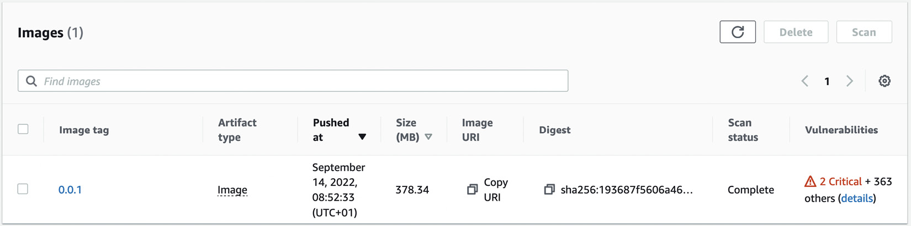
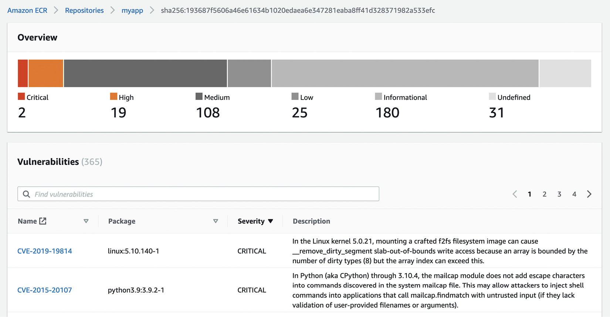
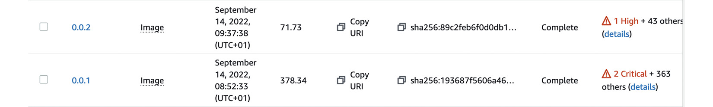
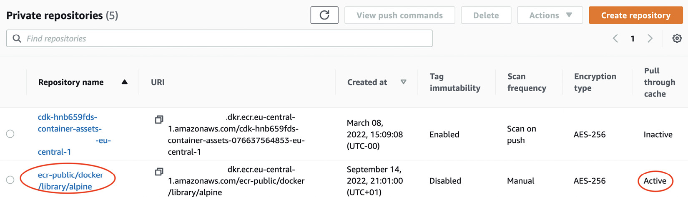
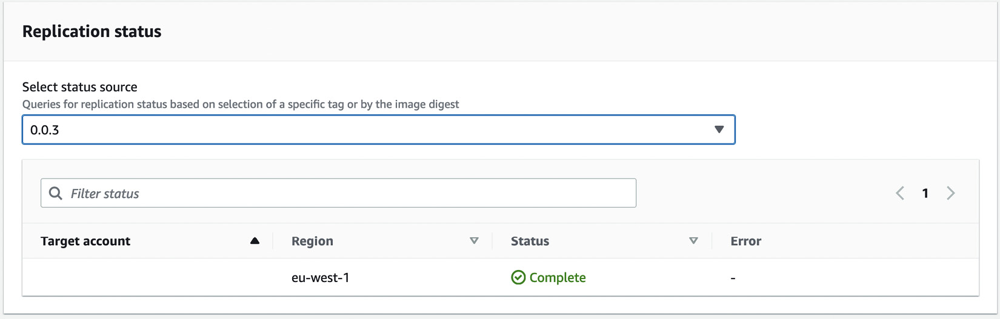

# Building Applications and Pushing Them to Amazon ECR

## Overview

This chapter explores how to use AWS Elastic Container Registry (ECR) to securely store container images and integrate them with Amazon EKS. ECR provides multiple repositories for container storage with IAM-controlled access and advanced features like vulnerability scanning.

!!! info "Prerequisites"
    - Network connectivity to EKS cluster API endpoint
    - AWS CLI, Docker, and kubectl installed
    - Basic understanding of Docker and Dockerfiles
    - Familiarity with YAML, networking, and EKS architecture

## Introducing Amazon ECR

### What is Amazon ECR?

Amazon ECR is AWS's managed Docker container registry service that:
- Hosts multiple repositories containing various versions of container images
- Supports OCI-compliant artifacts
- Provides IAM-controlled access (unlike public repositories like Docker Hub)
- Integrates seamlessly with EKS and other AWS services

### ECR vs Docker Hub

| Feature | Docker Hub | Amazon ECR |
|---------|------------|------------|
| Access Control | Public repositories, Docker Hub ID required | IAM and repository policies |
| Cost Model | Free tier with limits | Pay per GB stored + data transfer |
| Integration | General container registry | Native AWS integration |
| Security | Basic scanning (paid tiers) | Built-in vulnerability scanning |

### Creating Your First ECR Repository

Here's a simple Terraform configuration to create a private repository:

```hcl
resource "aws_ecr_repository" "myapp" {
  name                 = "myapp"
  image_tag_mutability = "MUTABLE"
  
  image_scanning_configuration {
    scan_on_push = true
  }
}

output "repo-url" {
  value = aws_ecr_repository.myapp.repository_url
}
```

#### Key Configuration Options

- **`image_tag_mutability`**: Set to `MUTABLE` to allow overwriting existing tags, or `IMMUTABLE` for strict versioning
- **`scan_on_push`**: Enables automatic vulnerability scanning when images are pushed

### ECR Pricing

ECR pricing consists of:
- **Storage**: $0.10 per GB per month
- **Data Transfer**: 
  - No charge for data transfer IN
  - No charge for transfer within same region (e.g., to EKS)
  - Standard AWS data transfer charges for cross-region/internet transfer

**Example**: 60 GB of images = $6/month storage cost

!!! tip "Cost Optimization"
    - Free tier available for new accounts
    - Optimize image sizes to reduce storage costs
    - Use image lifecycle policies to automatically delete old images

## Understanding Repository Authentication

### Private Repository Authentication

ECR uses AWS IAM for authentication with the standard Signature Version 4 signing process.

#### Docker Login Process

```bash
# Get authentication token and login to Docker
aws ecr get-login-password --region eu-central-1 | \
  docker login --username AWS --password-stdin \
  1122334.dkr.ecr.eu-central-1.amazonaws.com/myapp
```

!!! warning "Token Expiration"
    Authentication tokens are valid for 12 hours. You'll need to re-run the login command after expiration.

#### Required IAM Permissions

Default policy for EKS worker nodes:

```json
{
  "Version": "2012-10-17",
  "Statement": [
    {
      "Effect": "Allow",
      "Action": [
        "ecr:BatchCheckLayerAvailability",
        "ecr:BatchGetImage",
        "ecr:GetDownloadUrlForLayer",
        "ecr:GetAuthorizationToken"
      ],
      "Resource": "*"
    }
  ]
}
```

#### Repository Policies

For cross-account access, use repository policies:

```hcl
resource "aws_ecr_repository_policy" "apppolicy" {
  repository = aws_ecr_repository.myapp.name
  
  policy = jsonencode({
    Version = "2012-10-17"
    Statement = [
      {
        Sid    = "AllowCrossAccountPush"
        Effect = "Allow"
        Principal = {
          AWS = "arn:aws:iam::22334455:root"
        }
        Action = [
          "ecr:BatchCheckLayerAvailability",
          "ecr:CompleteLayerUpload",
          "ecr:InitiateLayerUpload",
          "ecr:PutImage",
          "ecr:UploadLayerPart"
        ]
      }
    ]
  })
}
```

### Public vs Private Repositories

| Aspect | Private Repository | Public Repository |
|--------|-------------------|-------------------|
| Access | IAM controlled | Anonymous pull allowed |
| Visibility | Account/role specific | Amazon ECR Public Gallery |
| Costs | Storage + egress from your account | Storage + egress charges for all pulls |
| Use Case | Private applications | Open source, public tools |

!!! danger "Public Repository Costs"
    Public repositories incur data transfer costs for all anonymous pulls, which can significantly impact your bill.

## Building and Pushing Container Images to ECR

### Sample Application Setup

Let's create a simple FastAPI application to demonstrate the process.

#### 1. Python Application (`main.py`)

```python
#!/usr/bin/env python3
'''simple API server that returns Hello World'''
from fastapi import FastAPI

app = FastAPI()

@app.get("/")
async def root():
    return {"message": "Hello World"}
```

#### 2. Dependencies (`requirements.txt`)

```txt
anyio==3.6.1
click==8.1.3
fastapi==0.83.0
h11==0.13.0
httptools==0.5.0
idna==3.3
importlib-metadata==4.12.0
pydantic==1.10.2
python-dotenv==0.21.0
PyYAML==6.0
sniffio==1.3.0
starlette==0.19.1
typing-extensions==4.3.0
uvicorn==0.18.3
uvloop==0.16.0
watchfiles==0.17.0
websockets==10.3
zipp==3.8.1
```

#### 3. Dockerfile

```dockerfile
FROM python:3.9
RUN pip install --upgrade pip
RUN adduser worker
USER worker
WORKDIR /home/worker
ENV PATH="/home/worker/.local/bin:${PATH}"

COPY ./requirements.txt /home/worker/requirements.txt
RUN pip install --no-cache-dir --upgrade -r /home/worker/requirements.txt

COPY ./main.py /home/worker/main.py

CMD ["uvicorn", "main:app", "--host", "0.0.0.0", "--port", "8080", "--reload"]
```

### Local Testing

```bash
# Build the image
docker build -t myapi:0.0.1 .

# Run locally for testing
docker run -p 8080:8080 --rm myapi:0.0.1

# Test the application
curl http://127.0.0.1:8080
curl http://127.0.0.1:8080/docs  # API documentation
```

### Pushing to ECR

```bash
# 1. Authenticate with ECR
aws ecr get-login-password --region eu-central-1 | \
  docker login --username AWS --password-stdin \
  1122334.dkr.ecr.eu-central-1.amazonaws.com/myapp

# 2. Tag the image for ECR
docker tag myapi:0.0.1 \
  1122334.dkr.ecr.eu-central-1.amazonaws.com/myapp:0.0.1

# 3. Verify the tag
docker images

# 4. Push to ECR
docker push 1122334.dkr.ecr.eu-central-1.amazonaws.com/myapp:0.0.1
```

### Image Vulnerability Scanning


*Figure 11.1 – Initial image details in ECR*

When `scan_on_push` is enabled, ECR automatically scans images using the open source Clair project.


*Figure 11.2 – Initial image scan output*

The scan results show:
- Vulnerability counts by severity (Critical, High, Medium, Low)
- CVE numbers with links to detailed information
- Recommendations for remediation

### Security Optimization

By changing the base image from `python:3.9` to `python:3.10-slim-bullseye`:

**Benefits achieved:**
- ✅ Eliminated all CRITICAL vulnerabilities
- ✅ Reduced overall vulnerability count
- ✅ Reduced image size by ~75%
- ✅ Improved download times
- ✅ Reduced storage costs


*Figure 11.3 – Improved container security posture and size*

```dockerfile
# Optimized Dockerfile
FROM python:3.10-slim-bullseye  # Changed from python:3.9
# ... rest of the Dockerfile remains the same
```

!!! tip "Security Best Practices"
    - Always use slim or alpine base images when possible
    - Regularly update base images to get security patches
    - Run vulnerability scans in CI/CD pipelines
    - Address CRITICAL and HIGH severity issues before production deployment

## Using Advanced ECR Features

### Pull-Through-Cache

Pull-through-cache allows private repositories to cache images from public repositories without giving worker nodes internet access.

#### Supported Upstream Registries
- Amazon ECR Public
- Quay.io
- ❌ Docker Hub (not currently supported)

#### Configuration

```hcl
resource "aws_ecr_pull_through_cache_rule" "example" {
  ecr_repository_prefix = "ecr-public"
  upstream_registry_url = "public.ecr.aws"
}
```

#### Usage Example

```bash
# Authenticate with the cache prefix
aws ecr get-login-password --region eu-central-1 | \
  docker login --username AWS --password-stdin \
  1122334.dkr.ecr.eu-central-1.amazonaws.com/ecr-public

# Pull through cache (creates repository automatically)
docker pull 1122334.dkr.ecr.eu-central-1.amazonaws.com/ecr-public/docker/library/alpine:latest
```


*Figure 11.4 – Pull-through-cache-enabled repository*

Benefits:
- No internet access required for worker nodes
- Improved security posture
- Faster pulls after initial cache
- Cost optimization for repeated pulls

### Cross-Region Replication

Replicate images across regions for:
- Disaster Recovery (DR)
- Global application deployment
- Reduced latency for regional deployments

#### Configuration

```hcl
data "aws_caller_identity" "current" {}

resource "aws_ecr_replication_configuration" "euwest1" {
  replication_configuration {
    rule {
      destination {
        region      = "eu-west-1"
        registry_id = data.aws_caller_identity.current.account_id
      }
      
      repository_filter {
        filter      = "myapp"
        filter_type = "PREFIX_MATCH"
      }
    }
  }
}
```

#### Configuration Options

| Parameter | Description | Options |
|-----------|-------------|---------|
| `destination.region` | Target AWS region | Any valid AWS region |
| `destination.registry_id` | Target AWS account ID | Same account or cross-account |
| `repository_filter.filter` | Repository selection | Prefix, exact match |
| `repository_filter.filter_type` | Filter type | `PREFIX_MATCH` |


*Figure 11.5 – Replication status for new image tag*

!!! note "Replication Timing"
    Only images pushed AFTER replication configuration is set up will be replicated. Existing images are not automatically replicated.

#### Cross-Account Replication

For cross-account replication, you need:
1. Cross-account IAM role in the destination account
2. Trust relationship allowing source account access
3. Appropriate ECR permissions in destination account

## Using ECR Images in EKS

### Prerequisites for EKS Integration

EKS worker nodes need the `AmazonEC2ContainerRegistryReadOnly` managed IAM policy attached to their node group role.

### Kubernetes Deployment with ECR Image

#### Deployment Manifest

```yaml
---
apiVersion: apps/v1
kind: Deployment
metadata:
  name: my-deployment
spec:
  selector:
    matchLabels:
      app: fastapi
  replicas: 1
  template:
    metadata:
      labels:
        app: fastapi
    spec:
      containers:
      - name: fastapi
        image: "1122334.dkr.ecr.eu-central-1.amazonaws.com/myapp:0.0.2"
        ports:
        - containerPort: 8080
```

#### Service Definition

```yaml
---
apiVersion: v1
kind: Service
metadata:
 name: fastapi-dev
spec:
 type: NodePort
 selector:
   app: fastapi
 ports:
 - nodePort: 32410
   protocol: TCP
   port: 8080
   targetPort: 8080
```

### Deployment and Testing

```bash
# Apply the manifests
kubectl apply -f deployment.yaml

# Get pod host IP
kubectl get pod <podname> -o jsonpath={.status.hostIP}

# Test the application
curl http://<hostIP>:32410
```

!!! warning "Network Security"
    Ensure proper security group rules and routing are configured to allow client connections to worker node IP addresses on the specified NodePort.

### Image Path Format

ECR images must use the full path format:
```
<aws_account_id>.dkr.ecr.<aws_region>.amazonaws.com/<repository-name>:<tag>
```

Examples:
```yaml
# Production image
image: "123456789012.dkr.ecr.us-west-2.amazonaws.com/myapp:v1.2.3"

# Development image  
image: "123456789012.dkr.ecr.us-west-2.amazonaws.com/myapp:latest"

# Pull-through cache image
image: "123456789012.dkr.ecr.us-west-2.amazonaws.com/ecr-public/nginx/nginx:latest"
```

## Best Practices and Recommendations

### Security Best Practices

1. **Use Minimal Base Images**
   - Prefer `alpine`, `slim`, or `distroless` images
   - Regularly update base images for security patches

2. **Implement Vulnerability Scanning**
   - Enable `scan_on_push` for all repositories
   - Set up automated scanning in CI/CD pipelines
   - Address CRITICAL and HIGH vulnerabilities before deployment

3. **Access Control**
   - Use least privilege IAM policies
   - Implement repository-level policies for fine-grained access
   - Use cross-account roles for multi-account scenarios

### Cost Optimization

1. **Image Lifecycle Management**
   ```hcl
   resource "aws_ecr_lifecycle_policy" "example" {
     repository = aws_ecr_repository.myapp.name
     
     policy = jsonencode({
       rules = [
         {
           rulePriority = 1
           description  = "Keep last 10 images"
           selection = {
             tagStatus     = "tagged"
             tagPrefixList = ["v"]
             countType     = "imageCountMoreThan"
             countNumber   = 10
           }
           action = {
             type = "expire"
           }
         }
       ]
     })
   }
   ```

2. **Image Size Optimization**
   - Use multi-stage builds
   - Remove unnecessary packages and files
   - Optimize layer caching

3. **Regional Strategy**
   - Deploy images in regions where they're used
   - Use cross-region replication strategically
   - Monitor data transfer costs

### Operational Excellence

1. **Tagging Strategy**
   ```bash
   # Semantic versioning
   docker tag myapp:latest myapp:v1.2.3
   
   # Environment-specific tags
   docker tag myapp:latest myapp:prod-v1.2.3
   docker tag myapp:latest myapp:staging-latest
   
   # Build-specific tags
   docker tag myapp:latest myapp:build-${BUILD_NUMBER}
   ```

2. **Monitoring and Alerting**
   - Monitor repository size and costs
   - Set up alerts for vulnerability scan results
   - Track image pull metrics

3. **Automation**
   - Automate image builds in CI/CD
   - Implement automated vulnerability scanning
   - Use Infrastructure as Code for ECR management

## Common Issues and Troubleshooting

### Authentication Issues

| Error | Cause | Solution |
|-------|-------|----------|
| `no basic auth credentials` | Not logged in to ECR | Run `aws ecr get-login-password` command |
| `authentication token expired` | Token > 12 hours old | Re-authenticate with ECR |
| `access denied` | Insufficient IAM permissions | Check IAM policies and repository permissions |

### Image Pull Issues in EKS

| Error | Cause | Solution |
|-------|-------|----------|
| `ImagePullBackOff` | Authentication or network issues | Check node IAM roles and security groups |
| `ErrImageNeverPull` | Incorrect image path | Verify full ECR image path format |
| `RepositoryDoesNotExist` | Typo in repository name | Check repository name and region |

### Performance Issues

| Issue | Cause | Solution |
|-------|-------|----------|
| Slow image pulls | Large image size | Optimize Dockerfile and use smaller base images |
| High data transfer costs | Cross-region pulls | Use replication or regional repositories |
| Frequent re-authentication | Token expiration | Implement automated token refresh |

## Summary

This chapter covered comprehensive ECR usage including:

- **Repository Management**: Creating and configuring ECR repositories with security scanning
- **Authentication**: Using IAM-based authentication for secure access
- **Image Lifecycle**: Building, optimizing, and pushing container images
- **Advanced Features**: Pull-through caching and cross-region replication
- **EKS Integration**: Deploying ECR images in Kubernetes clusters
- **Security**: Vulnerability scanning and remediation strategies
- **Cost Optimization**: Storage management and data transfer optimization

Key takeaways:
- ECR provides secure, scalable container image storage with AWS integration
- Vulnerability scanning helps maintain security posture
- Advanced features support enterprise-scale deployments
- Proper IAM configuration ensures secure access control
- Cost optimization through image lifecycle management and regional strategies

## Further Reading

- [AWS Signature V4 Signing Process](https://docs.aws.amazon.com/general/latest/gr/signature-version-4.html)
- [ECR Public Gallery](https://docs.aws.amazon.com/AmazonECR/latest/public/public-gallery.html)
- [Clair Container Scanning](https://github.com/quay/clair)
- [ECR Pricing Details](https://aws.amazon.com/ecr/pricing/)
- [Container Image Security Best Practices](https://aws.amazon.com/blogs/containers/container-image-security-best-practices/)

---

!!! tip "Next Steps"
    The next chapter will explore AWS storage drivers for providing stateful storage to Pods in your EKS applications.